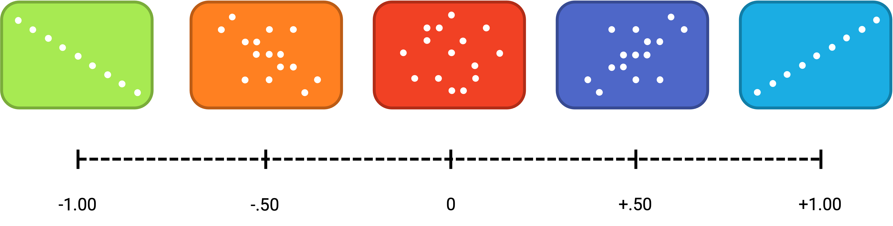
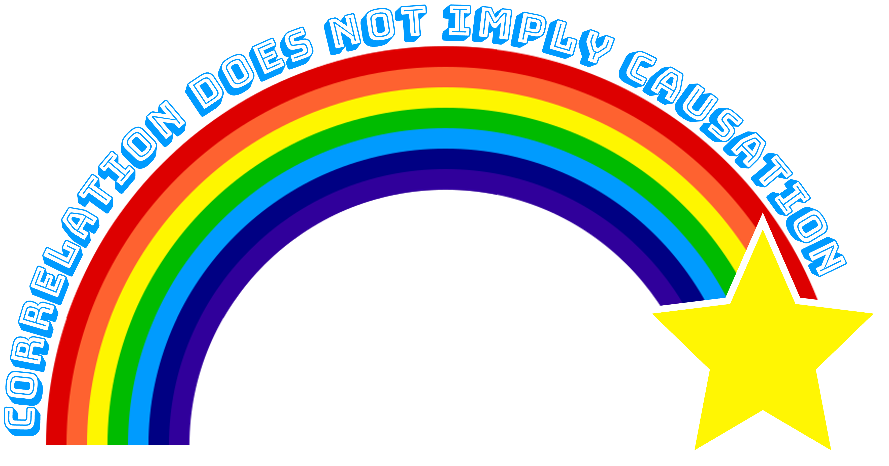

# Getting Started in Research

Here is the first paragraph of a 2020 article in the *Nature Human Behaviour*.

> Forgetting is an inevitable consequence of remembering. We forget many of our everyday experiences over time, remembering only a small proportion of the large volume of information that we process on a daily basis. Psychologists have focused on characterizing the rate at which forgetting occurs epitomized by Ebbinghaus’ forgetting curves, and have asked why it occurs for example, whether via interference or decay. This focus on the when and why of forgetting has perhaps been at the expense of asking what is forgotten. When forgetting occurs, what type of information is lost? This question is critical, given the proposal that forgetting is beneficial to decision-making processes. If we are to understand how forgetting aids decision making, we first need to reveal the form that such forgetting takes. [@Berens2020].

In this paragraph, the researchers opened with the broad topic of forgetting. They characterize past research questions that have focused on forgetting rates and the reasons why it may occur. This frames why their research question is important (what kind of information is forgotten) because little research has been done on it. In terms of the general model of scientific research in psychology presented in Figure \@ref(fig:scientificmethod) "A Simple Model of Scientific Research in Psychology", these are activities at the “top” of the cycle. In this chapter, we begin with some more basic concepts that are necessary to understand how research questions in psychology are conceptualized. 

## Basic Concepts

:::learningobjectives
##### LEARNING OBJECTIVES {-}
1. Define the concept of a variable, distinguish quantitative from categorical variables, and give examples of variables that might be of interest to psychologists.
2. Explain the difference between a population and a sample.
3. Describe two basic forms of statistical relationship and give examples of each.
4. Interpret basic statistics and graphs used to describe statistical relationships.
5. Explain why correlation does not imply causation.
:::

### Variables {-}

Research questions in psychology are about [variables](#variable). A variable is a quantity or quality that varies across people or situations. For example, the height of the students in a psychology class is a variable because it varies from student to student. The sex assigned at birth of the students is also a variable as long as there are both male and female students in the class. A [quantitative variable] is a quantity, such as height, that is typically measured by assigning a number to each individual. Other examples of quantitative variables include people’s level of talkativeness, how depressed they are, and the number of siblings they have. A [categorical variable] is a quality, such as sex assigned at birth, and is typically measured by assigning a category label to each individual. Other examples include people’s nationality, their occupation, and whether they are receiving psychotherapy.

### Sampling and Measurement {-}

Researchers in psychology are usually interested in drawing conclusions about some very large group of people. This is called the [population]. It could be American teenagers, children with autism, professional athletes, or even just human beings—depending on the interests and goals of the researcher. But they usually study only a small subset or [sample] of the population. For example, a researcher might measure the talkativeness of a few hundred college students with the intention of drawing conclusions about the talkativeness of men and women in general. It is important, therefore, for researchers to use a representative sample—one that is similar to the population in important respects.

One method of obtaining a sample is simple random sampling, in which every member of the population has an equal chance of being selected for the sample. For example, a pollster could start with a list of all the registered voters in a city (the population), randomly select 100 of them from the list (the sample), and ask those 100 whom they intended to vote for. Unfortunately, random sampling is difficult or impossible in most psychological research because the populations are less clearly defined than the registered voters in a city. How could a researcher give all American teenagers or all children with autism an equal chance of being selected for a sample? The most common alternative to random sampling is convenience sampling, in which the sample consists of individuals who happen to be nearby and willing to participate (such as introductory psychology students). The obvious problem with convenience sampling is that the sample might not be representative of the population.

Once the sample is selected, researchers need to measure the variables they are interested in. This requires an [operational definition]—a definition of the variable in terms of precisely how it is to be measured. Most variables can be operationally defined in many different ways. For example, depression can be operationally defined as people’s scores on a paper-and-pencil depression scale, the number of depressive symptoms they are experiencing, or whether they have been diagnosed with major depressive disorder. When a variable has been measured for a particular individual, the result is called a score, and a set of scores is called data. Note that data is plural—the singular datum is rarely used—so it is grammatically correct to say, “Those are interesting data” (and incorrect to say, “That is interesting data”).

## Relationships Between Variables

Some research questions in psychology are about one variable. How accurate are children’s memories for being touched? How talkative are American college students? How common is it for people to be diagnosed with major depressive disorder? Answering such questions requires operationally defining the variable, measuring it for a sample, analyzing the results, and drawing conclusions about the population. For a quantitative variable, this would typically involve computing the mean and standard deviation of the scores. For a categorical variable, it would typically involve computing the percentage of scores at each level of the variable.

However, research questions in psychology are more likely to be about statistical relationships between variables. There is a [statistical relationship] between two variables when the average score on one differs systematically across the levels of the other. Studying statistical relationships is important because instead of telling us about behaviors and psychological characteristics in isolation, it tells us about the causes, consequences, development, and organization of those behaviors and characteristics.

There are two basic forms of statistical relationship: differences between groups and correlations between quantitative variables. Although both are consistent with the general definition of a statistical relationship—the average score on one variable differs across levels of the other—they are usually described and analyzed somewhat differently. For this reason it is important to distinguish them clearly.

### Differences Between Groups {-}

One basic form of statistical relationship is a difference between the mean scores of two groups on some variable of interest. A wide variety of research questions in psychology take this form. Can people multitask? Are flashcards more effective for learning than studying notes? Do people talking on a cell phone have poorer driving abilities than people not talking on a cell phone? Do people receiving Psychotherapy A tend to have fewer depressive symptoms than people receiving Psychotherapy B? Later we will also see that such relationships can involve more than two groups and that the groups can consist of the very same individuals tested at different times or under different conditions. For now, however, it is easiest to think in terms of two distinct groups.

Differences between groups are usually described by giving the mean score and standard deviation for each group. This information can also be presented in a bar graph like that in Figure \@ref(fig:bargraph), where the heights of the bars represent the group means.

```{r bargraph, echo = FALSE, out.width='70%', fig.align = 'center', fig.cap='Bar graph showing the very small difference in the mean number of words spoken per day by women and men in a large sample. Based on data from @mehl2007women'}
words <- c(16215,15669)

barplot(words, names.arg = c("Women","Men"), col = c("#1BADE3","#4E67C8"), xlab = "Sex Assigned at Birth", axis.lty=1, ylab = "Words Spoken per Day", ylim = c(0,20000))
```


:::fyi
##### The Gold Standard of Evidence {-}
The gold standard of evidence is a randomized controlled trial (RCT). RCTs enable us to infer causality because they control for sample selection bias and confounding factors through randomization. Generally for an RCT, there is a target population which a random sample is taken from. In the simplest form, RCTs have two groups, the control group where no treatment is applied and the treatment group where we manipulate a variable. Random assignment to these two groups is key to ensure that a third variable only in one group is affecting the results. We then compare the outcomes of the two groups and see if the treatment had any effect relative to the control group.    
:::

### Correlations Between Quantitative Variables {-}

A second basic form of statistical relationship is a correlation between two quantitative variables, where the average score on one variable differs systematically across the levels of the other. Again, a wide variety of research questions in psychology take this form. Is being a happier person associated with being more talkative? Do children’s memories for touch information improve as they get older? Does the effectiveness of psychotherapy depend on how much the patient likes the therapist?

Correlations between quantitative variables are often presented using [scatterplots](#scatterplot). Figure \@ref(fig:scatter) shows some hypothetical data on the relationship between the amount of stress people are under and the number of physical symptoms they have. Each point in the scatterplot represents one person’s score on both variables. For example, the circled point in Figure \@ref(fig:scatter) represents a person whose stress score was 10 and who had three physical symptoms. Taking all the points into account, one can see that people under more stress tend to have more physical symptoms. This is a good example of a positive relationship, in which higher scores on one variable tend to be associated with higher scores on the other. A negative relationship is one in which higher scores on one variable tend to be associated with lower scores on the other. There is a negative relationship between stress and immune system functioning, for example, because higher stress is associated with lower immune system functioning.

```{r scatter, echo = FALSE, out.width='75%', fig.align = 'center', fig.cap='Scatterplot showing a hypothetical positive relationship between stress and number of physical symptoms. The point highlighted in the blue box represents a person whose stress score was 10 and who had three physical symptoms. Pearson’s *r* for these data is +.51.'}
y <- c(3,5,3,6,4,6,6,7,8,3,4,5,6,3,5,8,4,6,7,9,8)
x <- c(10,11,12,12,13,13,14,14,14,15,15,15,15,16,16,16,17,17,18,19,20)
Data <- data.frame(x, y)

plot(x, y, type = "p", xlab = "Stress", ylab = "Physical Symptoms", ylim = c(0,10), xlim = c(0,25), pch = 19, col = "#1482AA")
rect(xleft=9.3,
     xright=10.7,
     ybottom=2.5, ytop=3.5, col="#1BADE340") # use alpha value in col
grid(nx = NULL, ny = NULL,
     lty = 2,      # Grid line type
     col = "#7F7F7F40", # Grid line color
     lwd = 1)      # Grid line width
```


The strength of a correlation between quantitative variables is typically measured using a statistic called [Pearson’s *r*]. As Figure \@ref(fig:pearson) shows, Pearson’s *r* ranges from −1.00 (the strongest possible negative relationship) to +1.00 (the strongest possible positive relationship). A value of 0 means there is no relationship between the two variables. When Pearson’s *r* is 0, the points on a scatterplot form a shapeless “cloud.” As its value moves toward −1.00 or +1.00, the points come closer and closer to falling on a single straight line.

```{r pearson, echo = FALSE, out.width='90%', fig.align = 'center', fig.cap='Range of Pearson’s *r*, from −1.00 (strongest possible negative relationship), through 0 (no relationship), to +1.00 (strongest possible positive relationship)'}

```

Pearson’s *r* is a good measure only for linear relationships, in which the points are best approximated by a straight line. It is not a good measure for nonlinear relationships, in which the points are better approximated by a curved line. Figure \@ref(fig:nonlinear), for example, shows a hypothetical relationship between the amount of sleep people get per night and their level of depression. In this example, the line that best approximates the points is a U-shaped curve, because people who get about eight hours of sleep tend to be the least depressed. Those who get too little sleep and those who get too much sleep tend to be more depressed. Nonlinear relationships are fairly common in psychology, but measuring their strength is beyond the scope of this book.

```{r nonlinear, echo = FALSE, out.width='70%', fig.align = 'center', fig.cap='Hypothetical nonlinear relationship between sleep and depression.'}
y <- c(10,9,8,8,7,6,6,5,7,6,5,7,6,5,9,8,7,7,6,10,9)
x <- c(4,4,5,6,6,6,7,7,8,8,8,9,9,9,10,10,10,11,11,12,12)
Data <- data.frame(x, y)
loess_fit <- loess(y ~ x, Data)

plot(x, y, type = "p", xlab = "Hours of Sleep Per Night", ylab = "Depression", ylim = c(0,12), xlim = c(0,14), col = "#4E67C8")
lines(smooth.spline(x, y), lwd = 3, lty = 3, col = "#4E67C8")
grid(nx = NULL, ny = NULL,
     lty = 2,      # Grid line type
     col = "#7F7F7F40", # Grid line color
     lwd = 1)      # Grid line width
```

### Correlation Does Not Imply Causation {-}

Researchers are often interested in a statistical relationship between two variables because they think that one of the variables causes the other. That is, the statistical relationship reflects a causal relationship. In these situations, the variable that is thought to be the cause is called the [independent variable] (often referred to as *X* for short), and the variable that is thought to be the effect is called the [dependent variable] (often referred to as *Y*). For example, the statistical relationship between whether or not a depressed person receives psychotherapy and the number of depressive symptoms he or she has reflects the fact that the psychotherapy (the independent variable) *causes* the reduction in symptoms (the dependent variable). Understanding causal relationships is important in part because it allows us to change people’s behavior in predictable ways. If we know that psychotherapy causes a reduction in depressive symptoms—and we want people to have fewer depressive symptoms—then we can use psychotherapy to achieve this goal.

But not all statistical relationships reflect causal relationships. This is what psychologists mean when they say, “Correlation does not imply causation.” An obvious example comes from a study in Taiwan showing a positive relationship between the number of electrical appliances that people use and the extent to which they use birth control [@stanovich2013think]. It seems clear, however, that this does not mean that owning electrical appliances causes people to use birth control, and it would not make sense to try to increase the use of birth control by giving people toasters and hair dryers.

```{r correlationdoesnotimplycausation, echo = FALSE, out.width='90%', fig.align = 'center', fig.cap='A Public Service Announcement.'}

```

There are two reasons that correlation does not imply causation. The first is called the [directionality problem]. Two variables, *X* and *Y*, can be statistically related because *X* causes *Y* or because *Y* causes *X.* Consider, for example, a study showing that whether or not people exercise is statistically related to how happy they are—such that people who exercise are happier on average than people who do not. This statistical relationship is consistent with the idea that exercising causes happiness, but it is also consistent with the idea that happiness causes exercise. Perhaps being happy gives people more energy or leads them to seek opportunities to socialize with others by going to the gym. The second reason that correlation does not imply causation is called the [third-variable problem]. Two variables, *X* and *Y*, can be statistically related not because *X* causes *Y*, or because *Y* causes *X*, but because some third variable, *Z*, causes both *X* and *Y.* For example, the fact that people with more electrical appliances are more likely to use birth control probably reflects the fact that having more education or income causes people to own more appliances and causes them to use birth control. Similarly, the statistical relationship between exercise and happiness could mean that some third variable, such as physical health, causes both of the others. Being physically healthy could cause people to exercise and cause them to be happier.

:::fyi
##### “Lots of Candy Could Lead to Violence” {-}
Although researchers in psychology know that correlation does not imply causation, many journalists do not. One website about correlation and causation, http://jonathan.mueller.faculty.noctrl.edu/100/correlation_or_causation.htm, links to dozens of media reports about real biomedical and psychological research. Many of the headlines suggest that a causal relationship has been demonstrated, when a careful reading of the articles shows that it has not because of the directionality and third-variable problems.

One article is about a study showing that children who ate candy every day were more likely than other children to be arrested for a violent offense later in life. But could candy really “lead to” violence, as the headline suggests? What alternative explanations can you think of for this statistical relationship? How could the headline be rewritten so that it is not misleading?
:::

As we will see later in the book, there are various ways that researchers address the directionality and third-variable problems. The most effective, however, is to conduct an [experiment]. An experiment is a study in which the researcher manipulates the independent variable. For example, instead of simply measuring how much people exercise, a researcher could bring people into a laboratory and randomly assign half of them to run on a treadmill for 15 minutes and the rest to sit on a couch for 15 minutes. Although this seems like a minor addition to the research design, it is extremely important. Now if the exercisers end up in more positive moods than those who did not exercise, it cannot be because their moods affected how much they exercised (because it was the researcher who determined how much they exercised). Likewise, it cannot be because some third variable (e.g., physical health) affected both how much they exercised and what mood they were in (because, again, it was the researcher who determined how much they exercised). Thus experiments eliminate the directionality and third-variable problems and allow researchers to draw firm conclusions about causal relationships. We will have much more to say about experimental and nonexperimental research later in the book.

:::takeaways
##### KEY TAKEAWAYS {-}
- Research questions in psychology are about variables and relationships between variables.
- Two basic forms of statistical relationship are differences between group means and correlations between quantitative variables, each of which can be described using a few simple statistical techniques.
- Correlation does not imply causation. A statistical relationship between two variables, *X* and *Y*, does not necessarily mean that *X* causes *Y.* It is also possible that *Y* causes *X*, or that a third variable, *Z*, causes both *X* and *Y.*
:::

:::exercises
##### EXERCISES {-}

1. Practice: List 10 variables that might be of interest to a researcher in psychology. For each, specify whether it is quantitative or categorical.
2. Practice: Imagine that you categorize people as either introverts (quieter, shyer, more inward looking) or extroverts (louder, more outgoing, more outward looking). Sketch a bar graph showing a hypothetical statistical relationship between this variable and the number of words people speak per day.
3. Practice: Now imagine that you measure people’s levels of extroversion as a quantitative variable, with values ranging from 0 (extreme introversion) to 30 (extreme extroversion). Sketch a scatterplot showing a hypothetical statistical relationship between this variable and the number of words people speak per day.
4. Practice: For each of the following statistical relationships, decide whether the directionality problem is present and think of at least one plausible third variable:
    + People who eat more lobster tend to live longer.
    + People who exercise more tend to weigh less.
    + College students who drink more alcohol tend to have poorer grades.
:::

## Quantitative and Qualitative Research

:::learningobjectives
##### LEARNING OBJECTIVES {-}

1. List several ways in which qualitative research differs from quantitative research in psychology.
2. Describe the strengths and weaknesses of qualitative research in psychology compared with quantitative research.
3. Give examples of qualitative research in psychology.
:::

### What Is Qualitative Research? {-}

This book is primarily about [quantitative research]. Quantitative researchers typically start with a focused research question or hypothesis, collect a small amount of data from each of a large number of individuals, describe the resulting data using statistical techniques, and draw general conclusions about some large population. Although this is by far the most common approach to conducting empirical research in psychology, there is an important alternative called qualitative research. Qualitative research originated in the disciplines of anthropology and sociology but is now used to study many psychological topics as well. Qualitative researchers generally begin with a less focused research question, collect large amounts of relatively “unfiltered” data from a relatively small number of individuals, and describe their data using nonstatistical techniques. They are usually less concerned with drawing general conclusions about human behavior than with understanding in detail the experience of their research participants.

Consider, for example, a study by researcher Per Lindqvist and his colleagues, who wanted to learn how the families of teenage suicide victims cope with their loss [@lindqvist2008aftermath]. They did not have a specific research question or hypothesis, such as, What percentage of family members join suicide support groups? Instead, they wanted to understand the variety of reactions that families had, with a focus on what it is like from *their* perspectives. To do this, they interviewed the families of 10 teenage suicide victims in their homes in rural Sweden. The interviews were relatively unstructured, beginning with a general request for the families to talk about the victim and ending with an invitation to talk about anything else that they wanted to tell the interviewer. One of the most important themes that emerged from these interviews was that even as life returned to “normal,” the families continued to struggle with the question of why their loved one committed suicide. This struggle appeared to be especially difficult for families in which the suicide was most unexpected.

### The Purpose of Qualitative Research {-}

Again, this book is primarily about quantitative research in psychology. The strength of quantitative research is its ability to provide precise answers to specific research questions and to draw general conclusions about human behavior. This is how we know that people have a strong tendency to obey authority figures, for example, or that female college students are not substantially more talkative than male college students. But while quantitative research is good at providing precise answers to specific research questions, it is not nearly as good at *generating* novel and interesting research questions. Likewise, while quantitative research is good at drawing general conclusions about human behavior, it is not nearly as good at providing detailed descriptions of the behavior of particular groups in particular situations. And it is not very good at all at communicating what it is actually like to be a member of a particular group in a particular situation.

But the relative weaknesses of quantitative research are the relative strengths of qualitative research. Qualitative research can help researchers to generate new and interesting research questions and hypotheses. The research of Lindqvist and colleagues, for example, suggests that there may be a general relationship between how unexpected a suicide is and how consumed the family is with trying to understand why the teen committed suicide. This relationship can now be explored using quantitative research. But it is unclear whether this question would have arisen at all without the researchers sitting down with the families and listening to what they themselves wanted to say about their experience. Qualitative research can also provide rich and detailed descriptions of human behavior in the real-world contexts in which it occurs. Among qualitative researchers, this is often referred to as “thick description” [@geertz1973interpretation]. Similarly, qualitative research can convey a sense of what it is actually like to be a member of a particular group or in a particular situation—what qualitative researchers often refer to as the “lived experience” of the research participants. Lindqvist and colleagues, for example, describe how all the families spontaneously offered to show the interviewer the victim’s bedroom or the place where the suicide occurred—revealing the importance of these physical locations to the families. It seems unlikely that a quantitative study would have discovered this.

### Data Collection and Analysis in Qualitative Research {-}

As with correlational research, data collection approaches in qualitative research are quite varied and can involve naturalistic observation, archival data, artwork, and many other things. But one of the most common approaches, especially for psychological research, is to conduct [interviews]. Interviews in qualitative research tend to be unstructured—consisting of a small number of general questions or prompts that allow participants to talk about what is of interest to them. The researcher can follow up by asking more detailed questions about the topics that do come up. Such interviews can be lengthy and detailed, but they are usually conducted with a relatively small sample. This was essentially the approach used by Lindqvist and colleagues in their research on the families of suicide survivors. Small groups of people who participate together in interviews focused on a particular topic or issue are often referred to as [focus groups]. The interaction among participants in a focus group can sometimes bring out more information than can be learned in a one-on-one interview. The use of focus groups has become a standard technique in business and industry among those who want to understand consumer tastes and preferences. The content of all focus group interviews is usually recorded and transcribed to facilitate later analyses.

Another approach to data collection in qualitative research is participant observation. In [participant observation], researchers become active participants in the group or situation they are studying. The data they collect can include interviews (usually unstructured), their own notes based on their observations and interactions, documents, photographs, and other artifacts. The basic rationale for participant observation is that there may be important information that is only accessible to, or can be interpreted only by, someone who is an active participant in the group or situation. An example of participant observation comes from a study by sociologist Amy Wilkins (published in *Social Psychology Quarterly*) on a college-based religious organization that emphasized how happy its members were [@wilkins2008happier]. Wilkins spent 12 months attending and participating in the group’s meetings and social events, and she interviewed several group members. In her study, Wilkins identified several ways in which the group “enforced” happiness—for example, by continually talking about happiness, discouraging the expression of negative emotions, and using happiness as a way to distinguish themselves from other groups.

#### Data Analysis in Qualitative Research {-}

Although quantitative and qualitative research generally differ along several important dimensions (e.g., the specificity of the research question, the type of data collected), it is the method of data *analysis* that distinguishes them more clearly than anything else. To illustrate this idea, imagine a team of researchers that conducts a series of unstructured interviews with recovering alcoholics to learn about the role of their religious faith in their recovery. Although this sounds like qualitative research, imagine further that once they collect the data, they code the data in terms of how often each participant mentions God (or a “higher power”), and they then use descriptive and inferential statistics to find out whether those who mention God more often are more successful in abstaining from alcohol. Now it sounds like quantitative research. In other words, the quantitative-qualitative distinction depends more on what researchers *do* with the data they have collected than with why or how they collected the data.

But what does qualitative data analysis look like? Just as there are many ways to collect data in qualitative research, there are many ways to analyze data. Here we focus on one general approach called [grounded theory] [@glaser2017discovery]. This approach was developed within the field of sociology in the 1960s and has gradually gained popularity in psychology. Remember that in quantitative research, it is typical for the researcher to start with a theory, derive a hypothesis from that theory, and then collect data to test that specific hypothesis. In qualitative research using grounded theory, researchers start with the data and develop a theory or an interpretation that is “grounded in” those data. They do this in stages. First, they identify ideas that are repeated throughout the data. Then they organize these ideas into a smaller number of broader themes. Finally, they write a [theoretical narrative]—an interpretation—of the data in terms of the themes that they have identified. This theoretical narrative focuses on the subjective experience of the participants and is usually supported by many direct quotations from the participants themselves.

As an example, consider a study by researchers Laura Abrams and Laura Curran, who used the grounded theory approach to study the experience of postpartum depression symptoms among low-income mothers [@abrams2009and]. Their data were the result of unstructured interviews with 19 participants. Table \@ref(tab:themes) shows the five broad themes the researchers identified and the more specific repeating ideas that made up each of those themes. In their research report, they provide numerous quotations from their participants, such as this one from “Destiny:”

> Well, just recently my apartment was broken into and the fact that his Medicaid for some reason was cancelled so a lot of things was happening within the last two weeks all at one time. So that in itself I don’t want to say almost drove me mad but it put me in a funk.…Like I really was depressed. (p. 357)

Their theoretical narrative focused on the participants’ experience of their symptoms not as an abstract “affective disorder” but as closely tied to the daily struggle of raising children alone under often difficult circumstances.

```{r themes, echo = FALSE, }
theme <- c("Ambivalence","Caregiving overload","Juggling","Mothering alone","Real-life worry")
idea <- c("“I wasn’t prepared for this baby,” “I didn’t want to have any more children.”","“Please stop crying,” “I need a break,” “I can’t do this anymore.”","“No time to breathe,” “Everyone depends on me,” “Navigating the maze.”","“I really don’t have any help,” “My baby has no father.”","“I don’t have any money,” “Will my baby be OK?” “It’s not safe here.”")
themes <- data.frame(theme,idea)

knitr::kable(themes,
  col.name=c("Theme","Repeating ideas"), caption = 'Themes and repeating ideas in a study of postpartum depression among low-income mothers.')
```

### The Quantitative-Qualitative “Debate” {-}

Given their differences, it may come as no surprise that quantitative and qualitative research in psychology and related fields do not coexist in complete harmony. Some quantitative researchers criticize qualitative methods on the grounds that they lack objectivity, are difficult to evaluate in terms of reliability and validity, and do not allow generalization to people or situations other than those actually studied. At the same time, some qualitative researchers criticize quantitative methods on the grounds that they overlook the richness of human behavior and experience and instead answer simple questions about easily quantifiable variables.

In general, however, qualitative researchers are well aware of the issues of objectivity, reliability, validity, and generalizability. In fact, they have developed a number of frameworks for addressing these issues (which are beyond the scope of our discussion). And in general, quantitative researchers are well aware of the issue of oversimplification. They do not believe that all human behavior and experience can be adequately described in terms of a small number of variables and the statistical relationships among them. Instead, they use simplification as a strategy for uncovering general principles of human behavior.

Many researchers from both the quantitative and qualitative camps now agree that the two approaches can and should be combined into what has come to be called [mixed-methods research] [@todd2004mixing]. (In fact, the studies by Lindqvist and colleagues and by Abrams and Curran both combined quantitative and qualitative approaches.) One approach to combining quantitative and qualitative research is to use qualitative research for hypothesis generation and quantitative research for hypothesis testing. Again, while a qualitative study might suggest that families who experience an unexpected suicide have more difficulty resolving the question of why, a well-designed quantitative study could test a hypothesis by measuring these specific variables for a large sample. A second approach to combining quantitative and qualitative research is referred to as [triangulation]. The idea is to use both quantitative and qualitative methods simultaneously to study the same general questions and to compare the results. If the results of the quantitative and qualitative methods converge on the same general conclusion, they reinforce and enrich each other. If the results diverge, then they suggest an interesting new question: Why do the results diverge and how can they be reconciled?

:::takeaways
##### KEY TAKEAWAYS {-}

- Qualitative research is an important alternative to quantitative research in psychology. It generally involves asking broader research questions, collecting more detailed data (e.g., interviews), and using nonstatistical analyses.
- Many researchers conceptualize quantitative and qualitative research as complementary and advocate combining them. For example, qualitative research can be used to generate hypotheses and quantitative research to test them.
:::

:::exercises
##### EXERCISE {-}
1. Discussion: What are some ways in which a qualitative study of girls who play youth baseball would be likely to differ from a quantitative study on the same topic?
:::

## Glossary

##### bar graph {-}

A graph used to show differences between the mean scores of two or more groups.

##### categorical variable {-}

A quality that varies across individuals and is measured by assigning a category label to each individual.

##### dependent variable {-}

A variable that is thought to be the effect of another variable (called the independent variable).

##### directionality problem {-}

The problem of knowing whether two variables, *X* and *Y*, are statistically related because *X* causes *Y* or because *Y* causes *X*.

##### experiment {-}

A type of empirical study in which an independent variable is manipulated and a dependent variable is measured while extraneous variables are controlled.

##### focus groups {-}

A small group of people who participate together in an interview focused on a particular topic or issue.

##### grounded theory {-}

An approach to analyzing qualitative data in which repeating ideas are identified and grouped into broader themes. The themes are integrated in a theoretical narrative.##### interviews {-}

A data collection method in qualitative research. Interviews can be structured, semistructured, or unstructured—depending on how well specified the sequence of questions or prompts is.

##### independent variable {-}

A variable that is thought to be the cause of another variable (called the dependent variable). In an experiment, the independent variable is manipulated by the researcher.

##### interviews {-}

A data collection method in qualitative research. Interviews can be structured, semistructured, or unstructured—depending on how well specified the sequence of questions or prompts is.

##### mixed-methods research {-}

Research that uses both quantitative and qualitative methods.

##### operational definition {-}

A definition of a variable or construct in terms of precisely how it will be measured.

##### participant observation {-}

An approach to data collection in qualitative research in which the researcher becomes an active participant in the group or situation under study.

##### Pearson’s *r* {-}

A measure of the strength of the correlation between two quantitative variables.

##### population {-}

The entire group of individuals that the researcher wants to draw conclusions about.

##### qualitative research {-}

Research that typically involves formulating broad research questions, collecting large amounts of data from a small number of participants, and summarizing the data using nonstatistical techniques.

##### quantitative research {-}

Research that involves formulating focused research questions, collecting small amounts of data from a large number of participants, and summarizing the data using descriptive and inferential statistics.

##### quantitative variable {-}

A quantity that varies across individuals and is measured by assigning a number to each individual.

##### sample {-}

The subset of individuals that the researcher actually studies.

##### scatterplot {-}

A graph used to show the correlation between two quantitative variables.

##### statistical relationship {-}

A difference in the average score on one variable across levels of another variable.

##### theoretical narrative {-}

In grounded theory, a narrative interpretation of the broad themes that emerge from the data, usually supported by many direct quotations or examples from the data.

##### third-variable problem {-}

Two variables, *X* and *Y*, can be statistically related not because *X* causes *Y* or because *Y* causes *X*, but because some third variable, *Z*, causes both.

##### triangulation {-}

In mixed methods research, using multiple quantitative and qualitative methods to study the same topic, with the goal of converging on a single interpretation.

##### variable {-}

A quantity or quality that varies across individuals.