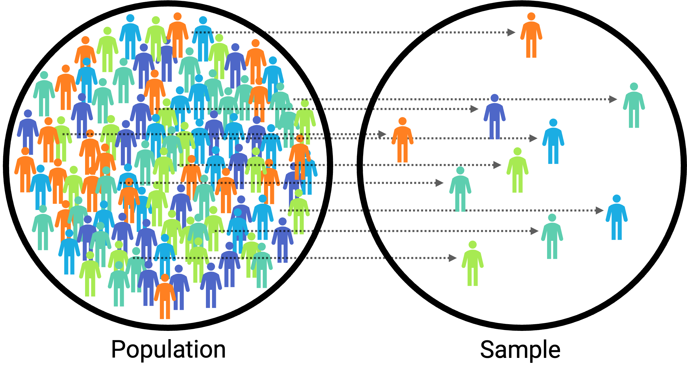

# Sampling

Consider the following three research questions:

1. What is the average number of close friends for American adults?
2. Over the last five years, what is the average time to complete a degree for undergrads in the University of California system?
3. Does a new drug reduce the severity of symptoms in patients with panic disorder?

Each research question refers to a target [population]. In the first question, the target population is all Americans over the age of 18. Oftentimes, it is not feasible to collect data for every case in a population. Collecting data for an entire population is called a [census]. A census is difficult because it is too expensive to collect data for the entire population, but it might also be because it is difficult or impossible to identify the entire population of interest! Instead, a sample is taken. A [sample] is the data you have. Ideally, a sample is a small fraction of the population. For instance, 200 Americans adults in the population might be selected, and this sample data may be used to provide an estimate of the population average and to answer the research question.

```{r sampling, echo = FALSE, out.width='60%', fig.align = 'center', fig.cap='A sample of 10 selected from a population of 100.', fig.alt = 'A circle on the left with 100 human figures. A circle on the right with 10 human figures.'}

```

## Sampling Procedures

:::learningobjectives
##### LEARNING OBJECTIVES {-}
1. Explain the difference between probability and nonprobability sampling.
2. Describe the major types of probability sampling.
:::

Essentially all psychological research involves sampling—selecting a sample to study from the population of interest. Sampling falls into two broad categories. [Probability sampling] occurs when the researcher can specify the probability that each member of the population will be selected for the sample. [Nonprobability sampling] occurs when the researcher cannot specify these probabilities. Most psychological research involves nonprobability sampling. Convenience sampling—studying individuals who happen to be nearby and willing to participate—is a very common form of nonprobability sampling used in psychological research.

Survey researchers, however, are much more likely to use some form of probability sampling. This is because the goal of most survey research is to make accurate estimates about what is true in a particular population, and these estimates are most accurate when based on a probability sample. For example, it is important for survey researchers to base their estimates of election outcomes—which are often decided by only a few percentage points—on probability samples of likely registered voters.

Compared with nonprobability sampling, probability sampling requires a very clear specification of the population, which of course depends on the research questions to be answered. The population might be all registered voters in the state of Arkansas, all American consumers who have purchased a car in the past year, women in the United States over 40 years old who have received a mammogram in the past decade, or all the alumni of a particular university. Once the population has been specified, probability sampling requires a [sampling frame]. This is essentially a list of all the members of the population from which to select the respondents. Sampling frames can come from a variety of sources, including telephone directories, lists of registered voters, and hospital or insurance records. In some cases, a map can serve as a sampling frame, allowing for the selection of cities, streets, or households.

There are a variety of different probability sampling methods. [Simple random sampling] is done in such a way that each individual in the population has an equal probability of being selected for the sample (Figure \@ref(fig:simple)). This could involve putting the names of all individuals in the sampling frame into a hat, mixing them up, and then drawing out the number needed for the sample. Given that most sampling frames take the form of computer files, random sampling is more likely to involve computerized sorting or selection of respondents. A common approach in telephone surveys is random-digit dialing, in which a computer randomly generates phone numbers from among the possible phone numbers within a given geographic area.

```{r simple, echo = FALSE, fig.cap="Example of simple random sampling. Simple random sampling was used to randomly select the 18 cases (denoted with filled-in dots).", fig.width = 10, out.width = "95%", fig.alt = "Box shows a population of dots (i.e., individuals) where a handful of the dots have been sampled randomly."}

set.seed(1)

# _____ Simple Random _____ #
build_srs <- function(n, N) {
  
  plot(0, xlim = c(0,2), ylim = 0:1, type = 'n', axes = FALSE)
  box()
  x   <- runif(N, 0, 2)
  y   <- runif(N)
  inc <- n
  points(x, y)
  
  these <- sample(N, n)
  points(x[these], y[these], pch = 20, cex = .8)
  points(x[these], y[these], cex = 1.4)
}

par_og <- par(no.readonly = TRUE)     # save original par
par(mar = rep(0.5,4), mfrow = c(1,1)) # no margin, 1 figure
build_srs(n = 18, N = 108)            # build figure
par(par_og)                           # restore original par
```

A common alternative to simple random sampling is [stratified random sampling], in which the population is divided into different subgroups or “strata” (usually based on demographic characteristics) and then a random sample is taken from each “stratum" (Figure \@ref(fig:stratified)). Stratified random sampling can be used to select a sample in which the proportion of respondents in each of various subgroups matches the proportion in the population. For example, because about 12.5% of the US population is Black, stratified random sampling can be used to ensure that a survey of 1,000 American adults includes about 125 Black respondents. Stratified random sampling can also be used to sample extra respondents from particularly small subgroups—allowing valid conclusions to be drawn about those subgroups. For example, because Asian Americans make up a fairly small percentage of the US population (about 4.5%), a simple random sample of 1,000 American adults might include too few Asian Americans to draw any conclusions about them as distinct from any other subgroup. If this is important to the research question, however, then stratified random sampling could be used to ensure that enough Asian American respondents are included in the sample to draw valid conclusions about Asian Americans as a whole.

```{r stratified, echo = FALSE, fig.cap="Example of stratified random sampling. Cases were first grouped into strata, or subgroups, then simple random sampling was employed to randomly select 20% of cases within each stratum. The resulting sample reflects the proportion of cases in each subgroup.", fig.width = 10, out.width = "95%", fig.alt = "The box shows the same population of dots but grouped in such a way that there are six strata.  From each stratum 20% of the dots (i.e., individuals) are randomly selected."}

set.seed(14)

# _____ Stratified _____ #
build_stratified <- function(N) {
  
  plot(0, xlim = c(0,2), ylim = 0:1 + 0.01,
       type = 'n', axes = FALSE)
  box()
  X    <- c(0.18, 0.3, 0.68, 1.18, 1.4, 1.74)
  Y    <- c(0.2, 0.78, 0.44, 0.7, 0.25, 0.65)
  locs <- c(1, 4, 5, 3, 6, 2)
  gps  <- list()
  N    <- c(10, 10, 40, 20, 10, 30)
  R    <- sqrt(N/500)
  p    <- matrix(c(12, 2, NA,
                   1,  2, NA,
                   4,  30, NA,
                   19, 1, NA,
                   11, 0, NA,
                   3, 24, NA), 3)
  p     <- round(p * 1.1)
  p[3,] <- N - p[1,] - p[2,]
  above <- c(1, 1, 1, 1, -1, 1)
  for(i in 1:6){
    hold <- seq(0, 2 * pi, length.out = 99)
    x    <- X[i] + (R[i]+0.01)*cos(hold)
    y    <- Y[i] + (R[i]+0.01)*sin(hold)
    polygon(x, y)
    x    <- rep(NA, N[i])
    y    <- rep(NA, N[i])
    for(j in 1:N[i]){
      inside <- FALSE
      while(!inside){
        xx <- runif(1, -R[i], R[i])
        yy <- runif(1, -R[i], R[i])
        if(sqrt(xx^2 + yy^2) < R[i]){
          inside <- TRUE
          x[j]   <- xx
          y[j]   <- yy
        }
      }
    }
    type <- sample(1, N[i], TRUE)
    x    <- X[i]+x
    y    <- Y[i]+y
    points(x, y)
    these  <- sample(N[i], N[i]*.2)
    points(x[these], y[these],
           pch = 20, cex = 0.8)
    points(x[these], y[these], cex = 1.4)
  }
  text(X, Y + above * (R),
       paste("Stratum", 1:6),
       pos = 2 + above,
       cex = 1.3)
}

par_og <- par(no.readonly = TRUE)     # save original par
par(mar = rep(0.5,4), mfrow = c(1,1)) # no margin, 2 figures 
build_stratified(N = 108)             # build figure
par(par_og)                           # restore original par
```

Yet another type of probability sampling is [cluster sampling], in which larger clusters of individuals are randomly sampled and then individuals within each cluster are randomly sampled (Figure \@ref(fig:cluster)). For example, to select a sample of small-town residents in the United States, a researcher might randomly select several small towns and then randomly select several individuals within each town. Cluster sampling is especially useful for surveys that involve face-to-face interviewing because it minimizes the amount of traveling that the interviewers must do. For example, instead of traveling to 200 small towns to interview 200 residents, a research team could travel to 10 small towns and interview 20 residents of each. The National Comorbidity Survey was done using a form of cluster sampling.

```{r cluster, echo = FALSE, fig.cap="Example of cluster sampling. Data were binned into nine clusters, three of these clusters were sampled, and all observations within these three clusters were included in the sample.", fig.width = 10, out.width = "100%", fig.alt = "Dots are grouped into clusters, three clusters are selected, and every dot (i.e., all individuals) from each of the three clusters are sampled."}

set.seed(5)

# _____ Cluster _____ #
build_cluster <- function() {
  plot(0, xlim = c(0, 2), ylim  =  c(0.01, 1.04), type = 'n', axes = FALSE)
  box()
  X    <- c(0.17, 0.19, 0.52, 0.85, 1, 1.22, 1.49, 1.79, 1.85)
  Y    <- c(0.3, 0.75, 0.5, 0.26, 0.73, 0.38, 0.67, 0.3, 0.8)
  locs <- c(1, 4, 5, 3, 6, 2)
  gps  <- list()
  N    <- c(18, 12, 11, 13, 16, 14, 15, 16, 12)
  R    <- sqrt(N/500)
  p    <- matrix(c(6,  8, NA,
                   4,  4, NA,
                   4,  4, NA,
                   5,  4, NA,
                   8,  5, NA,
                   4,  5, NA,
                   5,  9, NA,
                   6,  5, NA,
                   4,  5, NA), 3)
  p[3,] <- N - p[1,] - p[2,]
  above <- c(-1, 1, 1, 1, 1, -1, 1, 1, 1)
  for(i in 1:length(X)){
    hold <- seq(0, 2 * pi, length.out = 99)
    x    <- X[i] + (R[i] + 0.02) * cos(hold)
    y    <- Y[i] + (R[i] + 0.02) * sin(hold)
    polygon(x, y)
    if(i %in% c(3, 4, 8)){
      polygon(x, y, lty = 2, lwd = 3)
    }
    x    <- rep(NA, N[i])
    y    <- rep(NA, N[i])
    for(j in 1:N[i]){
      inside <- FALSE
      while(!inside){
        xx <- runif(1, -R[i], R[i])
        yy <- runif(1, -R[i], R[i])
        if(sqrt(xx^2 + yy^2) < R[i]){
          inside <- TRUE
          x[j]   <- xx
          y[j]   <- yy
        }
      }
    }
    type <- sample(1, N[i], TRUE)
    x    <- X[i]+x
    y    <- Y[i]+y
    points(x, y)
    these  <- sample(N[i], N[i])
    if(i %in% c(3, 4, 8)){
      points(x[these], y[these], pch = 20, cex = 0.8,)
      points(x[these], y[these], cex = 1.4)
      #points(x[these], y[these], pch = 19)
    }
  }
  text(X, Y + above * (R + 0.01),
       paste("Cluster", 1:length(X)),
       pos = 2 + above,
       cex = 1.3)
}

par_og <- par(no.readonly = TRUE)     # save original par
par(mar = rep(0.5,4), mfrow = c(1,1)) # no margin, 2 figures 
build_cluster()                       # build figure
par(par_og)                           # restore original par
```

### Sample Size {-}

How large does a sample need to be? In general, this depends on two factors. One is the level of confidence in the result that the researcher wants. The larger the sample, the less any statistic will be affected by random error that might cause researchers to misestimate the corresponding value in the population. The other factor is the budget of the study. Larger samples provide greater confidence, but they take more time, effort, and money to obtain. In the August 2022 issue of *Psychological Science*, the total sample size for individual studies included 28 participants in a multi-trial lab study [@ohata2022] and 953 in an online study [@Schaumberg2022].

:::fyi
##### Sample Size and Population Size {-}
Why are a samples of 100 to 1,000 considered to be adequate for most survey research—even when the population is much larger than that? Consider, for example, that a sample of only 1,000 registered voters is generally considered a good sample of the roughly 120 million registered voters in the US population—even though it includes only about 0.0008% of the population! The answer is a bit surprising.

One part of the answer is that a statistic based on a larger sample will tend to be closer to the population value and that this can be characterized mathematically. Imagine, for example, that in a sample of registered voters, exactly 50% say they intend to vote for the incumbent. If there are 100 voters in this sample, then there is a 95% chance that the true percentage in the population is between 40 and 60. But if there are 1,000 voters in the sample, then there is a 95% chance that the true percentage in the population is between 47 and 53. Although this “95% confidence interval” continues to shrink as the sample size increases, it does so at a slower rate. For example, if there are 2,000 voters in the sample, then this only reduces the 95% confidence interval to 48 to 52. In many situations, the small increase in confidence beyond a sample size of 1,000 is not considered to be worth the additional time, effort, and money.

Another part of the answer—and perhaps the more surprising part—is that confidence intervals depend only on the size of the sample and not on the size of the population. So a sample of 1,000 would produce a 95% confidence interval of 47 to 53 regardless of whether the population size was a hundred thousand, a million, or a hundred million.
:::

:::takeaways
##### KEY TAKEAWAYS {-}
- Survey research usually involves probability sampling, in which each member of the population has a known probability of being selected for the sample.
- Types of probability sampling include simple random sampling, stratified random sampling, and cluster sampling.
:::

:::exercises
##### EXERCISE {-}
1. Discussion: If possible, identify an appropriate sampling frame for each of the following populations. If there is no appropriate sampling frame, explain why.
    a. students at a particular college or university
    b. adults living in the state of Nevada
    c. households in Little Rock, Arkansas
    d. people with low self-esteem
:::

## Sampling Bias

:::learningobjectives
##### LEARNING OBJECTIVES {-}
1. Define sampling bias in general and nonresponse bias in particular.
2. List some techniques that can be used to increase the response rate and reduce nonresponse bias.
:::

### Sampling Bias and Nonresponse Bias {-}

Probability sampling was developed in large part to address the issue of sampling bias. [Sampling bias] occurs when a sample is selected in such a way that it is not representative of the entire population and therefore produces inaccurate results. This was the reason that the *Literary Digest* straw poll was so far off in its prediction of the 1936 presidential election. The mailing lists used came largely from telephone directories and lists of registered automobile owners, which overrepresented wealthier people, who were more likely to vote for Landon. Gallup was successful because he knew about this bias and found ways to sample less wealthy people as well.

There is one form of sampling bias that even careful random sampling is subject to. It is almost never the case that everyone selected for the sample actually responds to the survey. Some may have died or moved away, and others may decline to participate because they are too busy, are not interested in the survey topic, or do not participate in surveys on principle. If these survey nonresponders differ from survey responders in systematic ways, then this can produce [nonresponse bias]. For example, in a mail survey on alcohol consumption, researcher Vivienne Lahaut and colleagues found that only about half the sample responded after the initial contact and two follow-up reminders [@lahaut2002non]. The danger here is that the half who responded might have different patterns of alcohol consumption than the half who did not, which could lead to inaccurate conclusions on the part of the researchers. So to test for nonresponse bias, the researchers later made unannounced visits to the homes of a subset of the nonresponders—coming back up to five times if they did not find them at home. They found that the original nonresponders included an especially high proportion of abstainers (nondrinkers), which meant that their estimates of alcohol consumption based only on the original responders were too high.

Although there are methods for statistically correcting for nonresponse bias, they are based on assumptions about the nonresponders—for example, that they are more similar to late responders than to early responders—which may not be correct. For this reason, the best approach to minimizing nonresponse bias is to minimize the number of nonresponders—that is, to maximize the response rate. There is a large research literature on the factors that affect survey response rates [@groves2011survey]. In general, in-person interviews have the highest response rates, followed by telephone surveys, and then mail and Internet surveys. Among the other factors that increase response rates are sending potential respondents a short prenotification message informing them that they will be asked to participate in a survey in the near future and sending simple follow-up reminders to nonresponders after a few weeks. The perceived length and complexity of the survey also makes a difference, which is why it is important to keep survey questionnaires as short, simple, and on topic as possible. Finally, offering an incentive—especially cash—is a reliable way to increase response rates.

### Anecdotal Evidence {-}

Consider the following possible responses to the three research questions at the start of this chapter:

1. A popular American YouTuber posted a video revealing that despite his many followers, he doesn't have anyone he could call a real friend, so the average number of close friends for American adults must be very low.
2. I met two students who took more than 7 years to graduate from campuses in the University of California system, so it must take longer to graduate from University of California schools than from many other colleges.
3. My friend’s sister had a severe panic attack after they gave her a new drug, so the drug must not work.

Each conclusion is based on data. However, there are two problems. First, the data only represent one or two cases. Second, and more importantly, it is unclear whether these cases are actually representative of the population. Data collected in this haphazard fashion are called [anecdotal evidence]. Be careful of data collected in a haphazard fashion. Such evidence may be true and verifiable, but it may only represent extraordinary cases and therefore not be a good representation of the population.

```{r snow, echo = FALSE, out.width='35%', fig.align = 'center', fig.cap='In February 2010, some media pundits cited one large snowstorm as evidence against global warming. As comedian Jon Stewart pointed out, “It is one storm, in one region of one country.” *Photo by Flow Clark on Unsplash.*', fig.alt = 'Person walking through a snowy city street.'}
knitr::include_graphics("images/sampling/snow.jpeg")
```

Anecdotal evidence typically is composed of unusual cases that we recall based on their striking characteristics. For instance, we are more likely to remember the two people we met who took 7 years to graduate than the six others who graduated in four years. Instead, of looking at the most unusual cases, we should examine a sample of many cases that better represent the population.

:::takeaways
##### KEY TAKEAWAYS {-}

- Sampling bias occurs when a sample is selected in such a way that it is not representative of the population and therefore produces inaccurate results.
- The most pervasive form of sampling bias is nonresponse bias, which occurs when people who do not respond to the survey differ in important ways from people who do respond.
- The best way to minimize nonresponse bias is to maximize the response rate by prenotifying respondents, sending them reminders, constructing questionnaires that are short and easy to complete, and offering incentives.
:::

:::exercises
##### EXERCISES {-}

1. Discussion: We can easily access ratings for products, sellers, and companies through websites. These ratings are based only on those people who go out of their way to provide a rating. If 50% of online reviews for a product are negative, do you think this means that 50% of buyers are dissatisfied with the product? Why or why not?
:::

## Glossary

##### anecdotal evidence {-}

Evidence collected in an casual or unsystematic way.

##### census {-}

A research approach in which all members of a population are part of the sample.

##### cluster sampling {-}

Sampling where larger clusters of individuals (e.g., cities, households) are sampled first and then individuals are sampled from these clusters.

##### context effect {-}

An unintended effect of the context in which a response is made. In within-subjects experiments, this can be an effect of being tested in one condition on how participants perceive stimuli or interpret their task and therefore how they respond in later conditions. In survey research, this can be an effect of the surrounding items or the response scale on responses to a particular item.

##### nonprobability sampling {-}

An approach to sampling in which the researcher cannot specify the probability that each member of the population will be selected. Convenience sampling is an example.

##### nonresponse bias {-}

A type of sampling bias in which those who do not respond to the survey differ systematically from those who do, producing misleading results.

##### population {-}

The entire group of individuals that the researcher wants to draw conclusions about.

##### probability sampling {-}

An approach to sampling in which the researcher can specify the probability that each member of the population will be selected.

##### sample {-}

The subset of individuals that the researcher actually studies.

##### sampling {-}

The process of selecting a sample from a population.

##### sampling bias {-}

Occurs when a sample is selected in such a way that it is not representative of the entire population and therefore produces inaccurate results.

##### sampling frame {-}

A list of all the members of the population, from which the actual sample is selected.

##### simple random sampling {-}

Sampling where each member of the population has an equal probability of being selected.

##### stratified random sampling {-}

Sampling where the population is first divided into different subgroups or strata and a separate random sample is selected from each stratum.