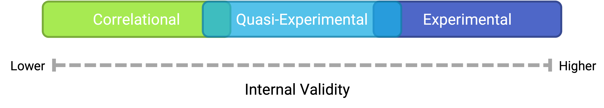
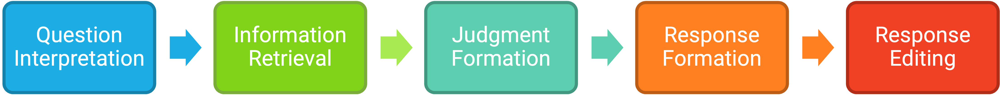
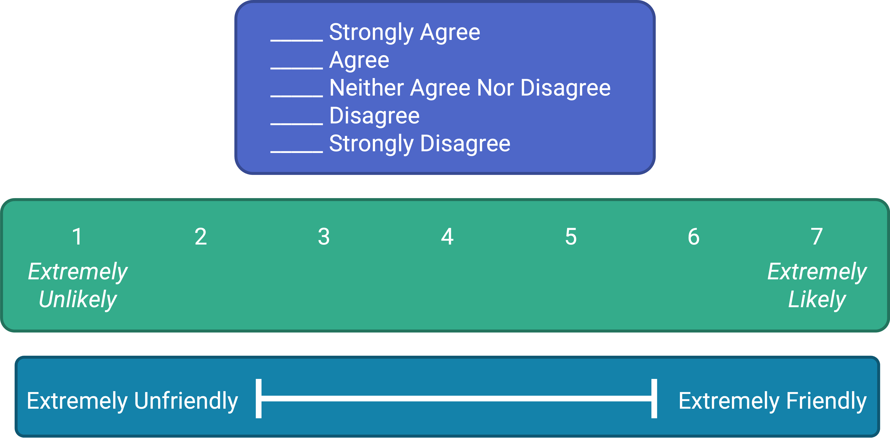

# Nonexperimental Research

What do the following classic studies have in common?

- Stanley Milgram found that about two thirds of his research participants were willing to administer dangerous shocks to another person just because they were told to by an authority figure [@milgram1963behavioral].
- Elizabeth Loftus and Jacqueline Pickrell showed that it is relatively easy to “implant” false memories in people by repeatedly asking them about childhood events that did not actually happen to them [@loftus1995formation].
- John Cacioppo and Richard Petty evaluated the validity of their Need for Cognition Scale—a measure of the extent to which people like and value thinking—by comparing the scores of college professors with those of factory workers [@cacioppo1982need].
- David Rosenhan found that confederates who went to psychiatric hospitals claiming to have heard voices saying things like “empty” and “thud” were labeled as schizophrenic by the hospital staff and kept there even though they behaved normally in all other ways [@rosenhan1973being].

The answer for purposes of this chapter is that they are not experiments. In this chapter we look more closely at nonexperimental research. We begin with a general definition of nonexperimental research, along with a discussion of when and why nonexperimental research is more appropriate than experimental research. We then look separately at three important types of nonexperimental research: correlational research, quasi-experimental research, and qualitative research.

## Overview of Nonexperimental Research

:::learningobjectives
##### LEARNING OBJECTIVES {-}
1. Define nonexperimental research, distinguish it clearly from experimental research, and give several examples.
2. Explain when a researcher might choose to conduct nonexperimental research as opposed to experimental research.
:::

### What Is Nonexperimental Research? {-}
[Nonexperimental research] is research that lacks the manipulation of an independent variable, random assignment of participants to conditions or orders of conditions, or both.

In a sense, it is unfair to define this large and diverse set of approaches collectively by what they are *not*. But doing so reflects the fact that most researchers in psychology consider the distinction between experimental and nonexperimental research to be an extremely important one. This is because while experimental research can provide strong evidence that changes in an independent variable cause differences in a dependent variable, nonexperimental research generally cannot. As we will see, however, this does not mean that nonexperimental research is less important than experimental research or inferior to it in any general sense.

### When to Use Nonexperimental Research {-}

As we saw in the chapter on experimental research, experimental research is appropriate when the researcher has a specific research question or hypothesis about a causal relationship between two variables—and it is possible, feasible, and ethical to manipulate the independent variable and randomly assign participants to conditions or to orders of conditions. It stands to reason, therefore, that nonexperimental research is appropriate—even necessary—when these conditions are not met. There are many ways in which this can be the case.

- The research question or hypothesis can be about a single variable rather than a statistical relationship between two variables (e.g., How accurate are people’s first impressions?).
- The research question can be about a noncausal statistical relationship between variables (e.g., Is there a correlation between verbal intelligence and mathematical intelligence?).
- The research question can be about a causal relationship, but the independent variable cannot be manipulated or participants cannot be randomly assigned to conditions or orders of conditions (e.g., Does damage to a person’s hippocampus impair the formation of long-term memory traces?).
- The research question can be broad and exploratory, or it can be about what it is like to have a particular experience (e.g., What is it like to be a working mother diagnosed with depression?).

Again, the choice between the experimental and nonexperimental approaches is generally dictated by the nature of the research question. If it is about a causal relationship and involves an independent variable that can be manipulated, the experimental approach is typically preferred. Otherwise, the nonexperimental approach is preferred. But the two approaches can also be used to address the same research question in complementary ways. For example, nonexperimental studies establishing that there is a relationship between watching violent television and aggressive behavior have been complemented by experimental studies confirming that the relationship is a causal one [@bushman2001effects]. Similarly, after his original study, Milgram conducted experiments to explore the factors that affect obedience. He manipulated several independent variables, such as the distance between the experimenter and the participant, the participant and the confederate, and the location of the study [@milgram1964obedience].

### Types of Nonexperimental Research {-}

Nonexperimental research falls into three broad categories: single-variable research, correlational and quasi-experimental research, and qualitative research. First, research can be nonexperimental because it focuses on a single variable rather than a statistical relationship between two variables. Although there is no widely shared term for this kind of research, we will call it [single-variable research]. Milgram’s original obedience study was nonexperimental in this way. He was primarily interested in one variable—the extent to which participants obeyed the researcher when he told them to shock the confederate—and he observed all participants performing the same task under the same conditions. The study by Loftus and Pickrell described at the beginning of this chapter is also a good example of single-variable research. The variable was whether participants “remembered” having experienced mildly traumatic childhood events (e.g., getting lost in a shopping mall) that they had not actually experienced but that the research asked them about repeatedly. In this particular study, nearly a third of the participants “remembered” at least one event. (As with Milgram’s original study, this study inspired several later experiments on the factors that affect false memories.)

As these examples make clear, single-variable research can answer interesting and important questions. What it cannot do, however, is answer questions about statistical relationships between variables. This is a point that beginning researchers sometimes miss. Imagine, for example, a group of research methods students interested in the relationship between children’s being the victim of bullying and the children’s self-esteem. The first thing that is likely to occur to these researchers is to obtain a sample of middle-school students who have been bullied and then to measure their self-esteem. But this would be a single-variable study with self-esteem as the only variable. Although it would tell the researchers something about the self-esteem of children who have been bullied, it would not tell them what they really want to know, which is how the self-esteem of children who have been bullied *compares* with the self-esteem of children who have not. Is it lower? Is it the same? Could it even be higher? To answer this question, their sample would also have to include middle-school students who have not been bullied.

Research can also be nonexperimental because it focuses on a statistical relationship between two variables but does not include the manipulation of an independent variable, random assignment of participants to conditions or orders of conditions, or both. This kind of research takes two basic forms: correlational research and quasi-experimental research. In [correlational research], the researcher measures the two variables of interest with little or no attempt to control extraneous variables and then assesses the relationship between them. A research methods student who finds out whether each of several middle-school students has been bullied and then measures each student’s self-esteem is conducting correlational research. In [quasi-experimental research], the researcher manipulates an independent variable but does not randomly assign participants to conditions or orders of conditions. For example, a researcher might start an antibullying program (a kind of treatment) at one school and compare the incidence of bullying at that school with the incidence at a similar school that has no antibullying program.

The final way in which research can be nonexperimental is that it can be qualitative. The types of research we have discussed so far are all quantitative, referring to the fact that the data consist of numbers that are analyzed using statistical techniques. In [qualitative research], the data are usually nonnumerical and are analyzed using nonstatistical techniques. Rosenhan’s study of the experience of people in a psychiatric ward was primarily qualitative. The data were the notes taken by the “pseudopatients”—the people pretending to have heard voices—along with their hospital records. Rosenhan’s analysis consists mainly of a written description of the experiences of the pseudopatients, supported by several concrete examples. To illustrate the hospital staff’s tendency to “depersonalize” their patients, he noted, “Upon being admitted, I and other pseudopatients took the initial physical examinations in a semipublic room, where staff members went about their own business as if we were not there” [@rosenhan1973being, p. 256].

### Internal Validity Revisited {-}

Recall that internal validity is the extent to which the design of a study supports the conclusion that changes in the independent variable caused any observed differences in the dependent variable. Figure \@ref(fig:validity) shows how experimental, quasi-experimental, and correlational research vary in terms of internal validity. Experimental research tends to be highest because it addresses the directionality and third-variable problems through manipulation and the control of extraneous variables through random assignment. If the average score on the dependent variable in an experiment differs across conditions, it is quite likely that the independent variable is responsible for that difference. Correlational research is lowest because it fails to address either problem. If the average score on the dependent variable differs across levels of the independent variable, it could be that the independent variable is responsible, but there are other interpretations. In some situations, the direction of causality could be reversed. In others, there could be a third variable that is causing differences in both the independent and dependent variables. Quasi-experimental research is in the middle because the manipulation of the independent variable addresses some problems, but the lack of random assignment and experimental control fails to address others. Imagine, for example, that a researcher finds two similar schools, starts an antibullying program in one, and then finds fewer bullying incidents in that “treatment school” than in the “control school.” There is no directionality problem because clearly the number of bullying incidents did not determine which school got the program. However, the lack of random assignment of children to schools could still mean that students in the treatment school differed from students in the control school in some other way that could explain the difference in bullying.

```{r validity, echo = FALSE, out.width='90%', fig.align = 'center', fig.cap='Experiments are generally high in internal validity, quasi-experiments lower, and correlational studies lower still.', fig.alt = 'Three overlapping rectangles. From left to right, they are labeled Correlational, Quasi-Experimental, and Experimental. The rectangles are over a continuum from lower internal validity on the left to higher internal validity on the right.'}

```

Notice also in Figure \@ref(fig:validity) that there is some overlap in the internal validity of experiments, quasi-experiments, and correlational studies. For example, a poorly designed experiment that includes many confounding variables can be lower in internal validity than a well designed quasi-experiment with no obvious confounding variables.

:::takeaways
##### KEY TAKEAWAYS {-}
- Nonexperimental research is research that lacks the manipulation of an independent variable, control of extraneous variables through random assignment, or both.
- There are three broad types of nonexperimental research. Single-variable research focuses on a single variable rather than a relationship between variables. Correlational and quasi-experimental research focus on a statistical relationship but lack manipulation or random assignment. Qualitative research focuses on broader research questions, typically involves collecting large amounts of data from a small number of participants, and analyzes the data nonstatistically.
- In general, experimental research is high in internal validity, correlational research is low in internal validity, and quasi-experimental research is in between.
:::

:::exercises
##### EXERCISE {-}
1. Discussion: For each of the following studies, decide which type of research design it is and explain why.
    a. A researcher conducts detailed interviews with unmarried teenage fathers to learn about how they feel and what they think about their role as fathers and summarizes their feelings in a written narrative.
    b. A researcher measures the impulsivity of a large sample of drivers and looks at the statistical relationship between this variable and the number of traffic tickets the drivers have received.
    c. A researcher randomly assigns patients with low back pain either to a treatment involving hypnosis or to a treatment involving exercise. She then measures their level of low back pain after 3 months.
    d. A college instructor gives weekly quizzes to students in one section of his course but no weekly quizzes to students in another section to see whether this has an effect on their test performance.
:::

## Correlational Research

:::learningobjectives
##### LEARNING OBJECTIVES {-}

1. Define correlational research and give several examples.
2. Explain why a researcher might choose to conduct correlational research rather than experimental research or another type of nonexperimental research.
:::

### What Is Correlational Research? {-}
Correlational research is a type of nonexperimental research in which the researcher measures two variables and assesses the statistical relationship (i.e., the correlation) between them with little or no effort to control extraneous variables. There are essentially two reasons that researchers interested in statistical relationships between variables would choose to conduct a correlational study rather than an experiment. The first is that they do not believe that the statistical relationship is a causal one. For example, a researcher might evaluate the validity of a brief extraversion test by administering it to a large group of participants along with a longer extraversion test that has already been shown to be valid. This researcher might then check to see whether participants’ scores on the brief test are strongly correlated with their scores on the longer one. Neither test score is thought to cause the other, so there is no independent variable to manipulate. In fact, the terms *independent variable* and *dependent variable* do not apply to this kind of research.

The other reason that researchers would choose to use a correlational study rather than an experiment is that the statistical relationship of interest is thought to be causal, but the researcher cannot manipulate the independent variable because it is impossible, impractical, or unethical. For example, Allen Kanner and his colleagues thought that the number of “daily hassles” (e.g., rude salespeople, heavy traffic) that people experience affects the number of physical and psychological symptoms they have [@kanner1981comparison]. But because they could not manipulate the number of daily hassles their participants experienced, they had to settle for measuring the number of daily hassles—along with the number of symptoms—using self-report questionnaires. Although the strong positive relationship they found between these two variables is consistent with their idea that hassles cause symptoms, it is also consistent with the idea that symptoms cause hassles or that some third variable (e.g., neuroticism) causes both.

A common misconception among beginning researchers is that correlational research must involve two quantitative variables, such as scores on two extraversion tests or the number of hassles and number of symptoms people have experienced. However, the defining feature of correlational research is that the two variables are measured—neither one is manipulated—and this is true regardless of whether the variables are quantitative or categorical. Imagine, for example, that a researcher administers the Rosenberg Self-Esteem Scale to 50 American college students and 50 Japanese college students. Although this “feels” like a between-subjects experiment, it is a correlational study because the researcher did not manipulate the students’ nationalities. The same is true of the study by Cacioppo and Petty comparing college faculty and factory workers in terms of their need for cognition. It is a correlational study because the researchers did not manipulate the participants’ occupations.

Figure \@ref(fig:todo) shows data from a hypothetical study on the relationship between whether people make a daily list of things to do (a “to-do list”) and stress. Notice that it is unclear whether this is an experiment or a correlational study because it is unclear whether the independent variable was manipulated. If the researcher randomly assigned some participants to make daily to-do lists and others not to, then it is an experiment. If the researcher simply asked participants whether they made daily to-do lists, then it is a correlational study. The distinction is important because if the study was an experiment, then it could be concluded that making the daily to-do lists reduced participants’ stress. But if it was a correlational study, it could only be concluded that these variables are statistically related. Perhaps being stressed has a negative effect on people’s ability to plan ahead (the directionality problem). Or perhaps people who are more conscientious are more likely to make to-do lists and less likely to be stressed (the third-variable problem). The crucial point is that what defines a study as experimental or correlational is not the variables being studied, nor whether the variables are quantitative or categorical, nor the type of graph or statistics used to analyze the data. It is how the study is conducted.

```{r todo, echo = FALSE, out.width='80%', fig.align = 'center', fig.cap='Results of a hypothetical study on whether people who make daily to-do lists experience less stress than people who do not make such lists.'}
stress <- c(18,25)

barplot(stress, names.arg = c("Yes","No"), col = c("#1BADE3","#F14124"), xlab = "Daily To-Do List?", axis.lty=1, ylab = "Stress", ylim = c(0,30))
```

### Data Collection in Correlational Research {-}

Again, the defining feature of correlational research is that neither variable is manipulated. It does not matter how or where the variables are measured. A researcher could have participants come to a laboratory to complete a computerized backward digit span task and a computerized risky decision-making task and then assess the relationship between participants’ scores on the two tasks. Or a researcher could go to a shopping mall to ask people about their attitudes toward the environment and their shopping habits and then assess the relationship between these two variables. Both of these studies would be correlational because no independent variable is manipulated. However, because some approaches to data collection are strongly associated with correlational research, it makes sense to discuss them here. The two we will focus on are naturalistic observation and archival data. A third, survey research, is discussed in its own chapter.

#### Naturalistic Observation {-}

[Naturalistic observation] is an approach to data collection that involves observing people’s behavior in the environment in which it typically occurs. Thus naturalistic observation is a type of field research (as opposed to a type of laboratory research). It could involve observing shoppers in a grocery store, children on a school playground, or psychiatric inpatients in their wards. Researchers engaged in naturalistic observation usually make their observations as unobtrusively as possible so that participants are often not aware that they are being studied. Ethically, this is considered to be acceptable if the participants remain anonymous and the behavior occurs in a public setting where people would not normally have an expectation of privacy. Grocery shoppers putting items into their shopping carts, for example, are engaged in public behavior that is easily observable by store employees and other shoppers. For this reason, most researchers would consider it ethically acceptable to observe them for a study. On the other hand, one of the arguments against the ethicality of the naturalistic observation of “bathroom behavior” discussed earlier in the book is that people have a reasonable expectation of privacy even in a public restroom and that this expectation was violated.

Researchers Robert Levine and Ara Norenzayan used naturalistic observation to study differences in the “pace of life” across countries [@levine1999pace]. One of their measures involved observing pedestrians in a large city to see how long it took them to walk 60 feet. They found that people in some countries walked reliably faster than people in other countries. For example, people in the United States and Japan covered 60 feet in about 12 seconds on average, while people in Brazil and Romania took close to 17 seconds.

Because naturalistic observation takes place in the complex and even chaotic “real world,” there are two closely related issues that researchers must deal with before collecting data. The first is sampling. When, where, and under what conditions will the observations be made, and who exactly will be observed? Levine and Norenzayan described their sampling process as follows:

Male and female walking speed over a distance of 60 feet was measured in at least two locations in main downtown areas in each city. Measurements were taken during main business hours on clear summer days. All locations were flat, unobstructed, had broad sidewalks, and were sufficiently uncrowded to allow pedestrians to move at potentially maximum speeds. To control for the effects of socializing, only pedestrians walking alone were used. Children, individuals with obvious physical handicaps, and window-shoppers were not timed. Thirty-five men and 35 women were timed in most cities. (p. 186)

Precise specification of the sampling process in this way makes data collection manageable for the observers, and it also provides some control over important extraneous variables. For example, by making their observations on clear summer days in all countries, Levine and Norenzayan controlled for effects of the weather on people’s walking speeds.

The second issue is measurement. What specific behaviors will be observed? In Levine and Norenzayan’s study, measurement was relatively straightforward. They simply measured out a 60-foot distance along a city sidewalk and then used a stopwatch to time participants as they walked over that distance. Often, however, the behaviors of interest are not so obvious or objective. For example, researchers Robert Kraut and Robert Johnston wanted to study bowlers’ reactions to their shots, both when they were facing the pins and then when they turned toward their companions [@kraut1979social]. But what “reactions” should they observe? Based on previous research and their own pilot testing, Kraut and Johnston created a list of reactions that included “closed smile,” “open smile,” “laugh,” “neutral face,” “look down,” “look away,” and “face cover” (covering one’s face with one’s hands). The observers committed this list to memory and then practiced by coding the reactions of bowlers who had been videotaped. During the actual study, the observers spoke into an audio recorder, describing the reactions they observed. Among the most interesting results of this study was that bowlers rarely smiled while they still faced the pins. They were much more likely to smile after they turned toward their companions, suggesting that smiling is not purely an expression of happiness but also a form of social communication.

```{r bowl, echo = FALSE, out.width='50%', fig.align = 'center', fig.cap='Naturalistic observation has revealed that bowlers tend to smile when they turn away from the pins and toward their companions, suggesting that smiling is not purely an expression of happiness but also a form of social communication. *Photo by José Juan Rosa on Unsplash.*', fig.alt = 'A person with short hair in a striped yellow shirt looks down the lane of a bowling alley, presumably having just bowled.'}
knitr::include_graphics("images/nonexperiments/bowl.jpeg")
```

When the observations require a judgment on the part of the observers—as in Kraut and Johnston’s study—this process is often described as [coding]. Coding generally requires clearly defining a set of target behaviors. The observers then categorize participants individually in terms of which behavior they have engaged in and the number of times they engaged in each behavior. The observers might even record the duration of each behavior. The target behaviors must be defined in such a way that different observers code them in the same way. This is the issue of interrater reliability. Researchers are expected to demonstrate the interrater reliability of their coding procedure by having multiple raters code the same behaviors independently and then showing that the different observers are in close agreement. Kraut and Johnston, for example, video recorded a subset of their participants’ reactions and had two observers independently code them. The two observers showed that they agreed on the reactions that were exhibited 97% of the time, indicating good interrater reliability.

#### Archival Data {-}

Another approach to correlational research is the use of [archival data], which are data that have already been collected for some other purpose. An example is a study by Brett Pelham and his colleagues on “implicit egotism”—the tendency for people to prefer people, places, and things that are similar to themselves [@pelham2005implicit]. In one study, they examined Social Security records to show that women with the names Virginia, Georgia, Louise, and Florence were especially likely to have moved to the states of Virginia, Georgia, Louisiana, and Florida, respectively.

As with naturalistic observation, measurement can be more or less straightforward when working with archival data. For example, counting the number of people named Virginia who live in various states based on Social Security records is relatively straightforward. But consider a study by Christopher Peterson and his colleagues on the relationship between optimism and health using data that had been collected many years before for a study on adult development [@peterson1988pessimistic]. In the 1940s, healthy male college students had completed an open-ended questionnaire about difficult wartime experiences. In the late 1980s, Peterson and his colleagues reviewed the men’s questionnaire responses to obtain a measure of explanatory style—their habitual ways of explaining bad events that happen to them. More pessimistic people tend to blame themselves and expect long-term negative consequences that affect many aspects of their lives, while more optimistic people tend to blame outside forces and expect limited negative consequences. To obtain a measure of explanatory style for each participant, the researchers used a procedure in which all negative events mentioned in the questionnaire responses, and any causal explanations for them, were identified and written on index cards. These were given to a separate group of raters who rated each explanation in terms of three separate dimensions of optimism-pessimism. These ratings were then averaged to produce an explanatory style score for each participant. The researchers then assessed the statistical relationship between the men’s explanatory style as college students and archival measures of their health at approximately 60 years of age. The primary result was that the more optimistic the men were as college students, the healthier they were as older men. Pearson’s r was +.25.

This is an example of [content analysis]—a family of systematic approaches to measurement using complex archival data. Just as naturalistic observation requires specifying the behaviors of interest and then noting them as they occur, content analysis requires specifying keywords, phrases, or ideas and then finding all occurrences of them in the data. These occurrences can then be counted, timed (e.g., the amount of time devoted to entertainment topics on the nightly news show), or analyzed in a variety of other ways.

:::takeaways
##### KEY TAKEAWAYS {-}

- Correlational research involves measuring two variables and assessing the relationship between them, with no manipulation of an independent variable.
- Correlational research is not defined by where or how the data are collected. However, some approaches to data collection are strongly associated with correlational research. These include naturalistic observation (in which researchers observe people’s behavior in the context in which it normally occurs) and the use of archival data that were already collected for some other purpose.
:::

:::exercises
##### EXERCISE {-}

1. Discussion: For each of the following, decide whether it is most likely that the study described is experimental or correlational and explain why.
    a. An educational researcher compares the academic performance of students from the “rich” side of town with that of students from the “poor” side of town.
    b. A cognitive psychologist compares the ability of people to recall words that they were instructed to “read” with their ability to recall words that they were instructed to “imagine.”
    c. A manager studies the correlation between new employees’ college grade point averages and their first-year performance reports.
    d. An automotive engineer installs different stick shifts in a new car prototype, each time asking several people to rate how comfortable the stick shift feels.
    e. A food scientist studies the relationship between the temperature inside people’s refrigerators and the amount of bacteria on their food.
    f. A social psychologist tells some research participants that they need to hurry over to the next building to complete a study. She tells others that they can take their time. Then she observes whether they stop to help a research assistant who is pretending to be hurt.
:::

## Survey Research
:::learningobjectives
##### LEARNING OBJECTIVES {-}
1. Define what survey research is, including its two important characteristics.
2. Describe several different ways that survey research can be used and give some examples.
3. Describe the cognitive processes involved in responding to a survey item.
4. Explain what a context effect is and give some examples.
5. Create a simple survey questionnaire based on principles of effective item writing and organization.
6. List the four major ways to conduct a survey along with some pros and cons of each.
:::

Shortly after the terrorist attacks in New York City and Washington, DC, in September of 2001, researcher Jennifer Lerner and her colleagues conducted an Internet-based survey of nearly 2,000 American teens and adults ranging in age from 13 to 88 [@lerner2003effects]. They asked participants about their reactions to the attacks and for their judgments of various terrorism-related and other risks. Among the results were that the participants tended to overestimate most risks, that females did so more than males, and that there were no differences between teens and adults. The most interesting result, however, had to do with the fact that some participants were “primed” to feel anger by asking them what made them angry about the attacks and by presenting them with a photograph and audio clip intended to evoke anger. Others were primed to feel fear by asking them what made them fearful about the attacks and by presenting them with a photograph and audio clip intended to evoke fear. As the researchers hypothesized, the participants who were primed to feel anger perceived less risk than the participants who had been primed to feel fear—showing how risk perceptions are strongly tied to specific emotions.

The study by Lerner and her colleagues is an example of survey research in psychology—the topic of this chapter. We begin with an overview of survey research, including its definition, some history, and a bit about who conducts it and why. We then look at survey responding as a psychological process and the implications of this for constructing good survey questionnaires. Finally, we consider some issues related to actually conducting survey research, including sampling the participants and collecting the data.

### What Is Survey Research? {-}

[Survey research] is a quantitative approach that has two important characteristics. First, the variables of interest are measured using self-reports. In essence, survey researchers ask their participants (who are often called [respondents](#respondent) in survey research) to report directly on their own thoughts, feelings, and behaviors. Second, considerable attention is paid to the issue of sampling. In particular, survey researchers have a strong preference for large random samples because they provide the most accurate estimates of what is true in the population. In fact, survey research may be the only approach in psychology in which random sampling is routinely used. Beyond these two characteristics, almost anything goes in survey research. Surveys can be long or short. They can be conducted in person, by telephone, through the mail, or over the Internet. They can be about voting intentions, consumer preferences, social attitudes, health, or anything else that it is possible to ask people about and receive meaningful answers.

Most survey research is nonexperimental. It is used to describe single variables (e.g., the percentage of voters who prefer one presidential candidate or another, the prevalence of schizophrenia in the general population) and also to assess statistical relationships between variables (e.g., the relationship between income and health). But surveys can also be experimental. The study by Lerner and her colleagues is a good example. Their use of self-report measures and a large national sample identifies their work as survey research. But their manipulation of an independent variable (anger vs. fear) to assess its effect on a dependent variable (risk judgments) also identifies their work as experimental.

#### History and Uses of Survey Research {-}

Survey research may have its roots in English and American “social surveys” conducted around the turn of the 20th century by researchers and reformers who wanted to document the extent of social problems such as poverty [@converse2017survey]. By the 1930s, the US government was conducting surveys to document economic and social conditions in the country. The need to draw conclusions about the entire population helped spur advances in sampling procedures. At about the same time, several researchers who had already made a name for themselves in market research, studying consumer preferences for American businesses, turned their attention to election polling. A watershed event was the presidential election of 1936 between Alf Landon and Franklin Roosevelt. A magazine called *Literary Digest* conducted a survey by sending ballots (which were also subscription requests) to millions of Americans. Based on this “straw poll,” the editors predicted that Landon would win in a landslide. At the same time, the new pollsters were using scientific methods with much smaller samples to predict just the opposite—that Roosevelt would win in a landslide. In fact, one of them, George Gallup, publicly criticized the methods of *Literary Digest* before the election and all but guaranteed that his prediction would be correct. And of course it was. (We will consider the reasons that Gallup was right later in this chapter.)

From market research and election polling, survey research made its way into several academic fields, including political science, sociology, and public health—where it continues to be one of the primary approaches to collecting new data. Beginning in the 1930s, psychologists made important advances in questionnaire design, including techniques that are still used today, such as the Likert scale. (See “What Is a Likert Scale?” in Section \@ref(Constructing Survey Questionnaires) Survey research has a strong historical association with the social psychological study of attitudes, stereotypes, and prejudice. Early attitude researchers were also among the first psychologists to seek larger and more diverse samples than the convenience samples of college students that were routinely used in psychology (and still are).

Survey research continues to be important in psychology today. For example, survey data have been instrumental in estimating the prevalence of various mental disorders and identifying statistical relationships among those disorders and with various other factors. The National Comorbidity Survey is a large-scale mental health survey conducted in the United States (more [here](https://www.hcp.med.harvard.edu/ncs/)). In just one part of this survey, nearly 10,000 adults were given a structured mental health interview in their homes in 2002 and 2003. Table \@ref(tab:comorbidity) presents results on the lifetime prevalence of some anxiety, mood, and substance use disorders. Obviously, this kind of information can be of great use both to basic researchers seeking to understand the causes and correlates of mental disorders and also to clinicians and policymakers who need to understand exactly how common these disorders are.

```{r comorbidity, echo = FALSE, }
disorder <- c("Generalized anxiety disorder","Obsessive-compulsive disorder","Major depressive disorder","Bipolar disorder","Alcohol abuse","Drug abuse")
total <- c(5.7,2.3,16.9,4.4,13.2,8.0)
female <- c(7.1,3.1,20.2,4.5,7.5,4.8)
male <- c(4.2,1.6,13.2,4.3,19.6,11.6)
comorbidity <- data.frame(disorder,total,female,male)

knitr::kable(comorbidity,
  col.name=c("Disorder","Total","Female","Male"), caption = 'Some lifetime prevalence results from the National Comorbidity Survey. The lifetime prevalence of a disorder is the percentage of people in the population that develop that disorder at any time in their lives.')
```

And as the opening example makes clear, survey research can even be used to conduct experiments to test specific hypotheses about causal relationships between variables. Such studies, when conducted on large and diverse samples, can be a useful supplement to laboratory studies conducted on college students. Although this is not a typical use of survey research, it certainly illustrates the flexibility of this approach.

### Constructing Survey Questionnaires

The heart of any survey research project is the survey questionnaire itself. Although it is easy to think of interesting questions to ask people, constructing a good survey questionnaire is not easy at all. The problem is that the answers people give can be influenced in unintended ways by the wording of the items, the order of the items, the response options provided, and many other factors. At best, these influences add noise to the data. At worst, they result in systematic biases and misleading results. In this section, therefore, we consider some principles for constructing survey questionnaires to minimize these unintended effects and thereby maximize the reliability and validity of respondents’ answers.

#### Survey Responding as a Psychological Process {-}

Before looking at specific principles of survey questionnaire construction, it will help to consider survey responding as a psychological process.

Figure \@ref(fig:cogsurvey) presents a model of the cognitive processes that people engage in when responding to a survey item [@sudman1996thinking]. Respondents must interpret the question, retrieve relevant information from memory, form a tentative judgment, convert the tentative judgment into one of the response options provided (e.g., a rating on a 1-to-7 scale), and finally edit their response as necessary.

```{r cogsurvey, echo = FALSE, out.width='95%', fig.align = 'center', fig.cap='Model of the cognitive processes inolved in responding to a survey item.'}

```

Consider, for example, the following questionnaire item:

> How many alcoholic drinks do you consume in a typical day?
>  
> _____ a lot more than average  
> _____ somewhat more than average  
> _____ average  
> _____ somewhat fewer than average  
> _____ a lot fewer than average

Although this item at first seems straightforward, it poses several difficulties for respondents. First, they must interpret the question. For example, they must decide whether “alcoholic drinks” include beer and wine (as opposed to just hard liquor) and whether a “typical day” is a typical weekday, typical weekend day, or both. Once they have interpreted the question, they must retrieve relevant information from memory to answer it. But what information should they retrieve, and how should they go about retrieving it? They might think vaguely about some recent occasions on which they drank alcohol, they might carefully try to recall and count the number of alcoholic drinks they consumed last week, or they might retrieve some existing beliefs that they have about themselves (e.g., “I am not much of a drinker”). Then they must use this information to arrive at a tentative judgment about how many alcoholic drinks they consume in a typical day. For example, this might mean dividing the number of alcoholic drinks they consumed last week by seven to come up with an average number per day. Then they must format this tentative answer in terms of the response options actually provided. In this case, the options pose additional problems of interpretation. For example, what does “average” mean, and what would count as “somewhat more” than average? Finally, they must decide whether they want to report the response they have come up with or whether they want to edit it in some way. For example, if they believe that they drink much more than average, they might not want to report this for fear of looking bad in the eyes of the researcher.

From this perspective, what at first appears to be a simple matter of asking people how much they drink (and receiving a straightforward answer from them) turns out to be much more complex.

##### Context Effects on Questionnaire Responses {-}

Again, this complexity can lead to unintended influences on respondents’ answers. These are often referred to as [context effects](#context-effect) because they are not related to the content of the item but to the context in which the item appears [@schwarz1991context]. For example, there is an [item-order effect] when the order in which the items are presented affects people’s responses. One item can change how participants interpret a later item or change the information that they retrieve to respond to later items. For example, researcher Fritz Strack and his colleagues asked college students about both their general life satisfaction and their dating frequency [@strack1988priming]. When the life satisfaction item came first, the correlation between the two was only −.12, suggesting that the two variables are only weakly related. But when the dating frequency item came first, the correlation between the two was +.66, suggesting that those who date more have a strong tendency to be more satisfied with their lives. Reporting the dating frequency first made that information more accessible in memory so that they were more likely to base their life satisfaction rating on it.

The response options provided can also have unintended effects on people’s responses [@schwarz1999self]. For example, when people are asked how often they are “really irritated” and given response options ranging from “less than once a year” to “more than once a month,” they tend to think of major irritations and report being irritated infrequently. But when they are given response options ranging from “less than once a day” to “several times a month,” they tend to think of minor irritations and report being irritated frequently. People also tend to assume that middle response options represent what is normal or typical. So if they think of themselves as normal or typical, they tend to choose middle response options. For example, people are likely to report watching more television when the response options are centered on a middle option of 4 hours than when centered on a middle option of 2 hours.

### Writing Survey Questionnaire Items {-}

#### Types of Items {-}

Questionnaire items can be either open-ended or closed-ended. [Open-ended items](#open-ended-item) simply ask a question and allow participants to answer in whatever way they choose. The following are examples of open-ended questionnaire items.

> What is the most important thing to teach children to prepare them for life?

> Please describe a time when you were discriminated against because of your age.

> Is there anything else you would like to tell us about?

Open-ended items are useful when researchers do not know how participants might respond or want to avoid influencing their responses. They tend to be used when researchers have more vaguely defined research questions—often in the early stages of a research project. Open-ended items are relatively easy to write because there are no response options to worry about. However, they take more time and effort on the part of participants, and they are more difficult for the researcher to analyze because the answers must be transcribed, coded, and submitted to some form of content analysis.

[Closed-ended items](#closed-ended item) ask a question and provide a set of response options for participants to choose from. The alcohol item just mentioned is an example, as are the following:

> How old are you?
> 
> _____ Under 18  
> _____ 18 to 34  
> _____ 35 to 49  
> _____ 50 to 70  
> _____ Over 70

> On a scale of 0 (no pain at all) to 10 (worst pain ever experienced), how much pain are you in right now?

> Have you ever in your adult life been depressed for a period of 2 weeks or more?

Closed-ended items are used when researchers have a good idea of the different responses that participants might make. They are also used when researchers are interested in a well-defined variable or construct such as participants’ level of agreement with some statement, perceptions of risk, or frequency of a particular behavior. Closed-ended items are more difficult to write because they must include an appropriate set of response options. However, they are relatively quick and easy for participants to complete. They are also much easier for researchers to analyze because the responses can be easily converted to numbers and entered into a spreadsheet. For these reasons, closed-ended items are much more common.

All closed-ended items include a set of response options from which a participant must choose. For categorical variables like sex, race, or political party preference, the categories are usually listed and participants choose the one (or ones) that they belong to. For quantitative variables, a rating scale is typically provided. A rating scale is an ordered set of responses that participants must choose from. Figure \@ref(fig:scales) shows several examples. The number of response options on a typical rating scale ranges from three to 11—although five and seven are probably most common. They can consist entirely of verbal labels or they can consist of a set of numbers with verbal labels as “anchors.” In some cases, the verbal labels or numbers can be supplemented with (or even replaced by) meaningful graphics. The last rating scale shown in Figure \@ref(fig:scales) is a visual-analog scale, on which participants make a mark somewhere along the horizontal line to indicate the magnitude of their response.

```{r scales, echo = FALSE, out.width='75%', fig.align = 'center', fig.cap='Example rating scales for closed-ended questionnaire items.'}

```

:::fyi
##### What Is a Likert Scale? {-}

In reading about psychological research, you are likely to encounter the term *Likert scale*. Although this term is sometimes used to refer to almost any rating scale (e.g., a 0-to-10 life satisfaction scale), it has a much more precise meaning.

In the 1930s, researcher Rensis Likert (pronounced LICK-ert) created a new approach for measuring people’s attitudes [@likert1932technique]. It involves presenting people with several statements—including both favorable and unfavorable statements—about some person, group, or idea. Respondents then express their agreement or disagreement with each statement on a 5-point scale: *Strongly Agree, Agree, Neither Agree nor Disagree, Disagree, Strongly Disagree*. Numbers are assigned to each response (with reverse coding as necessary) and then summed across all items to produce a score representing the attitude toward the person, group, or idea. The entire set of items came to be called a Likert scale.

Thus unless you are measuring people’s attitude toward something by assessing their level of agreement with several statements about it, it is best to avoid calling it a Likert scale. You are probably just using a “rating scale.”
:::

### Writing Effective Items {-}

We can now consider some principles of writing questionnaire items that minimize unintended context effects and maximize the reliability and validity of participants’ responses. A rough guideline for writing questionnaire items is provided by the BRUSO model [@peterson2000constructing]. An acronym, [BRUSO] stands for “brief,” “relevant,” “unambiguous,” “specific,” and “objective.” Effective questionnaire items are *brief* and to the point. They avoid long, overly technical, or unnecessary words. This makes them easier for respondents to understand and faster for them to complete. Effective questionnaire items are also *relevant* to the research question. If a respondent’s sexual orientation, marital status, or income is not relevant, then items on them should probably not be included. Again, this makes the questionnaire faster to complete, but it also avoids annoying respondents with what they will rightly perceive as irrelevant or even “nosy” questions. Effective questionnaire items are also *unambiguous*; they can be interpreted in only one way. Part of the problem with the alcohol item presented earlier in this section is that different respondents might have different ideas about what constitutes “an alcoholic drink” or “a typical day.” Effective questionnaire items are also *specific*, so that it is clear to respondents what their response should be about and clear to researchers what it is about. A common problem here is closed-ended items that are “double barreled.” They ask about two conceptually separate issues but allow only one response. For example, “Please rate the extent to which you have been feeling anxious and depressed.” This item should probably be split into two separate items—one about anxiety and one about depression. Finally, effective questionnaire items are *objective* in the sense that they do not reveal the researcher’s own opinions or lead participants to answer in a particular way. Table 9.2 "BRUSO Model of Writing Effective Questionnaire Items, Plus Examples" shows some examples of poor and effective questionnaire items based on the BRUSO criteria.

```{r bruso, echo = FALSE, }
criterion <- c("B—Brief","R—Relevant","U—Unambiguous","S—Specific","O—Objective")
poor <- c("“Are you now or have you ever been the possessor of a firearm?”","“What is your sexual orientation?”","“Are you a gun person?”","“How much have you read about the new gun control measure and sales tax?”","“How much do you support the new gun control measure?”")
effective <- c("“Have you ever owned a gun?”","Do not include this item unless it is clearly relevant to the research.","“Do you currently own a gun?”","“How much have you read about the new gun control measure?”  “How much have you read about the new sales tax?”","“What is your view of the new gun control measure?”")
bruso <- data.frame(criterion,poor,effective)

knitr::kable(bruso,
  col.name=c("Criterion","Poor","Effective"), caption = 'BRUSO model of writing effective questionnaire items, plus examples.')
```

For closed-ended items, it is also important to create an appropriate response scale. For categorical variables, the categories presented should generally be mutually exclusive and exhaustive. Mutually exclusive categories do not overlap. For a religion item, for example, the categories of *Christian* and *Catholic* are not mutually exclusive but *Protestant* and *Catholic* are. Exhaustive categories cover all possible responses. Although *Protestant* and *Catholic* are mutually exclusive, they are not exhaustive because there are many other religious categories that a respondent might select: *Jewish*, *Hindu*, *Buddhist*, and so on. In many cases, it is not feasible to include every possible category, in which case an *Other* category, with a space for the respondent to fill in a more specific response, is a good solution. If respondents could belong to more than one category (e.g., race), they should be instructed to choose all categories that apply.

For rating scales, five or seven response options generally allow about as much precision as respondents are capable of. However, numerical scales with more options can sometimes be appropriate. For dimensions such as attractiveness, pain, and likelihood, a 0-to-10 scale will be familiar to many respondents and easy for them to use. Regardless of the number of response options, the most extreme ones should generally be “balanced” around a neutral or modal midpoint. An example of an unbalanced rating scale measuring perceived likelihood might look like this:

> Unlikely | Somewhat Likely | Likely | Very Likely | Extremely Likely

A balanced version might look like this:

> Extremely Unlikely | Somewhat Unlikely | As Likely as Not | Somewhat Likely | Extremely Likely

Note, however, that a middle or neutral response option does not have to be included. Researchers sometimes choose to leave it out because they want to encourage respondents to think more deeply about their response and not simply choose the middle option by default.

Numerical rating scales often begin at 1 and go up to 5 or 7. However, they can also begin at 0 if the lowest response option means the complete absence of something (e.g., no pain). They can also have 0 as their midpoint, but it is important to think about how this might change people’s interpretation of the response options. For example, when asked to rate how successful in life they have been on a 0-to-10 scale, many people use numbers in the lower half of the scale because they interpret this to mean that they have been only somewhat successful in life. But when asked to rate how successful they have been in life on a −5 to +5 scale, very few people use numbers in the lower half of the scale because they interpret this to mean they have actually been unsuccessful in life [@schwarz1999self].

### Formatting the Questionnaire {-}

Writing effective items is only one part of constructing a survey questionnaire. For one thing, every survey questionnaire should have a written or spoken introduction that serves two basic functions [@peterson2000constructing]. One is to encourage respondents to participate in the survey. In many types of research, such encouragement is not necessary either because participants do not know they are in a study (as in naturalistic observation) or because they are part of a subject pool and have already shown their willingness to participate by signing up and showing up for the study. Survey research usually catches respondents by surprise when they answer their phone, go to their mailbox, or check their e-mail—and the researcher must make a good case for why they should agree to participate. Thus the introduction should briefly explain the purpose of the survey and its importance, provide information about the sponsor of the survey (university-based surveys tend to generate higher response rates), acknowledge the importance of the respondent’s participation, and describe any incentives for participating.

The second function of the introduction is to establish informed consent. Remember that this means describing to respondents everything that might affect their decision to participate. This includes the topics covered by the survey, the amount of time it is likely to take, the respondent’s option to withdraw at any time, confidentiality issues, and so on. Written consent forms are not typically used in survey research, so it is important that this part of the introduction be well documented and presented clearly and in its entirety to every respondent.

The introduction should be followed by the substantive questionnaire items. But first, it is important to present clear instructions for completing the questionnaire, including examples of how to use any unusual response scales. Remember that this is the point at which respondents are usually most interested and least fatigued, so it is good practice to start with the most important items for purposes of the research and proceed to less important items. Items should also be grouped by topic or by type. For example, items using the same rating scale (e.g., a 5-point agreement scale) should be grouped together if possible to make things faster and easier for respondents. Demographic items are often presented last because they are least interesting to participants but also easy to answer in the event respondents have become tired or bored. Of course, any survey should end with an expression of appreciation to the respondent.

### Conducting the Survey {-}

The four main ways to conduct surveys are through in-person interviews, by telephone, through the mail, and over the Internet. As with other aspects of survey design, the choice depends on both the researcher’s goals and the budget. In-person interviews have the highest response rates and provide the closest personal contact with respondents. Personal contact can be important, for example, when the interviewer must see and make judgments about respondents, as is the case with some mental health interviews. But in-person interviewing is by far the most costly approach. Telephone surveys have lower response rates and still provide some personal contact with respondents. They can also be costly but are generally less so than in-person interviews. Traditionally, telephone directories have provided fairly comprehensive sampling frames. Mail surveys are less costly still but generally have even lower response rates—making them most susceptible to nonresponse bias.

Not surprisingly, Internet surveys are becoming more common. They are increasingly easy to construct and use (see “Online Survey Creation”). Although initial contact can be made by mail with a link provided to the survey, this approach does not necessarily produce higher response rates than an ordinary mail survey. A better approach is to make initial contact by e-mail with a link directly to the survey. This can work well when the population consists of the members of an organization who have known e-mail addresses and regularly use them (e.g., a university community). For other populations, it can be difficult or impossible to find a comprehensive list of e-mail addresses to serve as a sampling frame. Alternatively, a request to participate in the survey with a link to it can be posted on websites known to be visited by members of the population. But again it is very difficult to get anything approaching a random sample this way because the members of the population who visit the websites are likely to be different from the population as a whole. However, Internet survey methods are in rapid development. Because of their low cost, and because more people are online than ever before, Internet surveys are likely to become the dominant approach to survey data collection in the near future.

:::fyi
##### Online Survey Creation {-}
There are now several online tools for creating online questionnaires. After a questionnaire is created, a link to it can then be e-mailed to potential respondents or embedded in a web page. The following websites are among those that offer free accounts. Although the free accounts limit the number of questionnaire items and the number of respondents, they can be useful for doing small-scale surveys and for practicing the principles of good questionnaire construction.

- LimeSurvey—https://www.limesurvey.org
- Qualtrics—https://www.qualtrics.com
- Alchemer—https://www.alchemer.com
- SurveyMonkey—https://www.surveymonkey.com
:::

:::takeaways
##### KEY TAKEAWAYS {-}

- Responding to a survey item is itself a complex cognitive process that involves interpreting the question, retrieving information, making a tentative judgment, putting that judgment into the required response format, and editing the response.
- Survey questionnaire responses are subject to numerous context effects due to question wording, item order, response options, and other factors. Researchers should be sensitive to such effects when constructing surveys and interpreting survey results.
- Survey questionnaire items are either open-ended or closed-ended. Open-ended items simply ask a question and allow respondents to answer in whatever way they want. Closed-ended items ask a question and provide several response options that respondents must choose from.
- According to the BRUSO model, questionnaire items should be brief, relevant, unambiguous, specific, and objective.
- Survey research is a quantitative approach that features the use of self-report measures on carefully selected samples. It is a flexible approach that can be used to study a wide variety of basic and applied research questions.
- Survey research has its roots in applied social research, market research, and election polling. It has since become an important approach in many academic disciplines, including political science, sociology, public health, and, of course, psychology.
- Surveys can be conducted in person, by telephone, through the mail, and on the Internet. In-person interviewing has the highest response rates but is the most expensive. Mail and Internet surveys are less expensive but have much lower response rates. Internet surveys are likely to become the dominant approach because of their low cost.
:::

:::exercises
##### EXERCISES {-}
1. Discussion: Write a survey item and then write a short description of how someone might respond to that item based on the cognitive model of survey responding (or choose any item on the [Rosenberg Self-Esteem Scale](https://socy.umd.edu/about-us/using-rosenberg-self-esteem-scale).
2. Practice: Write survey questionnaire items for each of the following general questions. In some cases, a series of items, rather than a single item, might be necessary.
    a. How much does the respondent use Facebook?
    b. How much exercise does the respondent get?
    c. How likely does the respondent think it is that the incumbent will be reelected in the next presidential election?
    d. To what extent does the respondent experience “road rage”?
3. Discussion: Think of a question that each of the following professionals might try to answer using survey research.
    a. a social psychologist
    b. an educational researcher
    c. a market researcher who works for a supermarket chain
    d. the mayor of a large city
    e. the head of a university police force
4. Practice: Use one of the online survey creation tools to create a 10-item survey questionnaire on a topic of your choice.
:::


## Quasi-Experimental Research

:::learningobjectives
##### LEARNING OBJECTIVES {-}

1. Explain what quasi-experimental research is and distinguish it clearly from both experimental and correlational research.
2. Describe three different types of quasi-experimental research designs (nonequivalent groups, pretest-posttest, and interrupted time series) and identify examples of each one.
:::

The prefix *quasi* means “resembling.” Thus quasi-experimental research is research that resembles experimental research but is not true experimental research. Although the independent variable is manipulated, participants are not randomly assigned to conditions or orders of conditions [@cook1979quasi]. Because the independent variable is manipulated before the dependent variable is measured, quasi-experimental research eliminates the directionality problem. But because participants are not randomly assigned—making it likely that there are other differences between conditions—quasi-experimental research does not eliminate the problem of confounding variables. In terms of internal validity, therefore, quasi-experiments are generally somewhere between correlational studies and true experiments.

Quasi-experiments are most likely to be conducted in field settings in which random assignment is difficult or impossible. They are often conducted to evaluate the effectiveness of a treatment—perhaps a type of psychotherapy or an educational intervention. There are many different kinds of quasi-experiments, but we will discuss just a few of the most common ones here.

### Nonequivalent Groups Design {-}

Recall that when participants in a between-subjects experiment are randomly assigned to conditions, the resulting groups are likely to be quite similar. In fact, researchers consider them to be equivalent. When participants are not randomly assigned to conditions, however, the resulting groups are likely to be dissimilar in some ways. For this reason, researchers consider them to be nonequivalent. A [nonequivalent groups design], then, is a between-subjects design in which participants have not been randomly assigned to conditions.

Imagine, for example, a researcher who wants to evaluate a new method of teaching fractions to third graders. One way would be to conduct a study with a treatment group consisting of one class of third-grade students and a control group consisting of another class of third-grade students. This would be a nonequivalent groups design because the students are not randomly assigned to classes by the researcher, which means there could be important differences between them. For example, the parents of higher achieving or more motivated students might have been more likely to request that their children be assigned to Ms. Williams’s class. Or the principal might have assigned the “troublemakers” to Mr. Jones’s class because he is a stronger disciplinarian. Of course, the teachers’ styles, and even the classroom environments, might be very different and might cause different levels of achievement or motivation among the students. If at the end of the study there was a difference in the two classes’ knowledge of fractions, it might have been caused by the difference between the teaching methods—but it might have been caused by any of these confounding variables.

Of course, researchers using a nonequivalent groups design can take steps to ensure that their groups are as similar as possible. In the present example, the researcher could try to select two classes at the same school, where the students in the two classes have similar scores on a standardized math test and the teachers are the same sex, are close in age, and have similar teaching styles. Taking such steps would increase the internal validity of the study because it would eliminate some of the most important confounding variables. But without true random assignment of the students to conditions, there remains the possibility of other important confounding variables that the researcher was not able to control.

### Pretest-Posttest Design {-}

In a [pretest-posttest design], the dependent variable is measured once before the treatment is implemented and once after it is implemented. Imagine, for example, a researcher who is interested in the effectiveness of an antidrug education program on elementary school students’ attitudes toward illegal drugs. The researcher could measure the attitudes of students at a particular elementary school during one week, implement the antidrug program during the next week, and finally, measure their attitudes again the following week. The pretest-posttest design is much like a within-subjects experiment in which each participant is tested first under the control condition and then under the treatment condition. It is unlike a within-subjects experiment, however, in that the order of conditions is not counterbalanced because it typically is not possible for a participant to be tested in the treatment condition first and then in an “untreated” control condition.

If the average posttest score is better than the average pretest score, then it makes sense to conclude that the treatment might be responsible for the improvement. Unfortunately, one often cannot conclude this with a high degree of certainty because there may be other explanations for why the posttest scores are better. One category of alternative explanations goes under the name of [history]. Other things might have happened between the pretest and the posttest. Perhaps an antidrug program aired on television and many of the students watched it, or perhaps a celebrity died of a drug overdose and many of the students heard about it. Another category of alternative explanations goes under the name of [maturation]. Participants might have changed between the pretest and the posttest in ways that they were going to anyway because they are growing and learning. If it were a yearlong program, participants might become less impulsive or better reasoners and this might be responsible for the change.

Another alternative explanation for a change in the dependent variable in a pretest-posttest design is [regression to the mean]. This refers to the statistical fact that an individual who scores extremely on a variable on one occasion will tend to score less extremely on the next occasion. For example, a bowler with a long-term average of 150 who suddenly bowls a 220 will almost certainly score lower in the next game. Her score will “regress” toward her mean score of 150. Regression to the mean can be a problem when participants are selected for further study because of their extreme scores. Imagine, for example, that only students who scored especially low on a test of fractions are given a special training program and then retested. Regression to the mean all but guarantees that their scores will be higher even if the training program has no effect. A closely related concept—and an extremely important one in psychological research—is [spontaneous remission]. This is the tendency for many medical and psychological problems to improve over time without any form of treatment. The common cold is a good example. If one were to measure symptom severity in 100 common cold sufferers today, give them a bowl of chicken soup every day, and then measure their symptom severity again in a week, they would probably be much improved. This does not mean that the chicken soup was responsible for the improvement, however, because they would have been much improved without any treatment at all. The same is true of many psychological problems. A group of severely depressed people today is likely to be less depressed on average in 6 months. In reviewing the results of several studies of treatments for depression, researchers Michael Posternak and Ivan Miller found that participants in waitlist control conditions improved an average of 10 to 15% before they received any treatment at all [@posternak2001untreated]. Thus one must generally be very cautious about inferring causality from pretest-posttest designs.

:::fyi
##### Does Psychotherapy Work? {-}

Early studies on the effectiveness of psychotherapy tended to use pretest-posttest designs. In a classic 1952 article, researcher Hans Eysenck summarized the results of 24 such studies showing that about two thirds of patients improved between the pretest and the posttest [@eysenck1952effects]. But Eysenck also compared these results with archival data from state hospital and insurance company records showing that similar patients recovered at about the same rate without receiving psychotherapy. This suggested to Eysenck that the improvement that patients showed in the pretest-posttest studies might be no more than spontaneous remission. Note that Eysenck did not conclude that psychotherapy was ineffective. He merely concluded that there was no evidence that it was, and he wrote of “the necessity of properly planned and executed experimental studies into this important field” (p. 323). You can read the entire article [here](http://psychclassics.yorku.ca/Eysenck/psychotherapy.htm).

Fortunately, many other researchers took up Eysenck’s challenge, and by 1980 hundreds of experiments had been conducted in which participants were randomly assigned to treatment and control conditions, and the results were summarized in a classic book by Mary Lee Smith, Gene Glass, and Thomas Miller [@smith1980benefits]. They found that overall psychotherapy was quite effective, with about 80% of treatment participants improving more than the average control participant. Subsequent research has focused more on the conditions under which different types of psychotherapy are more or less effective.

```{r eysenck, echo = FALSE, out.width='35%', fig.align = 'center', fig.cap='In a classic 1952 article, researcher Hans Eysenck pointed out the shortcomings of the simple pretest-posttest design for evaluating the effectiveness of psychotherapy. *Source: Sirswindon on Wikimedia Commons.*', fig.alt = "A photograph of Hans Eysenck wearing brown square glasses, a tan blazer, a brown shirt, and a brown tie."}
knitr::include_graphics("images/nonexperiments/eysenck.jpg")
```
:::

### Interrupted Time Series Design {-}

A variant of the pretest-posttest design is the [interrupted time-series design]. A time series is a set of measurements taken at intervals over a period of time. For example, a manufacturing company might measure its workers’ productivity each week for a year. In an interrupted time series-design, a time series like this is “interrupted” by a treatment. In one classic example, the treatment was the reduction of the work shifts in a factory from 10 hours to 8 hours [@cook1979quasi]. Because productivity increased rather quickly after the shortening of the work shifts, and because it remained elevated for many months afterward, the researcher concluded that the shortening of the shifts caused the increase in productivity. Notice that the interrupted time-series design is like a pretest-posttest design in that it includes measurements of the dependent variable both before and after the treatment. It is unlike the pretest-posttest design, however, in that it includes multiple pretest and posttest measurements.

Figure \@ref(fig:timeseries) shows data from a hypothetical interrupted time-series study. The dependent variable is the number of student absences per week in a research methods course. The treatment is that the instructor begins publicly taking attendance each day so that students know that the instructor is aware of who is present and who is absent. The top panel of Figure \@ref(fig:timeseries) shows how the data might look if this treatment worked. There is a consistently high number of absences before the treatment, and there is an immediate and sustained drop in absences after the treatment. The bottom panel of Figure \@ref(fig:timeseries) shows how the data might look if this treatment did not work. On average, the number of absences after the treatment is about the same as the number before. This figure also illustrates an advantage of the interrupted time-series design over a simpler pretest-posttest design. If there had been only one measurement of absences before the treatment at Week 7 and one afterward at Week 8, then it would have looked as though the treatment were responsible for the reduction. The multiple measurements both before and after the treatment suggest that the reduction between Weeks 7 and 8 is nothing more than normal week-to-week variation.

```{r timeseries, echo = FALSE, out.width='60%', fig.align = 'center',  fig.show = 'hold', fig.cap='Hypothetical interrupted time-series design. The top panel shows data that suggest that the treatment caused a reduction in absences. The bottom panel shows data that suggest that it did not.', fig.alt = 'Two line graphs. The x-axes on both are labeled Week and range from 0 to 14. The y-axes on both are labeled Absences and range from 0 to 8. Between weeks 7 and 8 a vertical dotted line indicates when a treatment was introduced. Both graphs show generally high levels of absences from weeks 1 through 7 (before the treatment) and only 2 absences in week 8 (the first observation after the treatment). The top graph shows the absence level staying low from weeks 9 to 14. The bottom graph shows the absence level for weeks 9 to 15 bouncing around at the same high levels as before the treatment.'}
y <- c(2,6,8,4,8,5,8,2,0,1,3,2,0,1)
x <- c(1,2,3,4,5,6,7,8,9,10,11,12,13,14)
y2 <- c(2,6,8,4,8,5,8,2,7,6,8,6,4,7)

plot(x, y, type = "b", xlab = "Week", ylab = "Absences", ylim = c(0,9), xlim = c(1,14), pch = 19, col = "#117EA7")
grid(nx = NULL, ny = NULL, lty = 2, col = "#7F7F7F40", lwd = 1)
abline(v = 7.5, lty = 2, lwd = 2)
text(8.8, 7.5, "← treatment")

plot(x, y2, type = "b", xlab = "Week", ylab = "Absences", ylim = c(0,9), xlim = c(1,14), pch = 19, col = "#117EA7")
grid(nx = NULL, ny = NULL,
     lty = 2,      # Grid line type
     col = "#7F7F7F40", # Grid line color
     lwd = 1)      # Grid line width
abline(v = 7.5, lty = 2, lwd = 2)
text(8.8, 7.5, "← treatment")
```

### Combination Designs {-}

A type of quasi-experimental design that is generally better than either the nonequivalent groups design or the pretest-posttest design is one that combines elements of both. There is a treatment group that is given a pretest, receives a treatment, and then is given a posttest. But at the same time there is a control group that is given a pretest, does *not* receive the treatment, and then is given a posttest. The question, then, is not simply whether participants who receive the treatment improve but whether they improve *more* than participants who do not receive the treatment.

Imagine, for example, that students in one school are given a pretest on their attitudes toward drugs, then are exposed to an antidrug program, and finally are given a posttest. Students in a similar school are given the pretest, not exposed to an antidrug program, and finally are given a posttest. Again, if students in the treatment condition become more negative toward drugs, this could be an effect of the treatment, but it could also be a matter of history or maturation. If it really is an effect of the treatment, then students in the treatment condition should become more negative than students in the control condition. But if it is a matter of history (e.g., news of a celebrity drug overdose) or maturation (e.g., improved reasoning), then students in the two conditions would be likely to show similar amounts of change. This type of design does not completely eliminate the possibility of confounding variables, however. Something could occur at one of the schools but not the other (e.g., a student drug overdose), so students at the first school would be affected by it while students at the other school would not.

Finally, if participants in this kind of design are randomly assigned to conditions, it becomes a true experiment rather than a quasi experiment. In fact, it is the kind of experiment that Eysenck called for—and that has now been conducted many times—to demonstrate the effectiveness of psychotherapy.

:::takeaways
##### KEY TAKEAWAYS {-}
- Quasi-experimental research involves the manipulation of an independent variable without the random assignment of participants to conditions or orders of conditions. Among the important types are nonequivalent groups designs, pretest-posttest, and interrupted time-series designs.
- Quasi-experimental research eliminates the directionality problem because it involves the manipulation of the independent variable. It does not eliminate the problem of confounding variables, however, because it does not involve random assignment to conditions. For these reasons, quasi-experimental research is generally higher in internal validity than correlational studies but lower than true experiments.
:::

:::exercises
##### EXERCISES {-}
1. Practice: Imagine that two college professors decide to test the effect of giving daily quizzes on student performance in a statistics course. They decide that Professor A will give quizzes but Professor B will not. They will then compare the performance of students in their two sections on a common final exam. List five other variables that might differ between the two sections that could affect the results.
2. Discussion: Imagine that a group of obese children is recruited for a study in which their weight is measured, then they participate for 3 months in a program that encourages them to be more active, and finally their weight is measured again. Explain how each of the following might affect the results:
    a. regression to the mean
    b. spontaneous remission
    c. history
    d. maturation
:::

## Glossary

##### archival data {-}

Existing data that were collected or created for some other purpose. They can include school and hospital records, newspaper and magazine articles, Internet content, television shows, and many other things.

##### BRUSO {-}

A prescriptive model for writing good questionnaire items. They should be brief, relevant, unambiguous, specific, and objective.

##### closed-ended item {-}

A questionnaire item that asks a question and provides a set of response options for respondents to choose from.

##### coding {-}

An approach to measurement in naturalistic observation, in which target behaviors are specified ahead of time and observers watch for and record those specific behaviors.

##### content analysis {-}

A family of techniques for analyzing archival data that generally involves identifying specific words, phrases, ideas, or other content in the data and then counting or summarizing their occurrence in other quantitative ways.

##### correlational research {-}

Research in which two or more variables are measured and the statistical relationships among them are assessed. There is no manipulated independent variable and usually very little attempt to control extraneous variables.

##### history {-}

Refers collectively to extraneous events that can occur between a pretest and posttest or between the first and last measurements in a time series. It can provide alternative explanations for an observed change in the dependent variable.

##### interrupted time-series design {-}

A research design in which a series of measurements of the dependent variable are taken both before and after a treatment.

##### item-order effect {-}

The effect of responding to one survey item on responses to a later survey item.

##### maturation {-}

Refers collectively to extraneous developmental changes in participants that can occur between a pretest and posttest or between the first and last measurements in a time series. It can provide an alternative explanation for an observed change in the dependent variable.

##### naturalistic observation {-}

An approach to data collection in which the behavior of interest is observed in the environment in which it typically occurs.

##### nonequivalent groups design {-}

A between-subjects research design in which participants are not randomly assigned to conditions, usually because participants are in preexisting groups (e.g., students at different schools).

##### nonexperimental research {-}

Research that lacks the manipulation of an independent variable or the random assignment of participants to conditions or orders of conditions.

##### open-ended item {-}

A questionnaire item that asks a question and allows respondents to respond in whatever way they want.

##### pretest-posttest design {-}

A research design in which the dependent variable is measured (the pretest), a treatment is given, and the dependent variable is measured again (the posttest) to see if there is a change in the dependent variable from pretest to posttest.

##### quasi-experimental research {-}

Research that involves the manipulation of an independent variable but lacks the random assignment of participants to conditions or orders of conditions. It is generally used in field settings to test the effectiveness of a treatment.

##### rating scale {-}

An ordered set of response options to a closed-ended questionnaire item.

##### respondent {-}

A term often used to refer to a participant in survey research.

##### regression to the mean {-}

The statistical fact that an individual who scores extremely on one occasion will tend to score less extremely on the next occasion.

##### single-variable research {-}

Research that focuses on a single variable rather than on a statistical relationship between variables.

##### spontaneous remission {-}

Improvement in a psychological or medical problem over time without any treatment.

##### survey research {-}

A quantitative research approach that uses self-report measures and large, carefully selected samples.