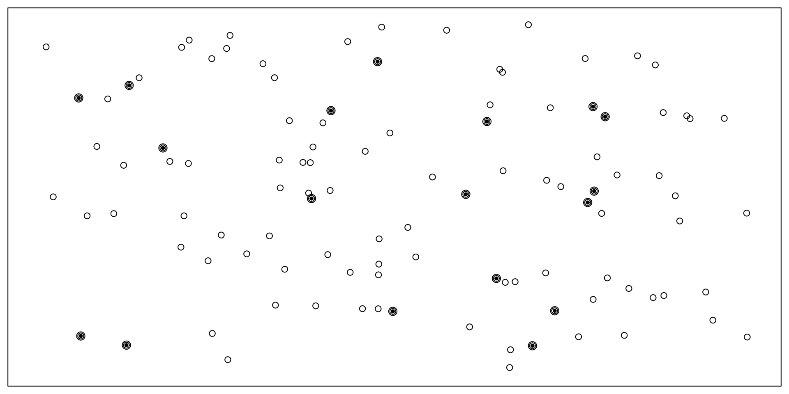

# Sampling

Consider the following three research questions:

1. What is the average number of close friends for American adults?
2. Over the last five years, what is the average time to complete a degree for undergrads in the University of California system?
3. Does a new drug reduce the severity of symptoms in patients with panic disorder?

Each research question refers to a target [population]. In the first question, the target population is all Americans over the age of 18. In the second question, it is all undergraduate students in the University of California system. In the third question, it is all patients diagnosed with a panic disorder.

Sometimes people collect data from an entire population, which is called a [census]. However, oftentimes it is not feasible to conduct a census. This might be because it is too expensive to collect data from every member of a population, or because it is difficult or even impossible to identify the entire population of interest! Most psychology research involves collecting data from a [sample]. Ideally, a sample is a small fraction of the population. For example, to address the first research question above, a researcher might sample 200 Americans adults to estimate the average number of close friends that all American adults have.

(\#fig:sampling)A sample of 10 selected from a population of 100.

## Sampling Procedures

:::learningobjectives
##### LEARNING OBJECTIVES {-}
1. Explain the difference between probability and nonprobability sampling.
2. Describe the major types of probability sampling and the most common type of nonprobability sampling.
3. Explain why it is important to construct representative samples, and list some ways that researchers construct them.
:::

### Probability and Nonprobability Sampling {-}
Essentially all psychological research involves sampling, which is the process of selecting a sample to study from a population of interest. Sampling methods fall into two broad categories: probability sampling and nonprobability sampling. [Probability sampling] occurs when 1) every member of a target population is identified, 2) every member has a certain non-zero probability of being selected, and 3) selection is random. [Nonprobability sampling] occurs when at least one of the criteria for probability sampling is not met. 

Researchers collect data from samples in order to make inferences about their target population. If members of a sample are very different from the other members of the population, researchers may not be able to make appropriate inferences from the sample. Therefore, it is often important to use representative samples: samples that resemble the population in their representation of one or several sociodemographic characteristics like gender, income, race and ethnicity, age, or political orientation. Representative samples can be constructed by probability sampling, but they can also be constructed through nonprobability methods. These methods are critical for much social science research, but historically they have been used less frequently in psychology research, which may limit the conclusions that experimental psychologists can make.   

#### Probability Sampling Methods {-}

Probability sampling requires a very clear specification of the population, which of course depends on the research questions being addressed. A target population might be all registered voters in the state of Arkansas, all American consumers who have purchased a car in the past year, women in the United States over 40 years old who have received a mammogram in the past decade, all the alumni of a particular university, or all humans on Earth. Once a researcher has specified their target population, probability sampling requires a [sampling frame]. This is essentially a list of all the members of the target population. Sampling frames can come from a variety of sources, including telephone directories, lists of registered voters, or hospital or insurance records. In some cases, a map can serve as a sampling frame, allowing for the selection of cities, streets, or households. However, sometimes creating a sampling frame is difficult or even impossible, which can be one reason that researchers use a nonprobability sampling method.

There are a variety of different probability sampling methods. [Simple random sampling] involves each individual in the population having an equal probability of being selected for the sample (Figure \@ref(fig:simple)). This could involve putting the names of all individuals in the sampling frame into a hat, mixing them up, and then drawing out the number needed for the sample. Given that most sampling frames nowadays take the form of computer files, random sampling is more likely to involve computerized sorting or selection of respondents. A common approach in telephone surveys is random-digit dialing, in which a computer randomly generates phone numbers from among the possible phone numbers within a given geographic area.

(\#fig:simple)Example of simple random sampling. Simple random sampling was used to randomly select the 18 cases (denoted with filled-in dots).

A common alternative to simple random sampling is [stratified random sampling], in which the population is divided into different subgroups or “strata” (usually based on demographic characteristics) and then a random sample is taken from each “stratum" (the plural of "strata"; Figure \@ref(fig:stratified)). Stratified random sampling can be used to select a sample in which the proportion of respondents in each of various subgroups matches the proportion in the population. For example, according to the 2022 Census, 13.6% of the US population identifies as Black alone, so stratified random sampling can be used to ensure that a survey of 1,000 American adults includes about 136 Black respondents. Stratified random sampling can also be used to sample extra respondents from smaller subgroups—allowing valid conclusions to be drawn about those subgroups. For example, because Asian Americans make up a fairly small percentage of the US population (about 6.3%), a simple random sample of 1,000 American adults might include too few Asian Americans to draw any conclusions about them as distinct from any other subgroup. If this is important to the research question, however, then stratified random sampling could be used to ensure that enough Asian American respondents are included in the sample to draw more valid conclusions about Asian Americans as a whole.

(\#fig:stratified)Example of stratified random sampling. Cases were first grouped into strata, or subgroups, then simple random sampling was employed to randomly select 20% of cases within each stratum. The resulting sample reflects the proportion of cases in each subgroup.

Yet another type of probability sampling is [cluster sampling], in which larger clusters of individuals are randomly sampled and then individuals within each cluster are randomly sampled (Figure \@ref(fig:cluster)). For example, to select a sample of small-town residents in the United States, a researcher might randomly select several small towns and then randomly select several individuals within each town. Cluster sampling is especially useful for surveys that involve face-to-face interviewing because it minimizes the amount of traveling that the interviewers must do. For example, instead of traveling to 200 small towns to interview 200 residents, a research team could travel to 10 small towns and interview 20 residents of each. The National Comorbidity Survey was done using a form of cluster sampling.

(\#fig:cluster)Example of cluster sampling. Data were binned into nine clusters, three of these clusters were sampled, and all observations within these three clusters were included in the sample.

#### Nonprobability Sampling Methods {-}

Gathering probability samples from the large populations that psychology researchers want to make conclusions about is often far too difficult and expensive. Consider the target population of all adult humans or even all adult English-speaking humans who are located in the United States. It would be very difficult to identify every member in a population like this and ensure every member has a non-zero probability of being selected. How would you find their names? How would you contact them? What if they did not have an email or a phone number? How could they participate in your experiment if they did not have access to the internet or a form of transportation to come into your lab? What if they did not want to participate at all? 

The vast majority of psychology research has been conducted with convenience samples: nonprobability samples that feature individuals who can be recruited easily, such as college undergraduates. Other types of nonprobability sampling methods are called snowball, quota, and purposive. Snowball sampling involves asking members of a sample to help recruit more participants by asking people they know to also participate. Quota (identifying pre-existing subgroups and recruiting a specific number of participants from each group, using a non-random selection method) and purposive (selecting participants on the basis of some characteristic, using a non-random selection method) are two types of nonprobability methods that can be used to construct more representative samples. Researchers often use more sophisticated sampling methods to ensure more representative samples when they believe specific characteristics of their participants are relevant to their research question, which is often the case in survey research. 

:::fyi
##### The Rise of Online Data Collection: A Solution to Non-Representative Samples? {-}
Psychology experiments have typically been conducted by recruiting participants from what has been referred to as the “subject pool” or participant pool. This term denotes a group of people who can be recruited for experiments, typically students from introductory psychology courses [@sieber1989census], who are required to complete a certain number of experiments as part of their coursework. The ready availability of this convenient pool has led to a massive over-representation of undergraduates in published psychology research [@sears1986college; @henrich2010weirdest]. 

Yet over the last couple of decades, there has been a revolution in data collection. Instead of focusing on university undergraduates, increasingly, researchers recruit individuals from crowdsourcing websites like Amazon Mechanical Turk (MTurk) and Prolific Academic. Crowdsourcing services were originally designed to recruit and pay workers for ad-hoc business tasks like retyping receipts, but they have also become marketplaces to connect researchers with people who are willing to complete surveys and tasks for small payments [@litman2017turkprime]. 

In addition to increasing the number of people that researchers have access to, some online platforms allow researchers to construct more representative samples using nonprobability sampling methods like quota sampling. For example, Prolific allows researchers to specify their desired proportion of three key demographics (age, sex, and ethnicity). These methods can increase the representativeness of samples, but there are other challenges to collecting data online. For example, many online studies involve almost no direct contact with participants; some online participants multi-task in other windows or on other devices; and compensation is often quite low so samples are likely to not be representative with respect to socioeconomic status (one study of crowd work found that the average wage earned was just $2.00/hour, and less than 5% of workers were paid at least the federal minimum wage [@hara2018data]). 
:::

:::takeaways
##### KEY TAKEAWAYS {-}
- Survey research usually involves probability sampling, in which each member of the population has a known non-zero probability of being selected for the sample.
- Types of probability sampling include simple random sampling, stratified random sampling, and cluster sampling. The most common sampling method used in psychology research is convenience sampling, which is a nonprobability sampling method.
:::

:::exercises
##### EXERCISE {-}
1. Discussion: If possible, identify an appropriate sampling frame for each of the following populations. If there is no appropriate sampling frame, explain why.
    a. students at a particular college or university
    b. adults living in the state of Nevada
    c. households in Little Rock, Arkansas
    d. people with low self-esteem
:::

## Sampling Bias

:::learningobjectives
##### LEARNING OBJECTIVES {-}
1. Define sampling bias in general and nonresponse bias in particular.
2. List some techniques that can be used to increase the response rate and reduce nonresponse bias.
3. Explain the WEIRD problem in psychology and how it may limit generalizability of psychological findings.  
:::

The previous section highlighted the main goal of sampling is to construct samples that allow researchers to make accurate conclusions about a target population, or to generalize their findings. [Sampling bias] occurs when a sample is selected in such a way that it is not representative of the entire population and therefore produces inaccurate results. In 1936, The Literary Digest straw poll incorrectly predicted Alf Landon would win over Franklin D. Roosevelt because of sampling bias. They used mailing lists that came largely from telephone directories and lists of registered automobile owners, which overrepresented wealthier people, who were more likely to vote for Landon. George Gallup, an advertising executive, successfully predicted Roosevelt would win because he knew about this bias and found ways to sample people with less wealth as well.

### Anecdotal Evidence {-}

Consider the following possible responses to the three research questions at the start of this chapter:

1.	A popular American YouTuber posted a video revealing that despite his many followers, he doesn’t have anyone he could call a real friend, so the average number of close friends for American adults must be very low.
2.	I met two students who took more than 7 years to graduate from campuses in the University of California system, so it must take longer to graduate from University of California schools than from many other colleges.
3.	My friend’s sister had a severe panic attack after they gave her a new drug, so the drug must not work.

Each conclusion is based on some data. However, there are two problems. First, the data only represent one or two individual cases. Second, and more importantly, it is unclear whether these cases are actually representative of the population. Data collected in this haphazard fashion are called [anecdotal evidence]. Be careful of data collected in a haphazard fashion. Such evidence may be true and verifiable, but it may only represent extraordinary cases and therefore not be a good representation of the population.

(\#fig:snow)In February 2010, some media pundits cited one large snowstorm as evidence against global warming. As comedian Jon Stewart pointed out, “It is one storm, in one region of one country.” *Photo by Flow Clark on Unsplash.*

Anecdotal evidence typically is composed of unusual cases that we recall based on their striking characteristics. For instance, we are more likely to remember the two people we met who took 7 years to graduate than the six others who graduated in four years. Instead, of looking at the most unusual cases, we should examine a sample of many cases that better represent the population.

### Nonresponse Bias {-}

There is one form of sampling bias that even careful probability sampling is subject to. It is almost never the case that everyone selected for the sample actually responds to the survey. Some may have died or moved away, while others may decline to participate because they are too busy, are not interested in the survey topic, or do not participate in surveys on principle. If these survey nonresponders differ from survey responders in systematic ways, then this can produce something called [nonresponse bias]. For example, in a mail survey on alcohol consumption, researcher Vivienne Lahaut and colleagues found that only about half the sample responded after the initial contact and two follow-up reminders [@lahaut2002non]. The danger here is that the half who responded might have different patterns of alcohol consumption than the half who did not, which could lead to inaccurate conclusions on the part of the researchers. To test for nonresponse bias, the researchers later made unannounced visits to the homes of a subset of the nonresponders—coming back up to five times if they did not find them at home. They found that the original nonresponders included an especially high proportion of abstainers (nondrinkers), which meant that their estimates of alcohol consumption based only on the original responders were too high.

There are methods to statistically correct for nonresponse bias, but they are based on assumptions about the nonresponders that may not be true. For example, one assumption is that nonresponders are more similar to late responders than to early responders, which may not be correct. To avoid reliance on these statistical correction methods, some researchers have suggested that the best approach to minimizing nonresponse bias is to minimize the number of nonresponders—that is, to maximize the response rate. Many different factors affect survey response rates [@groves2011survey]. In general, in-person interviews have the highest response rates, followed by telephone surveys, and then mail and online surveys. Sending people a short message informing them that they will be asked to participate in a survey in the near future and sending simple follow-up reminders to nonresponders can also improve response rates. The perceived length and complexity of the survey also makes a difference, which is why it is important to keep surveys as short, simple, and on topic as possible. Finally, offering an incentive—especially cash—is a reliable way to increase response rates. 

However, not all researchers agree that the best way to minimize nonresponse bias is to maximize response rates. A recent review found scant relationship between survey nonresponse bias and response rates [@hendra2019rethinking]. Increasing response rates can be quite costly and time intensive, and may not solve the nonresponse bias problem as well as people have thought in the past. Instead, it may be useful to devote those resources to other areas of reducing bias and improving generalizability in psychology research. 

### The WEIRD Problem in Psychology {-}

Psychology is defined as the study of the human mind. But from a sampling theory standpoint, not a single estimate in the published literature has been based on a probability sample (or a truly representative nonprobability sample) from the entire human population. 
We know that psychology researchers often collect data from convenience samples that are not representative of the local or national contexts in which they are recruited. But beyond that, it is important to recognize that these local and national contexts are also not representative of the broad range of human experiences. @henrich2010weirdest coined the term WEIRD (Western, Educated, Industrialized, Rich, and Democratic) to sum up some of the ways that typical participants in psychology experiments differ from other humans. The vast over-representation of WEIRD participants in psychology literature has led some researchers to suggest that published results simply reflect “WEIRD psychology”–a small an idiosyncratic part of a much broader universe of human psychology. 

The term WEIRD has been very useful in drawing attention to the lack of representation of the breadth of human experiences in experimental psychology research. However, some researchers have identified that one negative consequence of this idea has been the response that what we need to do as a field is simply to sample more “non-WEIRD” people. Every culture outside the WEIRD moniker is not the same [@syed2022cultural]. A better starting point may be to consider the way that cultural variation should guide our choices about sampling. Additionally, perhaps all researchers should consider the generalizations they make about the human mind from samples (even carefully-constructed probability samples!) that lack the cultural variation that exists in the population of all humans. 

:::fyi
##### Random Sampling vs. Random Assignment {-}
Chapter 3 warns against confusing the term *random sampling* with the term *random assignment*. This is easy to do because they sound quite similar, but they refer to different procedures! And when they are neglected, different types of biases occur.

Random sampling, as we have learned in this chapter, is a general term that encompasses probability sampling methods such as simple random sampling. Random sampling refers to *how researchers obtain the participants in their studies*. Probability sampling methods are rarely used in psychological research, which leads to different types of sampling bias, as discussed in the text above. When samples are biased, this limits how generalizable the findings of a study are.  

Random assignment refers to how researchers assign participants in their study to different conditions, *after those participants have already been selected to be in the sample*. Random assignment is very common in psychological research, as it is a required to conduct a true experiment. Without random assignment, a study is vulnerable to assignment bias, which is when groups differ from each other on dimensions not related to the researcher’s manipulation because participants were allowed to select their own group. For example, say a researcher is interested in whether people swim faster in pool water that is 85 degrees or 75 degrees. If they allow their participants to select which kind of water they swim in, it is plausible that people who are already stronger swimmers will pick the cooler pool. If the researcher randomly assigns participants to swim in either the warmer pool or the cooler pool, then any differences in swimming times are not due to individual differences, because those should average out across the two groups. When a study has assignment bias, this limits researchers from concluding that their manipulation caused their result. For more details on experimental design, see Chapter 3! 
:::

:::takeaways
##### KEY TAKEAWAYS {-}

- Sampling bias occurs when a sample is selected in such a way that it is not representative of the population and therefore produces inaccurate results.
- One pervasive form of sampling bias is nonresponse bias, which occurs when people who do not respond to the survey differ in important ways from people who do respond.
- Psychology research suffers from a “WEIRD” problem, in which a disproportionate number of participants are from White, Educated, Industrialized, Rich, and Democratic communities. This limits the conclusions that psychology researchers can make about the human mind in general. 
:::

:::exercises
##### EXERCISES {-}

1. Discussion: We can easily access ratings for products, sellers, and companies through websites. These ratings are based only on those people who go out of their way to provide a rating. If 50% of online reviews for a product are negative, do you think this means that 50% of buyers are dissatisfied with the product? Why or why not?
:::

## Glossary

##### anecdotal evidence {-}

Evidence collected in a casual or unsystematic way.

##### census {-}

A research approach in which all members of a population are part of the sample.

##### cluster sampling {-}

Sampling where larger clusters of individuals (e.g., cities, households) are sampled first and then individuals are sampled from these clusters.

##### context effect {-}

An unintended effect of the context in which a response is made. In within-subjects experiments, this can be an effect of being tested in one condition on how participants perceive stimuli or interpret their task and therefore how they respond in later conditions. In survey research, this can be an effect of the surrounding items or the response scale on responses to a particular item.

##### convenience sample {-}

Most commonly used nonprobability sample that features individuals who can be recruited easily, such as college undergraduates.

##### generalizability {-}

The extent to which the results from a sample can be generalized to the target population, to people and situations beyond those actually studied. 

##### nonprobability sampling {-}

An approach to sampling in which the researcher cannot specify the probability that each member of the population will be selected. Convenience sampling is an example.

##### nonresponse bias {-}

A type of sampling bias in which those who do not respond to the survey differ systematically from those who do, producing misleading results.

##### population {-}

The entire group of individuals that the researcher wants to draw conclusions about.

##### probability sampling {-}

An approach to sampling in which the researcher can specify the probability that each member of the population will be selected.

##### representative sample {-}

Samples the resemble the population in their representation of one or several sociodemographic characteristics like gender, income, race and ethnicity, age, or political orientation. 

##### sample {-}

The subset of individuals that the researcher actually studies.

##### sampling {-}

The process of selecting a sample from a population.

##### sampling bias {-}

Occurs when a sample is selected in such a way that it is not representative of the entire population and therefore produces inaccurate results.

##### sampling frame {-}

A list of all the members of the population, from which the actual sample is selected.

##### simple random sampling {-}

Sampling where each member of the population has an equal probability of being selected.

##### stratified random sampling {-}

Sampling where the population is first divided into different subgroups or strata and a separate random sample is selected from each stratum.
