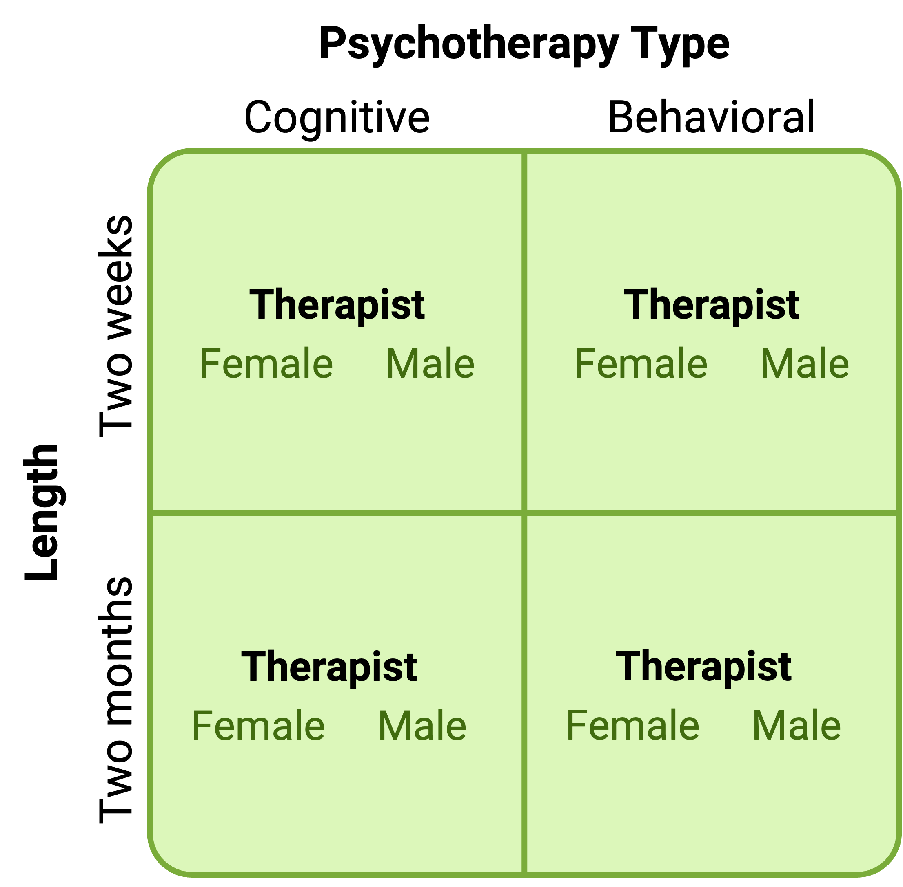
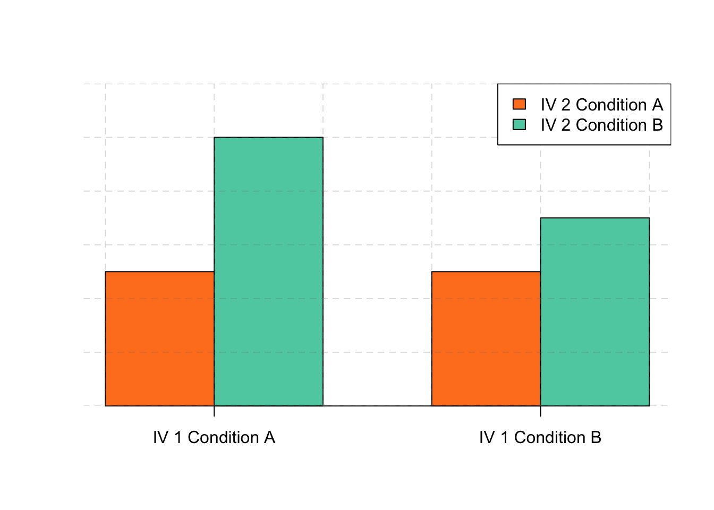
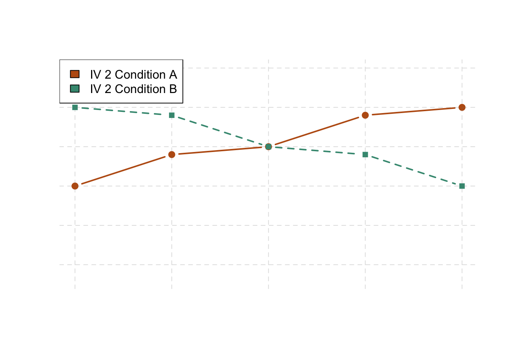

# Complex Experiments

@Gupta2022 were interested in whether the amount of on-task trial time and break time affected a participants' particular type of fatigue in a motor sequence task where they repeatedly typed the sequence 4-1-3-2-4. They conducted the experiment by manipulating those two variables over four groups. Thus, the two independent variables were break time (10 s or 30 s) and the trial time (10 s or 30 s). The dependent measure, reaction time per key press. They found that both variables independently affected reaction time, where longer breaks and shorter trials produce quicker reaction times. This straight forward 2x2 design is the bread and butter of experimental psychologists where they manipulate two independent variables (e.g., break time and trial time) and also manipulate them at two levels (e.g., 10 s or 30 s). These types of designs usually offer up tidy and interpretable results.

The research designs we have considered so far have been simple—focusing on a question about one variable or about a statistical relationship between two variables. But in many ways the more complex design of the experiment undertaken by @Gupta2022 is more typical of research in psychology. Fortunately, we have already covered the basic elements of such designs in previous chapters. In this chapter, we look closely at how and why researchers combine these basic elements into more complex designs. We start with complex experiments—considering first the inclusion of multiple dependent variables and then the inclusion of multiple independent variables. Finally, we look at complex correlational designs.

## Multiple Dependent Variables

:::learningobjectives
##### LEARNING OBJECTIVES {-}

1. Explain why researchers often include multiple dependent variables in their studies.
2. Explain what a manipulation check is and when it would be included in an experiment.
:::

Imagine that you have made the effort to find a research topic, review the research literature, formulate a question, design an experiment, obtain institutional review board (IRB) approval, recruit research participants, and manipulate an independent variable. It would seem almost wasteful to measure a single dependent variable. Even if you are primarily interested in the relationship between an independent variable and one primary dependent variable, there are usually several more questions that you can answer easily by including [multiple dependent variables].

### Measures of Different Constructs {-}

Often a researcher wants to know how an independent variable affects several distinct dependent variables. For example, Schnall and her colleagues were interested in how feeling disgusted affects the harshness of people’s moral judgments, but they were also curious about how disgust affects other variables, such as people’s willingness to eat in a restaurant. As another example, researcher Susan Knasko was interested in how different odors affect people’s behavior [@knasko1992ambient]. She conducted an experiment in which the independent variable was whether participants were tested in a room with no odor or in one scented with lemon, lavender, or dimethyl sulfide (which has a cabbagelike smell). Although she was primarily interested in how the odors affected people’s creativity, she was also curious about how they affected people’s moods and perceived health—and it was a simple enough matter to measure these dependent variables too. Although she found that creativity was unaffected by the ambient odor, she found that people’s moods were lower in the dimethyl sulfide condition, and that their perceived health was greater in the lemon condition.

When an experiment includes multiple dependent variables, there is again a possibility of carryover effects. For example, it is possible that measuring participants’ moods before measuring their perceived health could affect their perceived health or that measuring their perceived health before their moods could affect their moods. So the order in which multiple dependent variables are measured becomes an issue. One approach is to measure them in the same order for all participants—usually with the most important one first so that it cannot be affected by measuring the others. Another approach is to counterbalance, or systematically vary, the order in which the dependent variables are measured.

### Manipulation Checks {-}

When the independent variable is a construct that can only be manipulated indirectly—such as emotions and other internal states—an additional measure of that independent variable is often included as a [manipulation check]. This is done to confirm that the independent variable was, in fact, successfully manipulated. For example, Schnall and her colleagues had their participants rate their level of disgust to be sure that those in the messy room actually felt more disgusted than those in the clean room. Manipulation checks are usually done at the end of the procedure to be sure that the effect of the manipulation lasted throughout the entire procedure and to avoid calling unnecessary attention to the manipulation.

Manipulation checks become especially important when the manipulation of the independent variable turns out to have no effect on the dependent variable. Imagine, for example, that you exposed participants to happy or sad movie music—intending to put them in happy or sad moods—but you found that this had no effect on the number of happy or sad childhood events they recalled. This could be because being in a happy or sad mood has no effect on memories for childhood events. But it could also be that the music was ineffective at putting participants in happy or sad moods. A manipulation check—in this case, a measure of participants’ moods—would help resolve this uncertainty. If it showed that you had successfully manipulated participants’ moods, then it would appear that there is indeed no effect of mood on memory for childhood events. But if it showed that you did not successfully manipulate participants’ moods, then it would appear that you need a more effective manipulation to answer your research question.

### Measures of the Same Construct {-}

Another common approach to including multiple dependent variables is to operationally define and measure the same construct, or closely related ones, in different ways. Imagine, for example, that a researcher conducts an experiment on the effect of daily exercise on stress. The dependent variable, stress, is a construct that can be operationally defined in different ways. For this reason, the researcher might have participants complete the paper-and-pencil Perceived Stress Scale *and* measure their levels of the stress hormone cortisol. This is an example of the use of converging operations. If the researcher finds that the different measures are affected by exercise in the same way, then he or she can be confident in the conclusion that exercise affects the more general construct of stress.

When multiple dependent variables are different measures of the same construct—especially if they are measured on the same scale—researchers have the option of combining them into a single measure of that construct. Recall that Schnall and her colleagues were interested in the harshness of people’s moral judgments. To measure this construct, they presented their participants with seven different scenarios describing morally questionable behaviors and asked them to rate the moral acceptability of each one. Although they could have treated each of the seven ratings as a separate dependent variable, these researchers combined them into a single dependent variable by computing their mean.

When researchers combine dependent variables in this way, they are treating them collectively as a multiple-response measure of a single construct. The advantage of this is that multiple-response measures are generally more reliable than single-response measures. However, it is important to make sure the individual dependent variables are correlated with each other by computing an internal consistency measure such as Cronbach’s α. If they are not correlated with each other, then it does not make sense to combine them into a measure of a single construct. If they have poor internal consistency, then they should be treated as separate dependent variables.

:::takeaways
##### KEY TAKEAWAYS {-}
- Researchers in psychology often include multiple dependent variables in their studies. The primary reason is that this easily allows them to answer more research questions with minimal additional effort.
- When an independent variable is a construct that is manipulated indirectly, it is a good idea to include a manipulation check. This is a measure of the independent variable typically given at the end of the procedure to confirm that it was successfully manipulated.
- Multiple measures of the same construct can be analyzed separately or combined to produce a single multiple-item measure of that construct. The latter approach requires that the measures taken together have good internal consistency.
:::

:::exercises
##### EXERCISES {-}
1. Practice: List three independent variables for which it would be good to include a manipulation check. List three others for which a manipulation check would be unnecessary.
2. Practice: Imagine a study in which the independent variable is whether the room where participants are tested is warm (80°) or cool (65°). List three dependent variables that you might treat as measures of separate variables. List three more that you might combine and treat as measures of the same underlying construct.
:::

## Multiple Independent Variables

:::learningobjectives
##### LEARNING OBJECTIVES {-}

1. Explain why researchers often include multiple independent variables in their studies.
2. Define factorial design, and use a factorial design table to represent and interpret simple factorial designs.
3. Distinguish between main effects and interactions, and recognize and give examples of each.
4. Sketch and interpret bar graphs and line graphs showing the results of studies with simple factorial designs.
:::

Often, psychological studies are interested in manipulating multiple independent variables. For example,@Gupta2022 were interested in a specific type of fatigue during a motor sequence task. They were able to modulate this fatigue through either changing the amount of break time or on-task trial time length.   

Just as it is common for studies in psychology to include multiple dependent variables, it is also common for them to include multiple independent variables. Schnall and her colleagues studied the effect of both disgust and private body consciousness in the same study. Researchers’ inclusion of multiple independent variables in one experiment is further illustrated by the following actual titles from various professional journals:

- The Effects of Temporal Delay and Orientation on Haptic Object Recognition
- Opening Closed Minds: The Combined Effects of Intergroup Contact and Need for Closure on Prejudice
- Effects of Expectancies and Coping on Pain-Induced Intentions to Smoke
- The Effect of Age and Divided Attention on Spontaneous Recognition
- The Effects of Reduced Food Size and Package Size on the Consumption Behavior of Restrained and Unrestrained Eaters

Just as including multiple dependent variables in the same experiment allows one to answer more research questions, so too does including multiple independent variables in the same experiment. For example, instead of conducting one study on the effect of disgust on moral judgment and another on the effect of private body consciousness on moral judgment, Schnall and colleagues were able to conduct one study that addressed both questions. But including multiple independent variables also allows the researcher to answer questions about whether the effect of one independent variable depends on the level of another. This is referred to as an interaction between the independent variables. Schnall and her colleagues, for example, observed an interaction between disgust and private body consciousness because the effect of disgust depended on whether participants were high or low in private body consciousness. As we will see, interactions are often among the most interesting results in psychological research.

### Factorial Designs {-}

#### Overview {-}

By far the most common approach to including multiple independent variables in an experiment is the [factorial design]. In a factorial design, each level of one independent variable (which can also be called a [factor]) is combined with each level of the others to produce all possible combinations. Each combination, then, becomes a condition in the experiment. Imagine, for example, an experiment on the effect of cell phone use (yes vs. no) and time of day (day vs. night) on driving ability. This is shown in the [factorial design table] in Figure \@ref(fig:designtable). The columns of the table represent cell phone use, and the rows represent time of day. The four cells of the table represent the four possible combinations or conditions: using a cell phone during the day, not using a cell phone during the day, using a cell phone at night, and not using a cell phone at night. This particular design is a 2 × 2 (read “two-by-two”) factorial design because it combines two variables, each of which has two levels. If one of the independent variables had a third level (e.g., using a handheld cell phone, using a hands-free cell phone, and not using a cell phone), then it would be a 3 × 2 factorial design, and there would be six distinct conditions. Notice that the number of possible conditions is the product of the numbers of levels. A 2 × 2 factorial design has four conditions, a 3 × 2 factorial design has six conditions, a 4 × 5 factorial design would have 20 conditions, and so on.

(\#fig:designtable)Factorial design table representing a 2 x 2 factorial design.

In principle, factorial designs can include any number of independent variables with any number of levels. For example, an experiment could include the type of psychotherapy (cognitive vs. behavioral), the length of the psychotherapy (2 weeks vs. 2 months), and the sex assigned at birth of the psychotherapist (female vs. male). This would be a 2 × 2 × 2 factorial design and would have eight conditions. Figure \@ref(fig:designtable2) shows one way to represent this design. In practice, these types of designs can have difficult to interpret effects. We will later cover interaction effects in the \@ref(main-interactions) section. As the complexity of the design increases it becomes hard to scale the logic of interaction effects for multiple variables. Even for this "simple" case of 2 x 2 x 2, it becomes hard to describe interactions if they occur. In practice, it is unusual for there to be more than three independent variables with more than two or three levels each because the number of conditions can quickly become unmanageable. For example, adding a fourth independent variable with three levels (e.g., therapist experience: low vs. medium vs. high) to the current example would make it a 2 × 2 × 2 × 3 factorial design with 24 distinct conditions. In the rest of this section, we will focus on designs with two independent variables with two levels. The general principles discussed here extend to more complex factorial designs, however, comparisons become very unwieldy when considering many factors along with levels and their interactions.

(\#fig:designtable2)Factorial design table representing a 2 x 2 x 2 factorial design.

#### Assigning Participants to Conditions {-}

Recall that in a simple between-subjects design, each participant is tested in only one condition. In a simple within-subjects design, each participant is tested in all conditions. In a factorial experiment, the decision to take the between-subjects or within-subjects approach must be made separately for each independent variable. In a [between-subjects factorial design], all of the independent variables are manipulated between subjects. For example, all participants could be tested either while using a cell phone or while not using a cell phone and either during the day or during the night. This would mean that each participant was tested in one and only one condition. In a [within-subjects factorial design], all of the independent variables are manipulated within subjects. All participants could be tested both while using a cell phone and while not using a cell phone and both during the day and during the night. This would mean that each participant was tested in all conditions. The advantages and disadvantages of these two approaches are the same as those discussed in the chapter on experimental research. The between-subjects design is conceptually simpler, avoids carryover effects, and minimizes the time and effort of each participant. The within-subjects design is more efficient for the researcher and controls extraneous participant variables.

It is also possible to manipulate one independent variable between subjects and another within subjects. This is called a [mixed factorial design]. For example, a researcher might choose to treat cell phone use as a within-subjects factor by testing the same participants both while using a cell phone and while not using a cell phone (while counterbalancing the order of these two conditions). But he or she might choose to treat time of day as a between-subjects factor by testing each participant either during the day or during the night (perhaps because this only requires them to come in for testing once). Thus each participant in this mixed design would be tested in two of the four conditions.

Regardless of whether the design is between subjects, within subjects, or mixed, the actual assignment of participants to conditions or orders of conditions is typically done randomly.

#### Nonmanipulated Independent Variables {-}

In some factorial designs, one of the independent variables is a [nonmanipulated independent variable]. An example of this is a study by Halle Brown and colleagues in which participants were exposed to several words that they were later asked to recall [@brown1999perceptual]. The manipulated independent variable was the type of word. Some were negative health-related words (e.g., *tumor*, *coronary*), and others were not health related (e.g., *election*, *geometry*). The nonmanipulated independent variable was whether participants were high or low in hypochondriasis (excessive concern with ordinary bodily symptoms). The result of this study was that the participants high in hypochondriasis were better than those low in hypochondriasis at recalling the health-related words, but they were no better at recalling the non-health-related words.

These types of designs may be common, but there are a couple drawbacks to using them. While they are still considered experimental as long as at least one independent variable is manipulated, regardless of how many nonmanipulated independent variables are included. However, it is important to remember that causal conclusions can only be drawn about the manipulated independent variable. Thus, in the previous example, we would not be able to infer causal evidence that people with high hypochondriasis causes more greater recall of health-related words. This evidence is the equivalent of correlation evidence. Thus it is important to be aware of which variables in a study are manipulated and which are not.

#### Graphing the Results of Factorial Experiments {-}

The results of factorial experiments with two independent variables can be graphed by representing one independent variable on the x-axis and representing the other by using different kinds of bars or lines. (The y-axis is always reserved for the dependent variable.) Figure \@ref(fig:plots) shows results for two hypothetical factorial experiments. The top panel shows the results of a 2 × 2 design. Time of day (day vs. night) is represented by different locations on the x-axis, and cell phone use (no vs. yes) is represented by different-colored bars. (It would also be possible to represent cell phone use on the x-axis and time of day as different-colored bars. The choice comes down to which way seems to communicate the results most clearly.) The bottom panel of Figure \@ref(fig:plots) shows the results of a 4 × 2 design in which one of the variables is quantitative. This variable, psychotherapy length, is represented along the x-axis, and the other variable (psychotherapy type) is represented by differently formatted lines. This is a line graph rather than a bar graph because the variable on the x-axis is quantitative with a small number of distinct levels.

(\#fig:plots)Two ways to plot the results of a factorial experiment with two independent variables.

#### Main Effects and Interactions {- #main-interactions}

In factorial designs, there are two kinds of results that are of interest: main effects and interaction effects (which are also called just “interactions”). A main effect is the statistical relationship between one independent variable and a dependent variable—averaging across the levels of the other independent variable. Thus there is one main effect to consider for each independent variable in the study. The top panel of Figure \@ref(fig:plots) shows a main effect of cell phone use because driving performance was better, on average, when participants were not using cell phones than when they were. The blue bars are, on average, higher than the red bars. It also shows a main effect of time of day because driving performance was better during the day than during the night—both when participants were using cell phones and when they were not. Main effects are independent of each other in the sense that whether or not there is a main effect of one independent variable says nothing about whether or not there is a main effect of the other. The bottom panel of Figure \@ref(fig:plots), for example, shows a clear main effect of psychotherapy length. The longer the psychotherapy, the better it worked. But it also shows no overall advantage of one type of psychotherapy over the other.

There is an interaction effect (or just “interaction”) when the effect of one independent variable depends on the level of another. Although this might seem complicated, you have an intuitive understanding of interactions already. It probably would not surprise you, for example, to hear that the effect of receiving psychotherapy is stronger among people who are highly motivated to change than among people who are not motivated to change. This is an interaction because the effect of one independent variable (whether or not one receives psychotherapy) depends on the level of another (motivation to change). Schnall and her colleagues also demonstrated an interaction because the effect of whether the room was clean or messy on participants’ moral judgments depended on whether the participants were low or high in private body consciousness. If they were high in private body consciousness, then those in the messy room made harsher judgments. If they were low in private body consciousness, then whether the room was clean or messy did not matter.

The effect of one independent variable can depend on the level of the other in different ways. This is shown in Figures \@ref(fig:barinteractions1), \@ref(fig:barinteractions2), and \@ref(fig:barinteractions3). In \@ref(fig:barinteractions1), one independent variable has an effect at one level of the second independent variable but no effect at the others. (This is much like the study of Schnall and her colleagues where there was an effect of disgust for those high in private body consciousness but not for those low in private body consciousness.) In \@ref(fig:barinteractions2), one independent variable has a stronger effect at one level of the second independent variable than at the other level. This is like the hypothetical driving example where there was a stronger effect of using a cell phone at night than during the day. In \@ref(fig:barinteractions3), one independent variable again has an effect at both levels of the second independent variable, but the effects are in opposite directions. Figure \@ref(fig:barinteractions3) shows the strongest form of this kind of interaction, called a [crossover interaction]. One example of a crossover interaction comes from a study by Kathy Gilliland on the effect of caffeine on the verbal test scores of introverts and extroverts [@gilliland1980interactive]. Introverts perform better than extroverts when they have not ingested any caffeine. But extroverts perform better than introverts when they have ingested 4 mg of caffeine per kilogram of body weight. Figure \@ref(fig:lineinteractions1), \@ref(fig:lineinteractions2), and \@ref(fig:lineinteractions3) shows examples of these same kinds of interactions when one of the independent variables is quantitative and the results are plotted in a line graph. Note that in a crossover interaction, the two lines literally “cross over” each other.

(\#fig:barinteractions1)This bargraph is showing one of three types of interactions.This one shows that one independent variable has an effect at one level of the second independent variable but not at the other.

(\#fig:barinteractions2)This bargraph is showing one of three types of interactions.This one shows that one independent variable has a stronger effect at one level of the second independent variable than at the other.

(\#fig:barinteractions3)This bargraph is showing one of three types of interactions.This one shows that one independent variable has the opposite effect at one level of the second independent variable than at the other.

(\#fig:lineinteractions1)This linegraph is showing one of three types of interactions. This one shows that one independent variable has an effect at one level of the second independent variable but not at the other.

(\#fig:lineinteractions2)This linegraph is showing one of three types of interactions. This one shows that one independent variable has a stronger effect at one level of the second independent variable than at the other.

(\#fig:lineinteractions3)This linegraph is showing one of three types of interactions. This one shows that one independent variable has the opposite effect at one level of the second independent variable than at the other.

In many studies, the primary research question is about an interaction. The study by Brown and her colleagues was inspired by the idea that people with hypochondriasis are especially attentive to any negative health-related information. This led to the hypothesis that people high in hypochondriasis would recall negative health-related words more accurately than people low in hypochondriasis but recall non-health-related words about the same as people low in hypochondriasis. And of course this is exactly what happened in this study.

:::takeaways
##### KEY TAKEAWAYS {-}
- Researchers often include multiple independent variables in their experiments. The most common approach is the factorial design, in which each level of one independent variable is combined with each level of the others to create all possible conditions.
- In a factorial design, the main effect of an independent variable is its overall effect averaged across all other independent variables. There is one main effect for each independent variable.
- There is an interaction between two independent variables when the effect of one depends on the level of the other. Some of the most interesting research questions and results in psychology are specifically about interactions.
:::

:::exercises
##### EXERCISES {-}
1. Practice: Return to the five article titles presented at the beginning of this section. For each one, identify the independent variables and the dependent variable.
2. Practice: Create a factorial design table for an experiment on the effects of room temperature and noise level on performance on the SAT. Be sure to indicate whether each independent variable will be manipulated between subjects or within subjects and explain why.
:::

## Glossary

##### between-subjects factorial design {-}

A factorial design in which each independent variable is manipulated between subjects so that each participant is tested in only one condition.

##### crossover interaction {-}

An interaction in which one independent variable has opposite effects at different levels of another independent variable.

##### factor {-}

An independent variable in a factorial design. Also in factor analysis, one of the underlying constructs that is assumed to account for correlations among multiple variables.

##### factorial design {-}

A research design with multiple independent variables in which each level of one independent variable is combined with each level of the others to produce all possible conditions.

##### factorial design table {-}

A table used to represent a factorial design. The rows represent the levels of one independent variable, the columns represent the levels of a second independent variable, and each cell represents a condition.

##### interaction {-}

In a factorial design, when the effect of one independent variable depends on the level of another independent variable.

##### main effect {-}

In a factorial design, the effect of one independent variable averaged across levels of all other independent variables.

##### mixed factorial design {-}

A factorial design in which at least one independent variable is manipulated between subjects and at least one is manipulated within subjects.

##### multiple dependent variables {-}

More than one dependent variable in the same study. They can be measures of different variables, including a manipulation check, or different measures of the same construct.

##### nonmanipulated independent variable {-}

In a factorial design, a variable (usually a participant variable) that is treated as an independent variable but is not actually manipulated by the researcher.

##### within-subjects factorial design {-}

A factorial design in which each independent variable is manipulated within subjects so that each participant is tested in all conditions.
