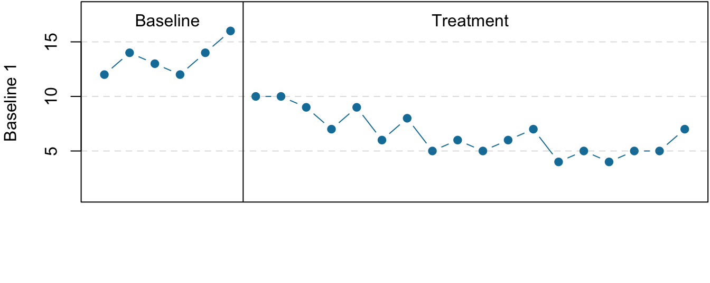

# Quasi-Experimental Research

:::learningobjectives
##### LEARNING OBJECTIVES {-}

1. Explain what quasi-experimental research is and distinguish it clearly from both experimental and correlational research.
2. Describe three different types of quasi-experimental research designs (nonequivalent groups, pretest-posttest, and interrupted time series) and identify examples of each one.
:::

The prefix *quasi* means “resembling.” Thus quasi-experimental research is research that resembles experimental research but is not true experimental research. Although the independent variable is manipulated, participants are not randomly assigned to conditions or orders of conditions [@cook1979quasi]. Because the independent variable is manipulated before the dependent variable is measured, quasi-experimental research eliminates the directionality problem. But because participants are not randomly assigned—making it likely that there are other differences between conditions—quasi-experimental research does not eliminate the problem of confounding variables. In terms of internal validity, therefore, quasi-experiments are generally somewhere between correlational studies and true experiments.

Quasi-experiments are most likely to be conducted in field settings in which random assignment is difficult or impossible. They are often conducted to evaluate the effectiveness of a treatment—perhaps a type of psychotherapy or an educational intervention. There are many different kinds of quasi-experiments, but we will discuss just a few of the most common ones here, focusing first on nonequivalent groups, pretest-posttest, interrupted time series, and combination designs before turning to single subject designs (including reversal and multiple-baseline designs).

## Nonequivalent Groups Design

Recall that when participants in a between-subjects experiment are randomly assigned to conditions, the resulting groups are likely to be quite similar. In fact, researchers consider them to be equivalent. When participants are not randomly assigned to conditions, however, the resulting groups are likely to be dissimilar in some ways. For this reason, researchers consider them to be nonequivalent. A [nonequivalent groups design], then, is a between-subjects design in which participants have not been randomly assigned to conditions.

Imagine, for example, a researcher who wants to evaluate a new method of teaching fractions to third graders. One way would be to conduct a study with a treatment group consisting of one class of third-grade students and a control group consisting of another class of third-grade students. This would be a nonequivalent groups design because the students are not randomly assigned to classes by the researcher, which means there could be important differences between them. For example, the parents of higher achieving or more motivated students might have been more likely to request that their children be assigned to Ms. Williams’s class. Or the principal might have assigned the “troublemakers” to Mr. Jones’s class because he is a stronger disciplinarian. Of course, the teachers’ styles, and even the classroom environments, might be very different and might cause different levels of achievement or motivation among the students. If at the end of the study there was a difference in the two classes’ knowledge of fractions, it might have been caused by the difference between the teaching methods—but it might have been caused by any of these confounding variables.

Of course, researchers using a nonequivalent groups design can take steps to ensure that their groups are as similar as possible. In the present example, the researcher could try to select two classes at the same school, where the students in the two classes have similar scores on a standardized math test and the teachers are the same sex, are close in age, and have similar teaching styles. Taking such steps would increase the internal validity of the study because it would eliminate some of the most important confounding variables. But without true random assignment of the students to conditions, there remains the possibility of other important confounding variables that the researcher was not able to control.

## Pretest-Posttest Design

In a [pretest-posttest design], the dependent variable is measured once before the treatment is implemented and once after it is implemented. Imagine, for example, a researcher who is interested in the effectiveness of an STEM education program on elementary school students’ attitudes toward science, technology, engineering and math. The researcher could measure the attitudes of students at a particular elementary school during one week, implement the STEM program during the next week, and finally, measure their attitudes again the following week. The pretest-posttest design is much like a within-subjects experiment in which each participant is tested first under the control condition and then under the treatment condition. It is unlike a within-subjects experiment, however, in that the order of conditions is not counterbalanced because it typically is not possible for a participant to be tested in the treatment condition first and then in an “untreated” control condition.

If the average posttest score is better than the average pretest score, then it makes sense to conclude that the treatment might be responsible for the improvement. Unfortunately, one often cannot conclude this with a high degree of certainty because there may be other explanations for why the posttest scores are better. One category of alternative explanations goes under the name of [history]. Other things might have happened between the pretest and the posttest. Perhaps an science program aired on television and many of the students watched it, or perhaps a major scientific discover occured and many of the students heard about it. Another category of alternative explanations goes under the name of [maturation]. Participants might have changed between the pretest and the posttest in ways that they were going to anyway because they are growing and learning. If it were a yearlong program, participants might become more exposed to STEM subjects in class or better reasoners and this might be responsible for the change.

Another alternative explanation for a change in the dependent variable in a pretest-posttest design is [regression to the mean]. This refers to the statistical fact that an individual who scores extremely on a variable on one occasion will tend to score less extremely on the next occasion. For example, a bowler with a long-term average of 150 who suddenly bowls a 220 will almost certainly score lower in the next game. Her score will “regress” toward her mean score of 150. Regression to the mean can be a problem when participants are selected for further study because of their extreme scores. Imagine, for example, that only students who scored especially low on a test of fractions are given a special training program and then retested. Regression to the mean all but guarantees that their scores will be higher even if the training program has no effect. A closely related concept—and an extremely important one in psychological research—is [spontaneous remission]. This is the tendency for many medical and psychological problems to improve over time without any form of treatment. The common cold is a good example. If one were to measure symptom severity in 100 common cold sufferers today, give them a bowl of chicken soup every day, and then measure their symptom severity again in a week, they would probably be much improved. This does not mean that the chicken soup was responsible for the improvement, however, because they would have been much improved without any treatment at all. The same is true of many psychological problems. A group of severely depressed people today is likely to be less depressed on average in 6 months. In reviewing the results of several studies of treatments for depression, researchers Michael Posternak and Ivan Miller found that participants in waitlist control conditions improved an average of 10 to 15% before they received any treatment at all [@posternak2001untreated]. Thus one must generally be very cautious about inferring causality from pretest-posttest designs.

Finally, it is possible that the act of taking a pretest can sensitize participants to the measurement process or heighten their awareness of the variable under investigation. This heightened sensitivity, called a [testing effect], can subsequently lead to changes in their posttest responses, even in the absence of any external intervention effect. 

## Interrupted Time Series Design

A variant of the pretest-posttest design is the [interrupted time-series design]. A time series is a set of measurements taken at intervals over a period of time. For example, a manufacturing company might measure its workers’ productivity each week for a year. In an interrupted time series-design, a time series like this is “interrupted” by a treatment. In one classic example, the treatment was the reduction of the work shifts in a factory from 10 hours to 8 hours [@cook1979quasi]. Because productivity increased rather quickly after the shortening of the work shifts, and because it remained elevated for many months afterward, the researcher concluded that the shortening of the shifts caused the increase in productivity. Notice that the interrupted time-series design is like a pretest-posttest design in that it includes measurements of the dependent variable both before and after the treatment. It is unlike the pretest-posttest design, however, in that it includes multiple pretest and posttest measurements.

Figure \@ref(fig:timeseries) shows data from a hypothetical interrupted time-series study. The dependent variable is the number of student absences per week in a research methods course. The treatment is that the instructor begins publicly taking attendance each day so that students know that the instructor is aware of who is present and who is absent. The top panel of Figure \@ref(fig:timeseries) shows how the data might look if this treatment worked. There is a consistently high number of absences before the treatment, and there is an immediate and sustained drop in absences after the treatment. The bottom panel of Figure \@ref(fig:timeseries) shows how the data might look if this treatment did not work. On average, the number of absences after the treatment is about the same as the number before. This figure also illustrates an advantage of the interrupted time-series design over a simpler pretest-posttest design. If there had been only one measurement of absences before the treatment at Week 7 and one afterward at Week 8, then it would have looked as though the treatment were responsible for the reduction. The multiple measurements both before and after the treatment suggest that the reduction between Weeks 7 and 8 is nothing more than normal week-to-week variation.

(\#fig:timeseries)Hypothetical interrupted time-series design. The top panel shows data that suggest that the treatment caused a reduction in absences. The bottom panel shows data that suggest that it did not.

## Combination Designs

A type of quasi-experimental design that is generally better than either the nonequivalent groups design or the pretest-posttest design is one that combines elements of both. There is a treatment group that is given a pretest, receives a treatment, and then is given a posttest. But at the same time there is a control group that is given a pretest, does *not* receive the treatment, and then is given a posttest. The question, then, is not simply whether participants who receive the treatment improve but whether they improve *more* than participants who do not receive the treatment.

Imagine, for example, that students in one school are given a pretest on their current level of engagement in pro-environmental behaviors (i.e., recycling, eating less red meat, abstaining for single-use plastics, etc.), then are exposed to an pro-environmental program in which they learn about the effects of human caused climate change on the planet, and finally are given a posttest. Students in a similar school are given the pretest, not exposed to an pro-environmental program, and finally are given a posttest. Again, if students in the treatment condition become more involved in pro-environmental behaviors, this could be an effect of the treatment, but it could also be a matter of history or maturation. If it really is an effect of the treatment, then students in the treatment condition should become engage in more pro-environmental behaviors than students in the control condition. But if it is a matter of history (e.g., news of a forest fire or drought) or maturation (e.g., improved reasoning or sense of responsibility), then students in the two conditions would be likely to show similar amounts of change. This type of design does not completely eliminate the possibility of confounding variables, however. Something could occur at one of the schools but not the other (e.g., a local heat wave with record high temperatures), so students at the first school would be affected by it while students at the other school would not.

Finally, if participants in this kind of design are randomly assigned to conditions, it becomes a true experiment rather than a quasi experiment. In fact, this kind of design has now been conducted many times—to demonstrate the effectiveness of psychotherapy.

:::takeaways
##### KEY TAKEAWAYS {-}
- Quasi-experimental research involves the manipulation of an independent variable without the random assignment of participants to conditions or orders of conditions. Among the important types are nonequivalent groups designs, pretest-posttest, and interrupted time-series designs.
- Quasi-experimental research eliminates the directionality problem because it involves the manipulation of the independent variable. It does not eliminate the problem of confounding variables, however, because it does not involve random assignment to conditions. For these reasons, quasi-experimental research is generally higher in internal validity than correlational studies but lower than true experiments.
:::

:::exercises
##### EXERCISES {-}
1. Practice: Imagine that two college professors decide to test the effect of giving daily quizzes on student performance in a statistics course. They decide that Professor A will give quizzes but Professor B will not. They will then compare the performance of students in their two sections on a common final exam. List five other variables that might differ between the two sections that could affect the results.
2. Discussion: Imagine that a group of obese children is recruited for a study in which their weight is measured, then they participate for 3 months in a program that encourages them to be more active, and finally their weight is measured again. Explain how each of the following might affect the results:
    a. regression to the mean
    b. spontaneous remission
    c. history
    d. maturation
:::

## Single-Subject Research

:::learningobjectives
##### LEARNING OBJECTIVES {-}

1. Explain what single-subject research is, including how it differs from other types of psychological research and who uses single-subject research and why.
2. Design simple single-subject studies using reversal and multiple-baseline designs.
3. Explain how single-subject research designs address the issue of internal validity.
4. Interpret the results of simple single-subject studies based on the visual inspection of graphed data.
5. Explain some of the points of disagreement between advocates of single-subject research and advocates of group research.
:::

Researcher Vance Hall and his colleagues were faced with the challenge of increasing the extent to which six disruptive elementary school students stayed focused on their schoolwork [@hall1968effects]. For each of several days, the researchers carefully recorded whether or not each student was doing schoolwork every 10 seconds during a 30-minute period. Once they had established this baseline, they introduced a treatment. The treatment was that when the student was doing schoolwork, the teacher gave him or her positive attention in the form of a comment like “good work” or a pat on the shoulder. The result was that all of the students dramatically increased their time spent on schoolwork and decreased their disruptive behavior during this treatment phase. For example, a student named Robbie originally spent 25% of his time on schoolwork and the other 75% “snapping rubber bands, playing with toys from his pocket, and talking and laughing with peers” (p. 3). During the treatment phase, however, he spent 71% of his time on schoolwork and only 29% on other activities. Finally, when the researchers had the teacher stop giving positive attention, the students all decreased their studying and increased their disruptive behavior. This was consistent with the claim that it was, in fact, the positive attention that was responsible for the increase in studying. This was one of the first studies to show that attending to positive behavior—and ignoring negative behavior—could be a quick and effective way to deal with problem behavior in an applied setting.

(\#fig:teacher)Single-subject research has shown that positive attention from a teacher for studying can increase studying and decrease disruptive behavior. *Photo by Jerry Wang on Unsplash.*

Most of this book is about what can be called group research, which typically involves studying a large number of participants and combining their data to draw general conclusions about human behavior. The study by Hall and his colleagues, in contrast, is an example of single-subject research, which typically involves studying a small number of participants and focusing closely on each individual. In this section, we consider this alternative approach. We begin with an overview of single-subject research, including some assumptions on which it is based, who conducts it, and why they do. We then look at some basic single-subject research designs and how the data from those designs are analyzed. Finally, we consider some of the strengths and weaknesses of single-subject research as compared with group research and see how these two approaches can complement each other.

### Overview of Single-Subject Research {-}

#### What Is Single-Subject Research? {-}

[Single-subject research] is a type of quantitative, quasi-experimental research that involves studying in detail the behavior of each of a small number of participants. Note that the term single-subject does not mean that only one participant is studied; it is more typical for there to be somewhere between two and 10 participants. (This is why single-subject research designs are sometimes called small-n designs, where n is the statistical symbol for the sample size.) Single-subject research can be contrasted with [group research], which typically involves studying large numbers of participants and examining their behavior primarily in terms of group means, standard deviations, and so on. The majority of this book is devoted to understanding group research, which is the most common approach in psychology. But single-subject research is an important alternative, and it is the primary approach in some areas of psychology.

Before continuing, it is important to distinguish single-subject research from two other approaches, both of which involve studying in detail a small number of participants. One is qualitative research, which focuses on understanding people’s subjective experience by collecting relatively unstructured data (e.g., detailed interviews) and analyzing those data using narrative rather than quantitative techniques. Single-subject research, in contrast, focuses on understanding objective behavior through experimental manipulation and control, collecting highly structured data, and analyzing those data quantitatively.

It is also important to distinguish single-subject research from case studies. A [case study] is a detailed description of an individual, which can include both qualitative and quantitative analyses. (Case studies that include only qualitative analyses can be considered a type of qualitative research.) The history of psychology is filled with influential cases studies, such as Sigmund Freud’s description of “Anna O.” (see box "The Case of 'Anna O.'") and John Watson and Rosalie Rayner’s description of Little Albert [@watson1920conditioned] who learned to fear a white rat—along with other furry objects—when the researchers made a loud noise while he was playing with the rat. Case studies can be useful for suggesting new research questions and for illustrating general principles. They can also help researchers understand rare phenomena, such as the effects of damage to a specific part of the human brain. As a general rule, however, case studies cannot substitute for carefully designed group or single-subject research studies. One reason is that case studies usually do not allow researchers to determine whether specific events are causally related, or even related at all. For example, if a patient is described in a case study as having been sexually abused as a child and then as having developed an eating disorder as a teenager, there is no way to determine whether these two events had anything to do with each other. A second reason is that an individual case can always be unusual in some way and therefore be unrepresentative of people more generally. Thus case studies have serious problems with both internal and external validity.

:::fyi
##### The Case of “Anna O.” {-}

Sigmund Freud used the case of a young woman he called “Anna O.” to illustrate many principles of his theory of psychoanalysis [@freud1957five]. (Her real name was Bertha Pappenheim, and she was an early feminist who went on to make important contributions to the field of social work.) Anna had come to Freud’s colleague Josef Breuer around 1880 with a variety of odd physical and psychological symptoms. One of them was that for several weeks she was unable to drink any fluids. According to Freud,

> She would take up the glass of water that she longed for, but as soon as it touched her lips she would push it away like someone suffering from hydrophobia.…She lived only on fruit, such as melons, etc., so as to lessen her tormenting thirst (p. 9).

But according to Freud, a breakthrough came one day while Anna was under hypnosis.

> [S]he grumbled about her English “lady-companion,” whom she did not care for, and went on to describe, with every sign of disgust, how she had once gone into this lady’s room and how her little dog—horrid creature!—had drunk out of a glass there. The patient had said nothing, as she had wanted to be polite. After giving further energetic expression to the anger she had held back, she asked for something to drink, drank a large quantity of water without any difficulty, and awoke from her hypnosis with the glass at her lips; and thereupon the disturbance vanished, never to return.

Freud’s interpretation was that Anna had repressed the memory of this incident along with the emotion that it triggered and that this was what had caused her inability to drink. Furthermore, her recollection of the incident, along with her expression of the emotion she had repressed, caused the symptom to go away.

As an illustration of Freud’s theory, the case study of Anna O. is quite effective. As evidence for the theory, however, it is essentially worthless. The description provides no way of knowing whether Anna had really repressed the memory of the dog drinking from the glass, whether this repression had caused her inability to drink, or whether recalling this “trauma” relieved the symptom. It is also unclear from this case study how typical or atypical Anna’s experience was.

(\#fig:annao)"Anna O." was the subject of a famous case study used by Freud to illustrate the principles of psychoanalysis. Source: Wikimedia Commons

:::

#### Assumptions of Single-Subject Research {-}

Again, single-subject research involves studying a small number of participants and focusing intensively on the behavior of each one. But why take this approach instead of the group approach? There are two important assumptions underlying single-subject research, and it will help to consider them now.

First and foremost is the assumption that it is important to focus intensively on the behavior of individual participants. One reason for this is that group research can hide individual differences and generate results that do not represent the behavior of any individual. For example, a treatment that has a positive effect for half the people exposed to it but a negative effect for the other half would, on average, appear to have no effect at all. Single-subject research, however, would likely reveal these individual differences. A second reason to focus intensively on individuals is that sometimes it is the behavior of a particular individual that is primarily of interest. A school psychologist, for example, might be interested in changing the behavior of a particular disruptive student. Although previous published research (both single-subject and group research) is likely to provide some guidance on how to do this, conducting a study on this student would be more direct and probably more effective.

Another assumption of single-subject research is that it is important to study strong and consistent effects that have biological or social importance. Applied researchers, in particular, are interested in treatments that have substantial effects on important behaviors and that can be implemented reliably in the real-world contexts in which they occur. This is sometimes referred to as [social validity] [@wolf1978social]. The study by Hall and his colleagues, for example, had good social validity because it showed strong and consistent effects of positive teacher attention on a behavior that is of obvious importance to teachers, parents, and students. Furthermore, the teachers found the treatment easy to implement, even in their often chaotic elementary school classrooms.

#### Who Uses Single-Subject Research? {-}

Single-subject research has been around as long as the field of psychology itself. In the late 1800s, one of psychology’s founders, Wilhelm Wundt, studied sensation and consciousness by focusing intensively on each of a small number of research participants. Herman Ebbinghaus’s research on memory and Ivan Pavlov’s research on classical conditioning are other early examples, both of which are still described in almost every introductory psychology textbook.

In the middle of the 20th century, B. F. Skinner clarified many of the assumptions underlying single-subject research and refined many of its techniques [@skinner1938behavior]. He and other researchers then used it to describe how rewards, punishments, and other external factors affect behavior over time. This work was carried out primarily using nonhuman subjects—mostly rats and pigeons. This approach, which Skinner called the [experimental analysis of behavior]—remains an important subfield of psychology and continues to rely almost exclusively on single-subject research. For examples of this work, look at any issue of the *Journal of the Experimental Analysis of Behavior*. By the 1960s, many researchers were interested in using this approach to conduct applied research primarily with humans—a subfield now called [applied behavior analysis] [@baer1968some]. Applied behavior analysis plays a significant role in contemporary research on developmental disabilities, education, organizational behavior, and health, among many other areas. Examples of this work (including the study by Hall and his colleagues) can be found in the *Journal of Applied Behavior Analysis*. The single-subject approach can also be used by clinicians who take any theoretical perspective—behavioral, cognitive, psychodynamic, or humanistic—to study processes of therapeutic change with individual clients and to document their clients’ improvement [@kazdin2019single].

### Single-Subject Research Designs {-}

#### General Features of Single-Subject Designs {-}

Before looking at any specific single-subject research designs, it will be helpful to consider some features that are common to most of them. Many of these features are illustrated in Figure \@ref(fig:aba), which shows the results of a generic single-subject study. First, the dependent variable (represented on the y-axis of the graph) is measured repeatedly over time (represented by the x-axis) at regular intervals. Second, the study is divided into distinct phases, and the participant is tested under one condition per phase. The conditions are often designated by capital letters: A, B, C, and so on. Thus Figure \@ref(fig:aba) represents a design in which the participant was tested first in one condition (A), then tested in another condition (B), and finally retested in the original condition (A). (This is called a reversal design and will be discussed in more detail shortly.)

(\#fig:aba)Results of a generic single-subject study illustrating several principles of single-subject research.

Another important aspect of single-subject research is that the change from one condition to the next does not usually occur after a fixed amount of time or number of observations. Instead, it depends on the participant’s behavior. Specifically, the researcher waits until the participant’s behavior in one condition becomes fairly consistent from observation to observation before changing conditions. This is sometimes referred to as the [steady state strategy] [@sidman1960tactics]. The idea is that when the dependent variable has reached a steady state, then any change across conditions will be relatively easy to detect. Recall that we encountered this same principle when discussing experimental research more generally. The effect of an independent variable is easier to detect when the “noise” in the data is minimized.

#### Reversal Designs {-}

The most basic single-subject research design is the [reversal design], also called the [ABA design]. During the first phase, A, a [baseline] is established for the dependent variable. This is the level of responding before any treatment is introduced, and therefore the baseline phase is a kind of control condition. When steady state responding is reached, phase B begins as the researcher introduces the treatment. Again, the researcher waits until that dependent variable reaches a steady state so that it is clear whether and how much it has changed. Finally, the researcher removes the treatment and again waits until the dependent variable reaches a steady state. This basic reversal design can also be extended with the reintroduction of the treatment (ABAB), another return to baseline (ABABA), and so on. The study by Hall and his colleagues was an ABAB reversal design (Figure \@ref(fig:abab)).

(\#fig:abab)An approximation of the results for Hall and colleagues’ participant Robbie in their ABAB reversal design. The percentage of time he spent studying (the dependent variable) was low during the first baseline phase, increased during the first treatment phase until it leveled off, decreased during the second baseline phase, and again increased during the second treatment phase.

Why is the reversal—the removal of the treatment—considered to be necessary in this type of design? If the dependent variable changes after the treatment is introduced, it is not always clear that the treatment was responsible for the change. It is possible that something else changed at around the same time and that this extraneous variable is responsible for the change in the dependent variable. But if the dependent variable changes with the introduction of the treatment and then changes *back* with the removal of the treatment, it is much clearer that the treatment (and removal of the treatment) is the cause. In other words, the reversal greatly increases the internal validity of the study.

#### Multiple-Baseline Designs {-}

There are two potential problems with the reversal design—both of which have to do with the removal of the treatment. One is that if a treatment is working, it may be unethical to remove it. For example, if a treatment seemed to reduce the incidence of self-injury in a developmentally disabled child, it would be unethical to remove that treatment just to show that the incidence of self-injury increases. The second problem is that the dependent variable may not return to baseline when the treatment is removed. For example, when positive attention for studying is removed, a student might continue to study at an increased rate. This could mean that the positive attention had a lasting effect on the student’s studying, which of course would be good, but it could also mean that the positive attention was not really the cause of the increased studying in the first place.

One solution to these problems is to use a [multiple-baseline design], which is represented in Figure \@ref(fig:multiple). In one version of the design, a baseline is established for each of several participants, and the treatment is then introduced for each one. In essence, each participant is tested in an AB design. The key to this design is that the treatment is introduced at a different time for each participant. The idea is that if the dependent variable changes when the treatment is introduced for one participant, it might be a coincidence. But if the dependent variable changes when the treatment is introduced for multiple participants—especially when the treatment is introduced at different times for the different participants—then it is less likely to be a coincidence.

(\#fig:multiple)Results of a generic multiple-baseline study. The multiple baselines can be for different participants, dependent variables, or settings. The treatment is introduced at a different time on each baseline.

As an example, consider a study by Scott Ross and Robert Horner [@ross2009bully]. They were interested in how a school-wide bullying prevention program affected the bullying behavior of particular problem students. At each of three different schools, the researchers studied two students who had regularly engaged in bullying. During the baseline phase, they observed the students for 10-minute periods each day during lunch recess and counted the number of aggressive behaviors they exhibited toward their peers. (The researchers used handheld computers to help record the data.) After 2 weeks, they implemented the program at one school. After 2 more weeks, they implemented it at the second school. And after 2 more weeks, they implemented it at the third school. They found that the number of aggressive behaviors exhibited by each student dropped shortly after the program was implemented at his or her school. Notice that if the researchers had only studied one school or if they had introduced the treatment at the same time at all three schools, then it would be unclear whether the reduction in aggressive behaviors was due to the bullying program or something else that happened at about the same time it was introduced (e.g., a holiday, a television program, a change in the weather). But with their multiple-baseline design, this kind of coincidence would have to happen three separate times—an unlikely occurrence—to explain their results.

#### Data Analysis in Single-Subject Research {-}

In addition to its focus on individual participants, single-subject research differs from group research in the way the data are typically analyzed. As we have seen throughout the book, group research involves combining data across participants. Inferential statistics are used to help decide whether the result for the sample is likely to generalize to the population. Single-subject research, by contrast, relies heavily on a very different approach called [visual inspection]. This means plotting individual participants’ data as shown throughout this chapter, looking carefully at those data, and making judgments about whether and to what extent the independent variable had an effect on the dependent variable. Inferential statistics are typically not used.

In visually inspecting their data, single-subject researchers take several factors into account. One of them is changes in the **level** of the dependent variable from condition to condition. If the dependent variable is much higher or much lower in one condition than another, this suggests that the treatment had an effect. A second factor is **trend**, which refers to gradual increases or decreases in the dependent variable across observations. If the dependent variable begins increasing or decreasing with a change in conditions, then again this suggests that the treatment had an effect. It can be especially telling when a trend changes directions—for example, when an unwanted behavior is increasing during baseline but then begins to decrease with the introduction of the treatment. A third factor is **latency**, which is the time it takes for the dependent variable to begin changing after a change in conditions. In general, if a change in the dependent variable begins shortly after a change in conditions, this suggests that the treatment was responsible.

In the top panel of Figure \@ref(fig:aba2), there are fairly obvious changes in the level and trend of the dependent variable from condition to condition. Furthermore, the latencies of these changes are short; the change happens immediately. This pattern of results strongly suggests that the treatment was responsible for the changes in the dependent variable. In the bottom panel of Figure \@ref(fig:aba2), however, the changes in level are fairly small. And although there appears to be an increasing trend in the treatment condition, it looks as though it might be a continuation of a trend that had already begun during baseline. This pattern of results strongly suggests that the treatment was not responsible for any changes in the dependent variable—at least not to the extent that single-subject researchers typically hope to see.

(\#fig:aba2)Visual inspection of the data suggests an effective treatment in the top panel but an ineffective treatment in the bottom panel.

The results of single-subject research can also be analyzed using statistical procedures—and this is becoming more common. There are many different approaches, and single-subject researchers continue to debate which are the most useful. One approach parallels what is typically done in group research. The mean and standard deviation of each participant’s responses under each condition are computed and compared, and inferential statistical tests such as the t test or analysis of variance are applied [@fisch2001evaluating]. (Note that averaging across participants is less common.) Another approach is to compute the [percentage of nonoverlapping data] (PND) for each participant [@scruggs2021summarize]. This is the percentage of responses in the treatment condition that are more extreme than the most extreme response in a relevant control condition. In the study of Hall and his colleagues, for example, all measures of Robbie’s study time in the first treatment condition were greater than the highest measure in the first baseline, for a PND of 100%. The greater the percentage of nonoverlapping data, the stronger the treatment effect. Still, formal statistical approaches to data analysis in single-subject research are generally considered a supplement to visual inspection, not a replacement for it.

### The Single-Subject Versus Group “Debate” {-}

Single-subject research is similar to group research—especially experimental group research—in many ways. They are both quantitative approaches that try to establish causal relationships by manipulating an independent variable, measuring a dependent variable, and controlling extraneous variables. As we will see, single-subject research and group research are probably best conceptualized as complementary approaches.

#### Data Analysis {-}

One set of disagreements revolves around the issue of data analysis. Some advocates of group research worry that visual inspection is inadequate for deciding whether and to what extent a treatment has affected a dependent variable. One specific concern is that visual inspection is not sensitive enough to detect weak effects. A second is that visual inspection can be unreliable, with different researchers reaching different conclusions about the same set of data [@danov2008survey]. A third is that the results of visual inspection—an overall judgment of whether or not a treatment was effective—cannot be clearly and efficiently summarized or compared across studies (unlike the measures of relationship strength typically used in group research).

In general, single-subject researchers share these concerns. However, they also argue that their use of the steady state strategy, combined with their focus on strong and consistent effects, minimizes most of them. If the effect of a treatment is difficult to detect by visual inspection because the effect is weak or the data are noisy, then single-subject researchers look for ways to increase the strength of the effect or reduce the noise in the data by controlling extraneous variables (e.g., by administering the treatment more consistently). If the effect is still difficult to detect, then they are likely to consider it neither strong enough nor consistent enough to be of further interest. Many single-subject researchers also point out that statistical analysis is becoming increasingly common and that many of them are using it as a supplement to visual inspection—especially for the purpose of comparing results across studies [@scruggs2021summarize].

Turning the tables, some advocates of single-subject research worry about the way that group researchers analyze their data. Specifically, they point out that focusing on group means can be highly misleading. Again, imagine that a treatment has a strong positive effect on half the people exposed to it and an equally strong negative effect on the other half. In a traditional between-subjects experiment, the positive effect on half the participants in the treatment condition would be statistically cancelled out by the negative effect on the other half. The mean for the treatment group would then be the same as the mean for the control group, making it seem as though the treatment had no effect when in fact it had a strong effect on every single participant!

But again, group researchers share this concern. Although they do focus on group statistics, they also emphasize the importance of examining distributions of individual scores. For example, if some participants were positively affected by a treatment and others negatively affected by it, this would produce a bimodal distribution of scores and could be detected by looking at a histogram of the data. The use of within-subjects designs is another strategy that allows group researchers to observe effects at the individual level and even to specify what percentage of individuals exhibit strong, medium, weak, and even negative effects.

#### External Validity {-}

The second issue about which single-subject and group researchers sometimes disagree has to do with external validity—the ability to generalize the results of a study beyond the people and situation actually studied. In particular, advocates of group research point out the difficulty in knowing whether results for just a few participants are likely to generalize to others in the population. Imagine, for example, that in a single-subject study, a treatment has been shown to reduce self-injury for each of two developmentally disabled children. Even if the effect is strong for these two children, how can one know whether this treatment is likely to work for other developmentally disabled children?

Again, single-subject researchers share this concern. In response, they note that the strong and consistent effects they are typically interested in—even when observed in small samples—are likely to generalize to others in the population. Single-subject researchers also note that they place a strong emphasis on replicating their research results. When they observe an effect with a small sample of participants, they typically try to replicate it with another small sample—perhaps with a slightly different type of participant or under slightly different conditions. Each time they observe similar results, they rightfully become more confident in the generality of those results. Single-subject researchers can also point to the fact that the principles of classical and operant conditioning—most of which were discovered using the single-subject approach—have been successfully generalized across an incredibly wide range of species and situations.

And again turning the tables, single-subject researchers have concerns of their own about the external validity of group research. One extremely important point they make is that studying large groups of participants does not entirely solve the problem of generalizing to other *individuals.* Imagine, for example, a treatment that has been shown to have a small positive effect on average in a large group study. It is likely that although many participants exhibited a small positive effect, others exhibited a large positive effect, and still others exhibited a small negative effect. When it comes to applying this treatment to another large *group*, we can be fairly sure that it will have a small effect on average. But when it comes to applying this treatment to another *individual*, we cannot be sure whether it will have a small, a large, or even a negative effect. Another point that single-subject researchers make is that group researchers also face a similar problem when they study a single situation and then generalize their results to other situations. For example, researchers who conduct a study on the effect of cell phone use on drivers on a closed oval track probably want to apply their results to drivers in many other real-world driving situations. But notice that this requires generalizing from a single situation to a population of situations. Thus the ability to generalize is based on much more than just the sheer number of participants one has studied. It requires a careful consideration of the similarity of the participants and situations studied to the population of participants and situations that one wants to generalize to [@shadish2002experimental].

#### Single-Subject and Group Research as Complementary Methods {-}

As with quantitative and qualitative research, it is probably best to conceptualize single-subject research and group research as complementary methods that have different strengths and weaknesses and that are appropriate for answering different kinds of research questions [@kazdin2019single]. Single-subject research is particularly good for testing the effectiveness of treatments on individuals when the focus is on strong, consistent, and biologically or socially important effects. It is especially useful when the behavior of particular individuals is of interest. Clinicians who work with only one individual at a time may find that it is their only option for doing systematic quantitative research.

Group research, on the other hand, is good for testing the effectiveness of treatments at the group level. Among the advantages of this approach is that it allows researchers to detect weak effects, which can be of interest for many reasons. For example, finding a weak treatment effect might lead to refinements of the treatment that eventually produce a larger and more meaningful effect. Group research is also good for studying interactions between treatments and participant characteristics. For example, if a treatment is effective for those who are high in motivation to change and ineffective for those who are low in motivation to change, then a group design can detect this much more efficiently than a single-subject design. Group research is also necessary to answer questions that cannot be addressed using the single-subject approach, including questions about independent variables that cannot be manipulated (e.g., number of siblings, extroversion, culture).

:::takeaways
##### KEY TAKEAWAYS {-}
- Single-subject research—which involves testing a small number of participants and focusing intensively on the behavior of each individual—is an important alternative to group research in psychology.
- Single-subject studies must be distinguished from case studies, in which an individual case is described in detail. Case studies can be useful for generating new research questions, for studying rare phenomena, and for illustrating general principles. However, they cannot substitute for carefully controlled experimental or correlational studies because they are low in internal and external validity.
- Single-subject research designs typically involve measuring the dependent variable repeatedly over time and changing conditions (e.g., from baseline to treatment) when the dependent variable has reached a steady state. This approach allows the researcher to see whether changes in the independent variable are causing changes in the dependent variable.
- Single-subject researchers typically analyze their data by graphing them and making judgments about whether the independent variable is affecting the dependent variable based on level, trend, and latency.
- Differences between single-subject research and group research sometimes lead to disagreements between single-subject and group researchers. These disagreements center on the issues of data analysis and external validity (especially generalization to other people). Single-subject research and group research are probably best seen as complementary methods, with different strengths and weaknesses, that are appropriate for answering different kinds of research questions.
:::

:::exercises
##### EXERCISES {-}
1. Practice: Design a simple single-subject study (using either a reversal or multiple-baseline design) to answer the following questions. Be sure to specify the treatment, operationally define the dependent variable, decide when and where the observations will be made, and so on.
    a. Does positive attention from a parent increase a child’s toothbrushing behavior?
    b. Does self-testing while studying improve a student’s performance on weekly spelling tests?
    c. Does regular exercise help relieve depression?
2. Practice: Create a graph that displays the hypothetical results for the study you designed in Exercise 1. Write a paragraph in which you describe what the results show. Be sure to comment on level, trend, and latency.
3. Discussion: Imagine you have conducted a single-subject study showing a positive effect of a treatment on the behavior of a man with social anxiety disorder. Your research has been criticized on the grounds that it cannot be generalized to others. How could you respond to this criticism?
4. Discussion: Imagine you have conducted a group study showing a positive effect of a treatment on the behavior of a group of people with social anxiety disorder, but your research has been criticized on the grounds that “average” effects cannot be generalized to individuals. How could you respond to this criticism?
:::

## Glossary

##### ABA design {-}

The simplest reversal design, in which there is a baseline condition (A), followed by a treatment condition (B), followed by a return to baseline (A).

##### applied behavior analysis {-}

A subfield of psychology that uses single-subject research and applies the principles of behavior analysis to real-world problems in areas that include education, developmental disabilities, organizational behavior, and health behavior.

##### baseline {-}

A condition in a single-subject research design in which the dependent variable is measured repeatedly in the absence of any treatment. Most designs begin with a baseline condition, and many return to the baseline condition at least once.

##### case study {-}

A detailed description of an individual case.

##### experimental analysis of behavior {-}

A subfield of psychology founded by B. F. Skinner that uses single-subject research—often with nonhuman animals—to study relationships primarily between environmental conditions and objectively observable behaviors.

##### group research {-}

A type of quantitative research that involves studying a large number of participants and examining their behavior in terms of means, standard deviations, and other group-level statistics.

##### interrupted time-series design {-}

A research design in which a series of measurements of the dependent variable are taken both before and after a treatment.

##### item-order effect {-}

The effect of responding to one survey item on responses to a later survey item.

##### maturation {-}

Refers collectively to extraneous developmental changes in participants that can occur between a pretest and posttest or between the first and last measurements in a time series. It can provide an alternative explanation for an observed change in the dependent variable.

##### multiple-baseline design {-}

A single-subject research design in which multiple baselines are established for different participants, different dependent variables, or different contexts and the treatment is introduced at a different time for each baseline.

##### naturalistic observation {-}

An approach to data collection in which the behavior of interest is observed in the environment in which it typically occurs.

##### nonequivalent groups design {-}

A between-subjects research design in which participants are not randomly assigned to conditions, usually because participants are in preexisting groups (e.g., students at different schools).

##### nonexperimental research {-}

Research that lacks the manipulation of an independent variable or the random assignment of participants to conditions or orders of conditions.

##### open-ended item {-}

A questionnaire item that asks a question and allows respondents to respond in whatever way they want.

##### percentage of nonoverlapping data {-}

A statistic sometimes used in single-subject research. The percentage of observations in a treatment condition that are more extreme than the most extreme observation in a relevant baseline condition.

##### pretest-posttest design {-}

A research design in which the dependent variable is measured (the pretest), a treatment is given, and the dependent variable is measured again (the posttest) to see if there is a change in the dependent variable from pretest to posttest.

##### quasi-experimental research {-}

Research that involves the manipulation of an independent variable but lacks the random assignment of participants to conditions or orders of conditions. It is generally used in field settings to test the effectiveness of a treatment.

##### rating scale {-}

An ordered set of response options to a closed-ended questionnaire item.

##### regression to the mean {-}

The statistical fact that an individual who scores extremely on one occasion will tend to score less extremely on the next occasion.

##### respondent {-}

A term often used to refer to a participant in survey research.

##### reversal design {-}

A single-subject research design that begins with a baseline condition with no treatment, followed by the introduction of a treatment, and after that a return to the baseline condition. It can include additional treatment conditions and returns to baseline.

##### single-subject research {-}

A type of quantitative research that involves examining in detail the behavior of each of a small number of participants.

##### single-variable research {-}

Research that focuses on a single variable rather than on a statistical relationship between variables.

##### social validity {-}

The extent to which a single-subject study focuses on an intervention that has a substantial effect on an important behavior and can be implemented reliably in the real-world contexts (e.g., by teachers in a classroom) in which that behavior occurs.

##### spontaneous remission {-}

Improvement in a psychological or medical problem over time without any treatment.

##### steady state strategy {-}

In single-subject research, allowing behavior to become fairly consistent from one observation to the next before changing conditions. This makes any effect of the treatment easier to detect.

##### survey research {-}

A quantitative research approach that uses self-report measures and large, carefully selected samples.

##### testing effect {-}

A bias in participants' responses in which scores on the posttest are influenced by simple exposure to the pretest

##### visual inspection {-}

The primary approach to data analysis in single-subject research, which involves graphing the data and making a judgment as to whether and to what extent the independent variable affected the dependent variable.
