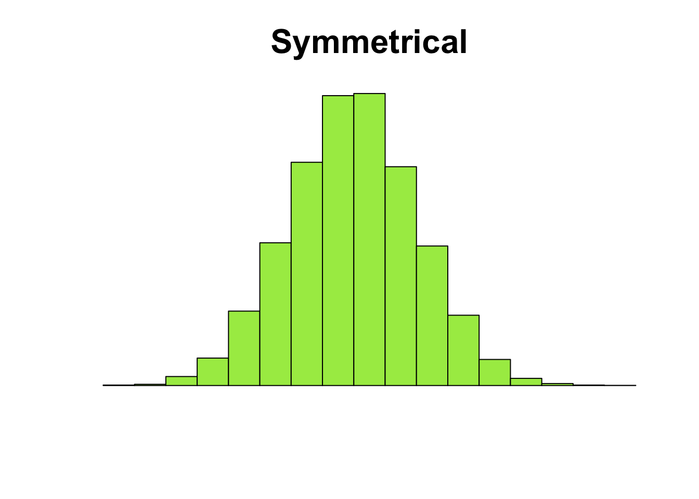
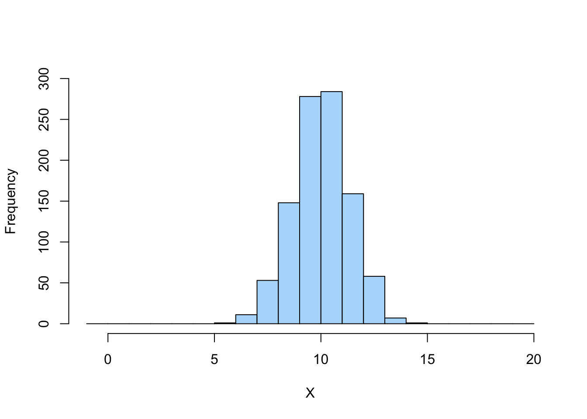
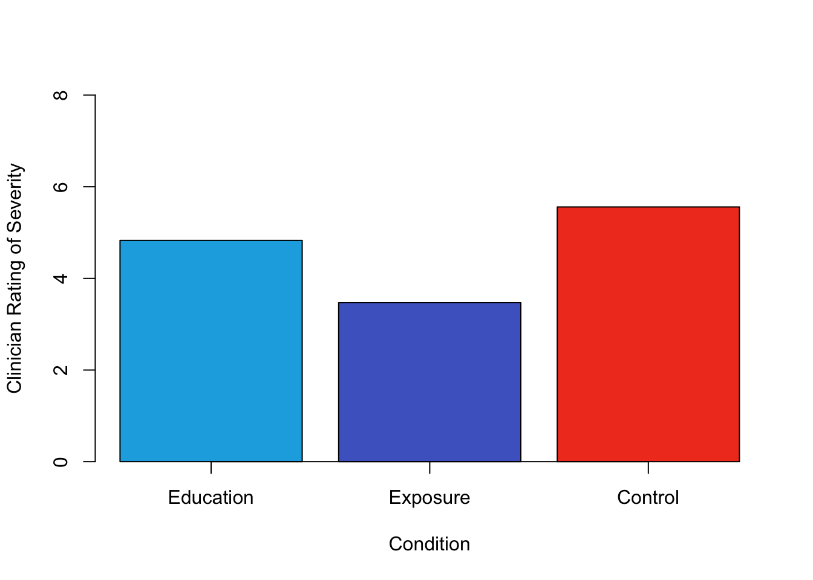
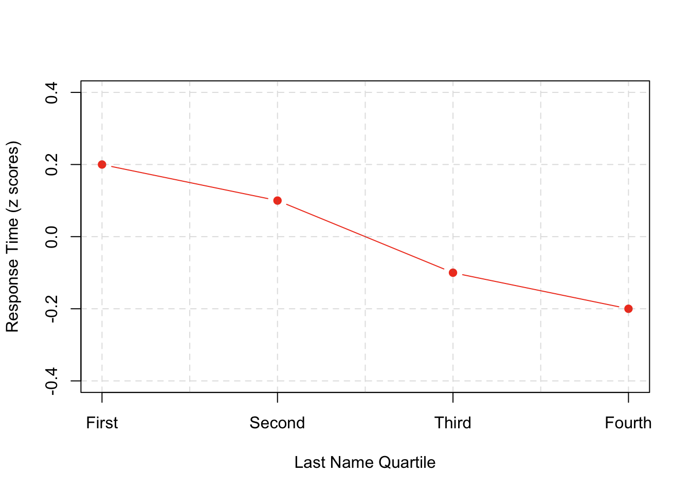
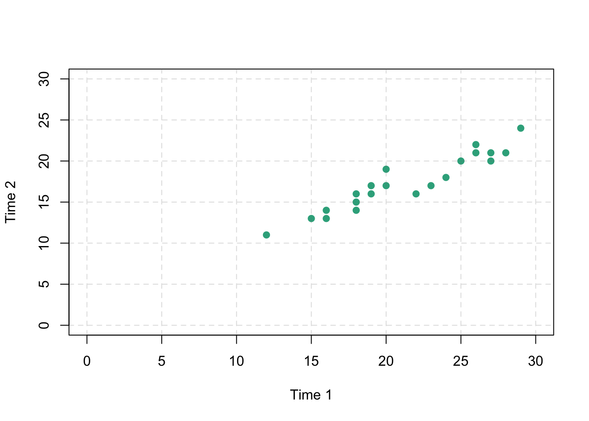
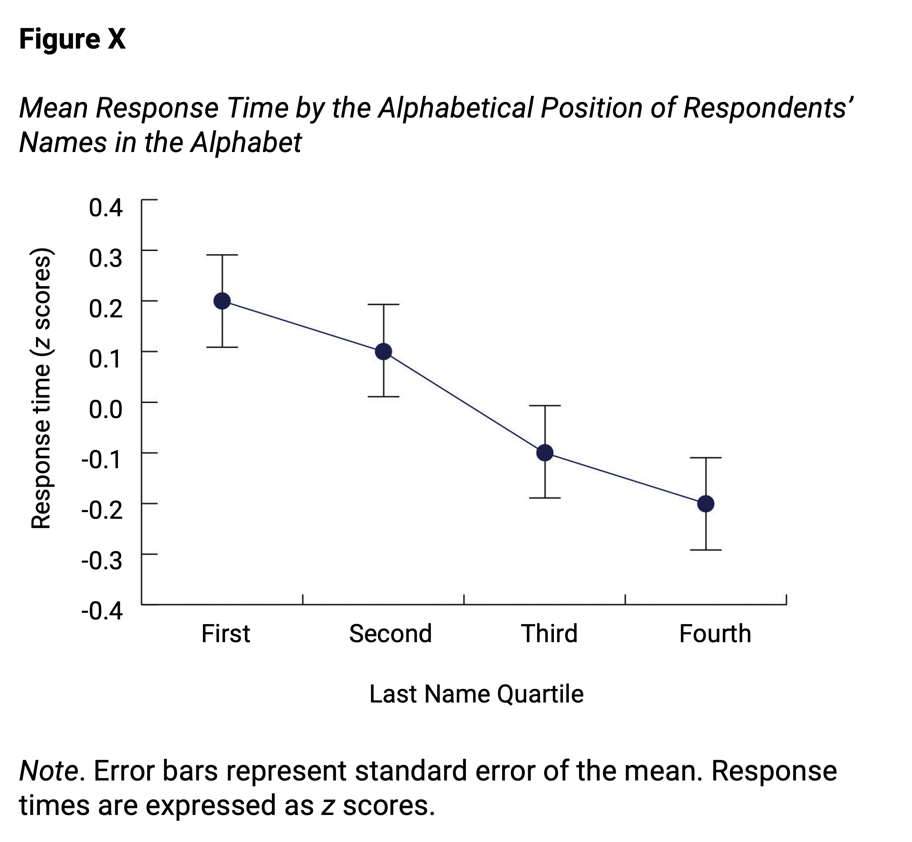

# Descriptive Statistics
At this point, we need to consider the basics of data analysis in psychological research in more detail. In this chapter, we focus on descriptive statistics—a set of techniques for summarizing and displaying the data from your sample. We look first at some of the most common techniques for describing single variables, followed by some of the most common techniques for describing statistical relationships between variables. We then look at how to present descriptive statistics in writing and also in the form of tables and graphs that would be appropriate for an American Psychological Association (APA)-style research report. We end with some practical advice for organizing and carrying out your analyses.

## Describing Single Variables

:::learningobjectives
##### LEARNING OBJECTIVES {-}
1. Use frequency tables and histograms to display and interpret the distribution of a variable.
2. Compute and interpret the mean, median, and mode of a distribution and identify situations in which the mean, median, or mode is the most appropriate measure of central tendency.
3. Compute and interpret the range and standard deviation of a distribution.
4. Compute and interpret percentile ranks and *z* scores.
:::

[Descriptive statistics] refers to a set of techniques for summarizing and displaying data. Let us assume here that the data are quantitative and consist of scores on one or more variables for each of several study participants. Although in most cases the primary research question will be about one or more statistical relationships between variables, it is also important to describe each variable individually. For this reason, we begin by looking at some of the most common techniques for describing single variables.

### The Distribution of a Variable {-}

Every variable has a [distribution], which is the way the scores are distributed across the levels of that variable. For example, in a sample of 100 college students, the distribution of the variable “number of siblings” might be such that 10 of them have no siblings, 30 have one sibling, 40 have two siblings, and so on. In the same sample, the distribution of the variable “sex” might be such that 44 have a score of “male” and 56 have a score of “female.”

#### Frequency Tables {-}

One way to display the distribution of a variable is in a [frequency table]. Table \@ref(tab:frequency), for example, is a frequency table showing a hypothetical distribution of scores on the Rosenberg Self-Esteem Scale for a sample of 40 college students. The first column lists the values of the variable—the possible scores on the Rosenberg scale—and the second column lists the frequency of each score. This table shows that there were three students who had self-esteem scores of 24, five who had self-esteem scores of 23, and so on. From a frequency table like this, one can quickly see several important aspects of a distribution, including the range of scores (from 15 to 24), the most and least common scores (22 and 17, respectively), and any extreme scores that stand out from the rest.

Table: (\#tab:frequency)Frequency table showing a hypothetical distribution of scores on the Rosenberg Self-Esteem Scale.

| Self-esteem | Frequency |
|:-----------:|:---------:|
|     24      |     3     |
|     23      |     5     |
|     22      |    10     |
|     21      |     8     |
|     20      |     5     |
|     19      |     3     |
|     18      |     3     |
|     17      |     0     |
|     16      |     2     |
|     15      |     1     |

There are a few other points worth noting about frequency tables. First, the levels listed in the first column usually go from the highest at the top to the lowest at the bottom, and they usually do not extend beyond the highest and lowest scores in the data. For example, although scores on the Rosenberg scale can vary from a high of 30 to a low of 0, Table \@ref(tab:frequency) only includes levels from 24 to 15 because that range includes all the scores in this particular data set. Second, when there are many different scores across a wide range of values, it is often better to create a grouped frequency table, in which the first column lists ranges of values and the second column lists the frequency of scores in each range. Table \@ref(tab:frequencybin), for example, is a grouped frequency table showing a hypothetical distribution of simple reaction times for a sample of 20 participants. In a grouped frequency table, the ranges must all be of equal width, and there are usually between five and 15 of them. Finally, frequency tables can also be used for categorical variables, in which case the levels are category labels. The order of the category labels is somewhat arbitrary, but they are often listed from the most frequent at the top to the least frequent at the bottom.

Table: (\#tab:frequencybin)A grouped frequency table showing a hypothetical distribution of reaction times.

| Reaction time (ms) | Frequency |
|:------------------:|:---------:|
|      241–260       |     1     |
|      221–240       |     2     |
|      201–220       |     2     |
|      181–200       |     9     |
|      161–180       |     4     |
|      141–160       |     2     |

#### Histograms {-}

A histogram is a graphical display of a distribution. It presents the same information as a frequency table but in a way that is even quicker and easier to grasp. The histogram in Figure \@ref(fig:hist) presents the distribution of self-esteem scores in Table \@ref(tab:frequency). The x-axis of the histogram represents the variable and the y-axis represents frequency. Above each level of the variable on the x-axis is a vertical bar that represents the number of individuals with that score. When the variable is quantitative, as in this example, there is usually no gap between the bars. When the variable is categorical, however, there is usually a small gap between them. (The gap at 17 in this histogram reflects the fact that there were no scores of 17 in this data set.)

(\#fig:hist)Histogram showing the distribution of self-esteem scores presented in the frequency table above.

#### Distribution Shapes {-}

When the distribution of a quantitative variable is displayed in a histogram, it has a shape. The shape of the distribution of self-esteem scores in Figure \@ref(fig:hist) is typical. There is a peak somewhere near the middle of the distribution and “tails” that taper in either direction from the peak. The distribution of Figure \@ref(fig:hist) is unimodal, meaning it has one distinct peak, but distributions can also be bimodal, meaning they have two distinct peaks. Figure \@ref(fig:bimodal), for example, shows a hypothetical bimodal distribution of scores on the Beck Depression Inventory. Distributions can also have more than two distinct peaks, but these are relatively rare in psychological research.

(\#fig:bimodal)Histogram showing a hypothetical bimodal distribution of scores on the Beck Depression Inventory.

Another characteristic of the shape of a distribution is whether it is symmetrical or skewed. The distribution in the center of Figure \@ref(fig:skew) is symmetrical. Its left and right halves are mirror images of each other. The distribution on the left is negatively skewed, with its peak shifted toward the upper end of its range and a relatively long negative tail. The distribution on the right is positively skewed, with its peak toward the lower end of its range and a relatively long positive tail.

(\#fig:skew)Histograms showing negatively skewed, symmetrical, and positively skewed distributions.

An [outlier] is an extreme score that is much higher or lower than the rest of the scores in the distribution. Sometimes outliers represent truly extreme scores on the variable of interest. For example, on the Beck Depression Inventory, a single clinically depressed person might be an outlier in a sample of otherwise happy and high-functioning peers. However, outliers can also represent errors or misunderstandings on the part of the researcher or participant, equipment malfunctions, or similar problems. We will say more about how to interpret outliers and what to do about them later in this chapter.

### Measures of Central Tendency and Variability {-}

It is also useful to be able to describe the characteristics of a distribution more precisely. Here we look at how to do this in terms of two important characteristics: their central tendency and their variability.

#### Central Tendency {-}

The [central tendency] of a distribution is its middle—the point around which the scores in the distribution tend to cluster. (Another term for central tendency is average.) Looking back at Figure \@ref(fig:hist), for example, we can see that the self-esteem scores tend to cluster around the values of 20 to 22. Here we will consider the three most common measures of central tendency: the mean, the median, and the mode.

The mean of a distribution (symbolized $M$) is the sum of the scores divided by the number of scores. As a formula, it looks like this:

$M = \frac{\sum X}{N}$

In this formula, the symbol $Σ$ (the Greek letter sigma) is the summation sign and means to sum across the values of the variable $X$. $N$ represents the number of scores. The mean is by far the most common measure of central tendency, and there are some good reasons for this. It usually provides a good indication of the central tendency of a distribution, and it is easily understood by most people. In addition, the mean has statistical properties that make it especially useful in doing inferential statistics.

An alternative to the mean is the median. The [median] is the middle score in the sense that half the scores in the distribution are less than it and half are greater than it. The simplest way to find the median is to organize the scores from lowest to highest and locate the score in the middle. Consider, for example, the following set of seven scores:

> 8 &nbsp; 4 &nbsp; 12 &nbsp; 14 &nbsp; 3 &nbsp; 2 &nbsp; 3

To find the median, simply rearrange the scores from lowest to highest and locate the one in the middle.

> 2 &nbsp; 3 &nbsp; 3 &nbsp; **4** &nbsp; 8 &nbsp; 12 &nbsp; 14

In this case, the median is 4 because there are three scores lower than 4 and three scores higher than 4. When there is an even number of scores, there are two scores in the middle of the distribution, in which case the median is the value halfway between them. For example, if we were to add a score of 15 to the preceding data set, there would be two scores (both 4 and 8) in the middle of the distribution, and the median would be halfway between them (6).

One final measure of central tendency is the [mode]. The mode is the most frequent score in a distribution. In the self-esteem distribution presented in Table \@ref(tab:frequency) and Figure \@ref(fig:hist), for example, the mode is 22. More students had that score than any other. The mode is the only measure of central tendency that can also be used for categorical variables.

In a distribution that is both unimodal and symmetrical, the mean, median, and mode will be very close to each other at the peak of the distribution. In a bimodal or asymmetrical distribution, the mean, median, and mode can be quite different. In a bimodal distribution, the mean and median will tend to be between the peaks, while the mode will be at the tallest peak. In a skewed distribution, the mean will differ from the median in the direction of the skew (i.e., the direction of the longer tail). For highly skewed distributions, the mean can be pulled so far in the direction of the skew that it is no longer a good measure of the central tendency of that distribution. Imagine, for example, a set of four simple reaction times of 200, 250, 280, and 250 milliseconds (ms). The mean is 245 ms. But the addition of one more score of 5,000 ms—perhaps because the participant was not paying attention—would raise the mean to 1,445 ms. Not only is this measure of central tendency greater than 80% of the scores in the distribution, but it also does not seem to represent the behavior of anyone in the distribution very well. This is why researchers often prefer the median for highly skewed distributions (such as distributions of reaction times).

Keep in mind, though, that you are not required to choose a single measure of central tendency in analyzing your data. Each one provides slightly different information, and all of them can be useful.

#### Measures of Variability {-}

The variability of a distribution is the extent to which the scores vary around their central tendency. Consider the two distributions in Figure \@ref(fig:variability), both of which have the same central tendency. The mean, median, and mode of each distribution are 10. Notice, however, that the two distributions differ in terms of their variability. The top one has relatively low variability, with all the scores relatively close to the center. The bottom one has relatively high variability, with the scores are spread across a greater range.

(\#fig:variability)Histograms showing hypothetical distributions of 1,000 observations with the same mean, median, and mode (10) but with low variability (top) and high variability (bottom).

One simple measure of variability is the [range], which is simply the difference between the highest and lowest scores in the distribution. The range of the self-esteem scores in Table \@ref(tab:frequency), for example, is the difference between the highest score (24) and the lowest score (15). That is, the range is 24 − 15 = 9. Although the range is easy to compute and understand, it can be misleading when there are outliers. Imagine, for example, an exam on which all the students scored between 90 and 100. It has a range of 10. But if there was a single student who scored 20, the range would increase to 80—giving the impression that the scores were quite variable when in fact only one student differed substantially from the rest.

By far the most common measure of variability is the standard deviation. The [standard deviation] of a distribution is, roughly speaking, the average distance between the scores and the mean. For example, the standard deviations of the distributions in Figure \@ref(fig:variability) are 1.3 for the top distribution and 3.0 for the bottom one. That is, while the scores in the top distribution differ from the mean by about 1.3 units on average, the scores in the bottom distribution differ from the mean by about 3.0 units on average.

Computing the standard deviation involves a slight complication. Specifically, it involves finding the difference between each score and the mean, squaring each difference, finding the mean of these squared differences, and finally finding the square root of that mean. The formula looks like this:

$SD=\sqrt{\frac{\sum(X-M)^2}{N}}$

The computations for the standard deviation are illustrated for a small set of data in Table \@ref(tab:sd). The first column is a set of eight scores that has a mean of 5. The second column is the difference between each score and the mean. The third column is the square of each of these differences. Notice that although the differences can be negative, the squared differences are always positive—meaning that the standard deviation is always positive. At the bottom of the third column is the mean of the squared differences, which is also called the [variance] (symbolized $SD^2$). Although the variance is itself a measure of variability, it generally plays a larger role in inferential statistics than in descriptive statistics. Finally, below the variance is the square root of the variance, which is the standard deviation.

Table: (\#tab:sd) Computations for the standard deviation.

| $X$ | $X-M$ | $X-M^2$ |
|:-----:|:-----:|:-----:|
| 3 | -2 | 4 |
| 5 | 0 | 0 |
| 4 | -1 | 1 |
| 2 | -3 | 9 |
| 7 | 2 | 4 |
| 6 | 1 | 1 |
| 5 | 0 | 0 |
| 8 | 3 | 9 |
| $M$ = 5 |  | $SD^2=28/8=3.5$ |
| &nbsp;&nbsp;&nbsp;&nbsp;&nbsp;&nbsp;&nbsp;&nbsp;&nbsp;&nbsp;&nbsp; | &nbsp;&nbsp;&nbsp;&nbsp;&nbsp;&nbsp;&nbsp;&nbsp;&nbsp;&nbsp;&nbsp; | $SD=\sqrt{3.50}=1.87$ |

:::fyi
##### *N* or *N*-1? {-}

If you have already taken a statistics course, you may have learned to divide the sum of the squared differences by *N* − 1 rather than by *N* when you compute the variance and standard deviation. Why is this?

By definition, the standard deviation is the square root of the mean of the squared differences. This implies dividing the sum of squared differences by *N*, as in the formula just presented. Computing the standard deviation this way is appropriate when your goal is simply to describe the variability in a sample. And learning it this way emphasizes that the variance is in fact the *mean* of the squared differences—and the standard deviation is the square root of this *mean.*

However, most calculators and software packages divide the sum of squared differences by *N* − 1. This is because the standard deviation of a sample tends to be a bit lower than the standard deviation of the population the sample was selected from. Dividing the sum of squares by *N* − 1 corrects for this tendency and results in a better estimate of the population standard deviation. Because researchers generally think of their data as representing a sample selected from a larger population—and because they are generally interested in drawing conclusions about the population—it makes sense to routinely apply this correction.
:::

#### Percentile Ranks and *z* Scores {-}

In many situations, it is useful to have a way to describe the location of an individual score within its distribution. One approach is the [percentile rank]. The percentile rank of a score is the percentage of scores in the distribution that are lower than that score. Consider, for example, the distribution in Table \@ref(tab:frequency). For any score in the distribution, we can find its percentile rank by counting the number of scores in the distribution that are lower than that score and converting that number to a percentage of the total number of scores. Notice, for example, that five of the students represented by the data in Table \@ref(tab:frequency) had self-esteem scores of 23. In this distribution, 32 of the 40 scores (80%) are lower than 23. Thus each of these students has a percentile rank of 80. (It can also be said that they scored “at the 80th percentile.”) Percentile ranks are often used to report the results of standardized tests of ability or achievement. If your percentile rank on a test of verbal ability were 40, for example, this would mean that you scored higher than 40% of the people who took the test.

Another approach is the *z* score. The [*z* score] for a particular individual is the difference between that individual’s score and the mean of the distribution, divided by the standard deviation of the distribution:

$z=\frac{(X-M)}{SD}$

A *z* score indicates how far above or below the mean a raw score is, but it expresses this in terms of the standard deviation. For example, in a distribution of intelligence quotient (IQ) scores with a mean of 100 and a standard deviation of 15, an IQ score of 110 would have a *z* score of (110 − 100) / 15 = +0.67. In other words, a score of 110 is 0.67 standard deviations (approximately two thirds of a standard deviation) above the mean. Similarly, a raw score of 85 would have a *z* score of (85 − 100) / 15 = −1.00. In other words, a score of 85 is one standard deviation below the mean.

There are several reasons that *z* scores are important. Again, they provide a way of describing where an individual’s score is located within a distribution and are sometimes used to report the results of standardized tests. They also provide one way of defining outliers. For example, outliers are sometimes defined as scores that have *z* scores less than −3.00 or greater than +3.00. In other words, they are defined as scores that are more than three standard deviations from the mean. Finally, *z* scores play an important role in understanding and computing other statistics, as we will see shortly.

:::fyi
##### Online Descriptive Statistics {-}

Although many researchers use commercially available software such as SPSS and Excel to analyze their data, there are several free online analysis tools that can also be extremely useful. Many allow you to enter or upload your data and then make one click to conduct several descriptive statistical analyses. Among them are the following.

jamovi: https://cloud.jamovi.org/

VassarStats: http://vassarstats.net/

Bright Stat: https://secure.brightstat.com/

For a list, see https://statpages.info/index.html.
:::

:::takeaways
##### KEY TAKEAWAYS {-}
- Every variable has a distribution—a way that the scores are distributed across the levels. The distribution can be described using a frequency table and histogram. It can also be described in words in terms of its shape, including whether it is unimodal or bimodal, and whether it is symmetrical or skewed.
- The central tendency, or middle, of a distribution can be described precisely using three statistics—the mean, median, and mode. The mean is the sum of the scores divided by the number of scores, the median is the middle score, and the mode is the most common score.
- The variability, or spread, of a distribution can be described precisely using the range and standard deviation. The range is the difference between the highest and lowest scores, and the standard deviation is roughly the average amount by which the scores differ from the mean.
- The location of a score within its distribution can be described using percentile ranks or *z* scores. The percentile rank of a score is the percentage of scores below that score, and the *z* score is the difference between the score and the mean divided by the standard deviation.
:::

:::exercises
##### EXERCISES {-}
1. Practice: Make a frequency table and histogram for the following data. Then write a short description of the shape of the distribution in words.  
    11, 8, 9, 12, 9, 10, 12, 13, 11, 13, 12, 6, 10, 17, 13, 11, 12, 12, 14, 14
2. Practice: For the data in Exercise 1, compute the mean, median, mode, standard deviation, and range.
3. Practice: Using the data in Exercises 1 and 2, find (a) the percentile ranks for scores of 9 and 14 and (b) the *z* scores for scores of 8 and 12.
:::

## Describing Statistical Relationships

:::learningobjectives
##### LEARNING OBJECTIVES {-}
1. Describe differences between groups in terms of their means and standard deviations, and in terms of Cohen’s *d*.
2. Describe correlations between quantitative variables in terms of Pearson’s *r*.
:::

As we have seen throughout this book, most interesting research questions in psychology are about statistical relationships between variables. Recall that there is a statistical relationship between two variables when the average score on one differs systematically across the levels of the other. In this section, we revisit the two basic forms of statistical relationship introduced earlier in the book—differences between groups or conditions and relationships between quantitative variables—and we consider how to describe them in more detail.

### Differences Between Groups or Conditions {-}

Differences between groups or conditions are usually described in terms of the mean and standard deviation of each group or condition. For example, Thomas Ollendick and his colleagues conducted a study in which they evaluated two one-session treatments for simple phobias in children [@ollendick2009one]. They randomly assigned children with an intense fear (e.g., to dogs) to one of three conditions. In the exposure condition, the children actually confronted the object of their fear under the guidance of a trained therapist. In the education condition, they learned about phobias and some strategies for coping with them. In the waitlist control condition, they were waiting to receive a treatment after the study was over. The severity of each child’s phobia was then rated on a 1-to-8 scale by a clinician who did not know which treatment the child had received. (This was one of several dependent variables.) The mean fear rating in the education condition was 4.83 with a standard deviation of 1.52, while the mean fear rating in the exposure condition was 3.47 with a standard deviation of 1.77. The mean fear rating in the control condition was 5.56 with a standard deviation of 1.21. In other words, both treatments worked, but the exposure treatment worked better than the education treatment. As we have seen, differences between group or condition means can be presented in a bar graph like that in Figure \@ref(fig:phobia), where the heights of the bars represent the group or condition means. We will look more closely at creating American Psychological Association (APA)-style bar graphs shortly.

(\#fig:phobia)Bar graph showing mean clinician phobia ratings for children in two treatment conditions.

It is also important to be able to describe the strength of a statistical relationship, which is often referred to as the [effect size]. The most widely used measure of effect size for differences between group or condition means is called [Cohen’s *d*], which is the difference between the two means divided by the standard deviation:

$d=\frac{(M_1-M_2)}{SD}$

In this formula, it does not really matter which mean is $M_1$ and which is $M_2$. If there is a treatment group and a control group, the treatment group mean is usually $M_1$ and the control group mean is $M_2$. Otherwise, the larger mean is usually $M_1$ and the smaller mean $M_2$ so that Cohen’s *d* turns out to be positive. The standard deviation in this formula is usually a kind of average of the two group standard deviations called the pooled-within groups standard deviation. To compute the pooled within-groups standard deviation, add the sum of the squared differences for Group 1 to the sum of squared differences for Group 2, divide this by the sum of the two sample sizes, and then take the square root of that. Informally, however, the standard deviation of either group can be used instead.

Conceptually, Cohen’s *d* is the difference between the two means expressed in standard deviation units. (Notice its similarity to a *z* score, which expresses the difference between an individual score and a mean in standard deviation units.) A Cohen’s *d* of 0.50 means that the two group means differ by 0.50 standard deviations (half a standard deviation). A Cohen’s *d* of 1.20 means that they differ by 1.20 standard deviations. But how should we interpret these values in terms of the strength of the relationship or the size of the difference between the means? Table \@ref(tab:guidelines) presents some guidelines for interpreting Cohen’s *d* values in psychological research [@cohen1992power]. Values near 0.20 are considered small, values near 0.50 are considered medium, and values near 0.80 are considered large. Thus a Cohen’s *d* value of 0.50 represents a medium-sized difference between two means, and a Cohen’s *d* value of 1.20 represents a very large difference in the context of psychological research. In the research by Ollendick and his colleagues, there was a large difference (*d* = 0.82) between the exposure and education conditions.

Table: (\#tab:guidelines)Guidelines for referring to Cohen’s *d* and Pearson’s *r* values as “strong,” “medium,” or “weak”.

| Relationship strength | Cohen's *d* | Pearson's *r* |
|:---------------------:|:-----------:|:-------------:|
|     Strong/large      |   ± 0.80    |    ± 0.50     |
|        Medium         |   ± 0.50    |    ± 0.30     |
|      Weak/small       |   ± 0.20    |    ± 0.10     |

Cohen’s *d* is useful because it has the same meaning regardless of the variable being compared or the scale it was measured on. A Cohen’s *d* of 0.20 means that the two group means differ by 0.20 standard deviations whether we are talking about scores on the Rosenberg Self-Esteem scale, reaction time measured in milliseconds, number of siblings, or diastolic blood pressure measured in millimeters of mercury. Not only does this make it easier for researchers to communicate with each other about their results, it also makes it possible to combine and compare results across different studies using different measures.

Be aware that the term *effect size* can be misleading because it suggests a causal relationship—that the difference between the two means is an “effect” of being in one group or condition as opposed to another. Imagine, for example, a study showing that a group of exercisers is happier on average than a group of nonexercisers, with an “effect size” of *d* = 0.35. If the study was an experiment—with participants randomly assigned to exercise and no-exercise conditions—then one could conclude that exercising caused a small to medium-sized increase in happiness. If the study was correlational, however, then one could conclude only that the exercisers were happier than the nonexercisers by a small to medium-sized amount. In other words, simply calling the difference an “effect size” does not make the relationship a causal one.

:::fyi
##### Sex Differences Expressed as Cohen’s *d* {-}

Researcher Janet Shibley Hyde has looked at the results of numerous studies on psychological sex differences and expressed the results in terms of Cohen’s *d* [@hyde2007new]. Following are a few of the values she has found, averaging across several studies in each case. (Note that because she always treats the mean for men as $M_1$ and the mean for women as $M_2$, positive values indicate that men score higher and negative values indicate that women score higher.)

| Attribute | *d* |
|	:----- | :--: |
| Mathematical problem solving |	+0.08 |
|	Reading comprehension	|	−0.09 |
|	Smiling	|	−0.40 |
|	Aggression	|	+0.50 |
|	Attitudes toward casual sex	|	+0.81 |
|	Leadership effectiveness	|	−0.02 |

Hyde points out that although men and women differ by a large amount on some variables (e.g., attitudes toward casual sex), they differ by only a small amount on the vast majority. In many cases, Cohen’s *d* is less than 0.10, which she terms a “trivial” difference. (The difference in talkativeness discussed in the @mehl2007women paper was also trivial: *d* = 0.06.) Although researchers and nonresearchers alike often emphasize sex differences, Hyde has argued that it makes at least as much sense to think of men and women as fundamentally similar. She refers to this as the “gender similarities hypothesis.”

(\#fig:leader)Research on psychological sex differences has shown that there is essentially no difference in the leadership effectiveness of women and men. *Photo by Jason Goodman on Unsplash.*

:::

### Correlations Between Quantitative Variables {-}

As we have seen throughout the book, many interesting statistical relationships take the form of correlations between quantitative variables. For example, researchers Kurt Carlson and Jacqueline Conard conducted a study on the relationship between the alphabetical position of the first letter of people’s last names (from A = 1 to Z = 26) and how quickly those people responded to consumer appeals [@carlson2011last]. In one study, they sent e-mails to a large group of MBA students, offering free basketball tickets from a limited supply. The result was that the further toward the end of the alphabet students’ last names were, the faster they tended to respond. These results are summarized in Figure \@ref(fig:line).

(\#fig:line)Line graph showing the relationship between the alphabetical position of people’s last names and how quickly those people respond to offers of consumer goods.

Such relationships are often presented using line graphs or scatterplots, which show how the level of one variable differs across the range of the other. In the line graph in Figure \@ref(fig:line), for example, each point represents the mean response time for participants with last names in the first, second, third, and fourth quartiles (or quarters) of the name distribution. It clearly shows how response time tends to decline as people’s last names get closer to the end of the alphabet. The scatterplot in Figure \@ref(fig:scatter), which is reproduced from the Measurement chapter, shows the relationship between 25 research methods students’ scores on the Rosenberg Self-Esteem Scale given on two occasions a week apart. Here the points represent individuals, and we can see that the higher students scored on the first occasion, the higher they tended to score on the second occasion. In general, line graphs are used when the variable on the x-axis has (or is organized into) a small number of distinct values, such as the four quartiles of the name distribution. Scatterplots are used when the variable on the x-axis has a large number of values, such as the different possible self-esteem scores.

(\#fig:scatter)Statistical relationship between several college students’ scores on the Rosenberg Self-Esteem Scale given on two occasions a week apart.

The data presented in Figure \@ref(fig:scatter) provide a good example of a positive relationship, in which higher scores on one variable tend to be associated with higher scores on the other (so that the points go from the lower left to the upper right of the graph). The data presented in Figure \@ref(fig:line) provide a good example of a negative relationship, in which higher scores on one variable tend to be associated with lower scores on the other (so that the points go from the upper left to the lower right).

Both of these examples are also linear relationships, in which the points are reasonably well fit by a single straight line. [Nonlinear relationships](#nonlinear-relationship) are those in which the points are better fit by a curved line. Figure \@ref(fig:nonlinear), for example, shows a hypothetical relationship between the amount of sleep people get per night and their level of depression. In this example, the line that best fits the points is a curve—a kind of upside down “U”—because people who get about eight hours of sleep tend to be the least depressed, while those who get too little sleep and those who get too much sleep tend to be more depressed. Nonlinear relationships are not uncommon in psychology, but a detailed discussion of them is beyond the scope of this book.

(\#fig:nonlinear)Hypothetical nonlinear relationship between sleep and depression.

As we saw earlier in the book, the strength of a correlation between quantitative variables is typically measured using a statistic called Pearson’s *r*. As Figure \@ref(fig:pearson) shows, its possible values range from −1.00, through zero, to +1.00. A value of 0 means there is no relationship between the two variables. In addition to his guidelines for interpreting Cohen’s *d*, Cohen offered guidelines for interpreting Pearson’s *r* in psychological research (see Table \@ref(tab:guidelines)). Values near ±.10 are considered small, values near ± .30 are considered medium, and values near ±.50 are considered large. Notice that the sign of Pearson’s *r* is unrelated to its strength. Pearson’s *r* values of +.30 and −.30, for example, are equally strong; it is just that one represents a moderate positive relationship and the other a moderate negative relationship. Like Cohen’s *d*, Pearson’s *r* is also referred to as a measure of “effect size” even though the relationship may not be a causal one.

(\#fig:pearson)Pearson’s *r* ranges from −1.00 (representing the strongest possible negative relationship), through 0 (representing no relationship), to +1.00 (representing the strongest possible positive relationship).

The computations for Pearson’s *r* are more complicated than those for Cohen’s *d*. Although you may never have to do them by hand, it is still instructive to see how. Computationally, Pearson’s *r* is the “mean cross-product of *z* scores.” To compute it, one starts by transforming all the scores to *z* scores. For the *X* variable, subtract the mean of *X* from each score and divide each difference by the standard deviation of *X*. For the *Y* variable, subtract the mean of *Y* from each score and divide each difference by the standard deviation of Y. Then, for each individual, multiply the two *z* scores together to form a cross-product. Finally, take the mean of the cross-products. The formula looks like this:

$r=\frac{\sum(z_xz_y)}{N}$

Table \@ref(tab:pearsonmath) illustrates these computations for a small set of data. The first column lists the scores for the *X* variable, which has a mean of 4.00 and a standard deviation of 1.90. The second column is the *z* score for each of these raw scores. The third and fourth columns list the raw scores for the *Y* variable, which has a mean of 40 and a standard deviation of 11.78, and the corresponding *z* scores. The fifth column lists the cross-products. For example, the first one is 0.00 multiplied by −0.85, which is equal to 0.00. The second is 1.58 multiplied by 1.19, which is equal to 1.88. The mean of these cross-products, shown at the bottom of that column, is Pearson’s *r*, which in this case is +.53. There are other formulas for computing Pearson’s *r* by hand that may be quicker. This approach, however, is much clearer in terms of communicating conceptually what Pearson’s *r* is.

Table: (\#tab:pearsonmath) Sample computations for Pearson's *r*.

| $X$ | $z_X$ | $Y$ | $z_Y$ | $z_Xz_Y$ | 
|:---:|:---:|:---:|:---:|:---:|
| 4 | 0.00 | 30 | -0.85 | 0.00 |
| 7 | 1.58 | 54 | 1.19 | 1.88 |
| 2 | -1.05 | 23 | -1.44 | 1.53 |
| 5 | 0.53 | 43 | 0.26 | 0.13 |
| 2 | -1.05 | 50 | 0.85 | -0.89 |
| $M_X$ = 4.00 |  | $M_Y$ = 40.00 |  | $r$ = 0.53 |
| $SD_X$ = 1.90 |  | $SD_Y$ = 11.78 |  |  |

There are two common situations in which the value of Pearson’s *r* can be misleading. One is when the relationship under study is nonlinear. Even though Figure \@ref(fig:nonlinear) shows a fairly strong relationship between depression and sleep, Pearson’s *r* would be close to zero because the points in the scatterplot are not well fit by a single straight line. This means that it is important to make a scatterplot and confirm that a relationship is approximately linear before using Pearson’s *r*. The other is when one or both of the variables have a limited range in the sample relative to the population. This is referred to as [restriction of range]. Assume, for example, that there is a strong negative correlation between people’s age and their enjoyment of hip hop music as shown by the scatterplot in Figure \@ref(fig:range). Pearson’s *r* here is −.77. However, if we were to collect data only from 18- to 24-year-olds—represented by the shaded area of Figure \@ref(fig:range)—then the relationship would seem to be quite weak. In fact, Pearson’s *r* for this restricted range of ages is 0. It is a good idea, therefore, to design studies to avoid restriction of range. For example, if age is one of your primary variables, then you can plan to collect data from people of a wide range of ages. Because restriction of range is not always anticipated or easily avoidable, however, it is good practice to examine your data for possible restriction of range and to interpret Pearson’s *r* in light of it. (There are also statistical methods to correct Pearson’s *r* for restriction of range, but they are beyond the scope of this book).

(\#fig:range)Hypothetical data showing how a strong overall correlation can appear to be weak when one variable has a restricted range. The overall correlation here is −.77, but the correlation for the 18- to 24-year-olds (in the blue box) is 0.

:::takeaways
##### KEY TAKEAWAYS {-}

- Differences between groups or conditions are typically described in terms of the means and standard deviations of the groups or conditions or in terms of Cohen’s *d* and are presented in bar graphs.
- Cohen’s *d* is a measure of relationship strength (or effect size) for differences between two group or condition means. It is the difference of the means divided by the standard deviation. In general, values of ±0.20, ±0.50, and ±0.80 can be considered small, medium, and large, respectively.
- Correlations between quantitative variables are typically described in terms of Pearson’s *r* and presented in line graphs or scatterplots.
- Pearson’s *r* is a measure of relationship strength (or effect size) for relationships between quantitative variables. It is the mean cross-product of the two sets of *z* scores. In general, values of ±.10, ±.30, and ±.50 can be considered small, medium, and large, respectively.
:::

:::exercises
##### EXERCISES {-}

1. Practice: The following data represent scores on the Rosenberg Self-Esteem Scale for a sample of 10 Japanese college students and 10 American college students. (Although hypothetical, these data are consistent with empirical findings [@schmitt2005simultaneous]). Compute the means and standard deviations of the two groups, make a bar graph, compute Cohen’s *d*, and describe the strength of the relationship in words.

|Japan |	United States |
| :---: | :---: |
| 25 | 27 |
| 20 | 30 |
| 24 | 34 |
| 28 | 37 |
| 30 | 26 |
| 32 | 24 |
| 21 | 28 |
| 24 | 35 |
| 20 | 33 |
| 26 | 36 |

2. Practice: The hypothetical data that follow are extroversion scores and the number of Facebook friends for 15 college students. Make a scatterplot for these data, compute Pearson’s *r*, and describe the relationship in words.

| Extroversion |	Facebook Friends |
| :---: | :---: |
| 8 | 75 |
| 10 | 315 |
| 4 | 28 |
| 6 | 214 |
| 12 | 176 |
| 14 | 95 |
| 10 | 120 |
| 11 | 150 |
| 4 |	32 |
| 13 | 250 |
| 5 |	99 |
| 7 |	136 |
| 8 |	185 |
| 11 | 88 |
| 10 | 144 |
:::

## Expressing Your Results

:::learningobjectives
##### LEARNING OBJECTIVES {-}
1. Write out simple descriptive statistics in American Psychological Association (APA) style.
2. Interpret and create simple APA-style graphs—including bar graphs, line graphs, and scatterplots.
3. Interpret and create simple APA-style tables—including tables of group or condition means and correlation matrixes.
:::

Once you have conducted your descriptive statistical analyses, you will need to present them to others. In this section, we focus on presenting descriptive statistical results in writing, in graphs, and in tables—following American Psychological Association (APA) guidelines for written research reports. These principles can be adapted easily to other presentation formats such as posters and slide show presentations.

### Presenting Descriptive Statistics in Writing {-}

When you have a small number of results to report, it is often most efficient to write them out. There are a few important APA style guidelines here. First, statistical results are always presented in the form of numerals rather than words and are usually rounded to two decimal places (e.g., “2.00” rather than “two” or “2”). They can be presented either in the narrative description of the results or parenthetically—much like reference citations. Here are some examples:

> The mean age of the participants was 22.43 years with a standard deviation of 2.34.

> Among the low self-esteem participants, those in a negative mood expressed stronger intentions to have unprotected sex (*M* = 4.05, *SD* = 2.32) than those in a positive mood (*M* = 2.15, *SD* = 2.27).

> The treatment group had a mean of 23.40 (*SD* = 9.33), while the control group had a mean of 20.87 (*SD* = 8.45).

> The test-retest correlation was .96.

> There was a moderate negative correlation between the alphabetical position of respondents’ last names and their response time (*r* = −.27).

Notice that when presented in the narrative, the terms *mean* and *standard deviation* are written out, but when presented parenthetically, the symbols *M* and *SD* are used instead. Notice also that it is especially important to use parallel construction to express similar or comparable results in similar ways. The third example is *much* better than the following nonparallel alternative:

> The treatment group had a mean of 23.40 (*SD* = 9.33), while 20.87 was the mean of the control group, which had a standard deviation of 8.45.

### Presenting Descriptive Statistics in Graphs {-}

When you have a large number of results to report, you can often do it more clearly and efficiently with a graph. When you prepare graphs for an APA-style research report, there are some general guidelines that you should keep in mind. First, the graph should always add important information rather than repeat information that already appears in the text or in a table. (If a graph presents information more clearly or efficiently, then you should keep the graph and eliminate the text or table.) Second, graphs should be as simple as possible. For example, the *Publication Manual* discourages the use of color in figures for print publication unless absolutely necessary (although color can still be an effective element in posters, slide show presentations, or textbooks.) Third, graphs should be interpretable on their own. A reader should be able to understand the basic result based only on the graph and its caption and should not have to refer to the text for an explanation.

There are also several more technical guidelines for graphs that include the following:

- Layout
    + The graph should be slightly wider than it is tall.
    + The independent variable should be plotted on the x-axis and the dependent variable on the y-axis.
    + Values should increase from left to right on the x-axis and from bottom to top on the y-axis.

- Axis Labels and Legends
    + Axis labels should be clear and concise and include the units of measurement if they do not appear in the caption.
    + Axis labels should be parallel to the axis.
    + Legends should appear within the boundaries of the graph.
    + Text should be in the same simple font throughout and differ by no more than four points.

- Captions
    + Captions should briefly describe the figure, explain any abbreviations, and include the units of measurement if they do not appear in the axis labels.

#### Bar Graphs {-}

As we have seen throughout this book, [bar graphs](#bar-graph) are generally used to present and compare the mean scores for two or more groups or conditions. The bar graph in Figure \@ref(fig:apabar) is an APA-style version of Figure \@ref(fig:phobia). Notice that it conforms to all the guidelines listed. A new element in Figure \@ref(fig:apabar) is the smaller vertical bars that extend both upward and downward from the top of each main bar. These are [error bars], and they represent the variability in each group or condition. Although they sometimes extend one standard deviation in each direction, they are more likely to extend one standard error in each direction (as in Figure \@ref(fig:apabar)). The [standard error] is the standard deviation of the group divided by the square root of the sample size of the group. The standard error is used because, in general, a difference between the means of two group that is greater than two standard errors is statistically significant. Thus one can “see” whether a difference is statistically significant based on a bar graph with standard error bars. It is also common for error bars to represent the 95% confidence interval of the man. These error bars are interpreted differently: if there is any overlap between error bars that represent the 95% confidence interval when comparing a plot of two means, the difference is *not* statistically significant.

(\#fig:apabar)Sample APA-style bar graph, with error bars representing the standard errors, based on research by Ollendick and colleagues.

#### Line Graphs {-}

[Line graphs](#line-graph) are used to present correlations between quantitative variables when the independent variable has, or is organized into, a relatively small number of distinct levels. Each point in a line graph represents the mean score on the dependent variable for participants at one level of the independent variable. Figure \@ref(fig:apaline) is an APA-style version of the results of Carlson and Conard. Notice that it includes error bars representing the standard error and conforms to all the stated guidelines.

(\#fig:apaline)Sample APA-style line graph based on research by Carlson and Conard.

In most cases, the information in a line graph could just as easily be presented in a bar graph. In Figure \@ref(fig:apabar), for example, one could replace each point with a bar that reaches up to the same level and leave the error bars right where they are. This emphasizes the fundamental similarity of the two types of statistical relationship. Both are differences in the average score on one variable across levels of another. The convention followed by most researchers, however, is to use a bar graph when the variable plotted on the x-axis is categorical and a line graph when it is quantitative.

#### Scatterplots {-}

[Scatterplots](#scatterplot) are used to present relationships between quantitative variables when the variable on the x-axis (typically the independent variable) has a large number of levels. Each point in a scatterplot represents an individual rather than the mean for a group of individuals, and there are no lines connecting the points. The graph in Figure \@ref(fig:apabar) is an APA-style version of Figure \@ref(fig:scatter), which illustrates a few additional points. First, when the variables on the x-axis and y-axis are conceptually similar and measured on the same scale—as here, where they are measures of the same variable on two different occasions—this can be emphasized by making the axes the same length. Second, when two or more individuals fall at exactly the same point on the graph, one way this can be indicated is by offsetting the points slightly along the x-axis. Other ways are by displaying the number of individuals in parentheses next to the point or by making the point larger or darker in proportion to the number of individuals. Finally, the straight line that best fits the points in the scatterplot, which is called the regression line, can also be included.

(\#fig:apascatter)Sample APA-style scatterplot.

:::fyi
##### Jitter plots {-}

Developments in data visualization software have led to new options for displaying results. One data visualization method that has increased in popularity is the **jitter plot**. Like scatterplots, jitter plots show individual data points. The data visualization software that generates the plots allows the points to shift slightly in a random direction in order to reduce data point overlap -- hence the word *jitter* in the name. These plots can display the same data as bar and line graphs (i.e., means and error bars) while helping the viewer grasp the full variability in the data. Figure \@ref(fig:apajitter) shows an example in APA format.

(\#fig:apajitter)Sample APA-style jitter plot showing hypothetical data.

The jitter plot above was generated using the free online application [ShowMyData](https://www.showmydata.org/).
:::

### Expressing Descriptive Statistics in Tables {-}

Like graphs, tables can be used to present large amounts of information clearly and efficiently. The same general principles apply to tables as apply to graphs. They should add important information to the presentation of your results, be as simple as possible, and be interpretable on their own. Again, we focus here on tables for an APA-style manuscript.

The most common use of tables is to present several means and standard deviations—usually for complex research designs with multiple independent and dependent variables. Figure \@ref(fig:apatable), for example, shows the results of a hypothetical study similar to the one by @macdonald2002self. (The means in Figure \@ref(fig:apatable) are the means reported by MacDonald and Martineau, but the standard errors are not). Recall that these researchers categorized participants as having low or high self-esteem, put them into a negative or positive mood, and measured their intentions to have unprotected sex. They also measured participants’ attitudes toward unprotected sex. Notice that the table includes horizontal lines spanning the entire table at the top and bottom, and just beneath the column headings. Furthermore, every column has a heading—including the leftmost column—and there are additional headings that span two or more columns that help to organize the information and present it more efficiently. Finally, notice that APA-style tables are numbered consecutively starting at 1 (Table 1, Table 2, and so on) and given a brief but clear and descriptive title.

(\#fig:apatable)Sample APA-style table presenting means and standard deviations.

Another common use of tables is to present correlations—usually measured by Pearson’s *r*—among several variables. This is called a [correlation matrix]. Figure \@ref(fig:apamatrix) is a correlation matrix based on a study by David McCabe and colleagues [@mccabe2010relationship]. They were interested in the relationships between working memory and several other variables. We can see from the table that the correlation between working memory and executive function, for example, was an extremely strong .96, that the correlation between working memory and vocabulary was a medium .27, and that all the measures except vocabulary tend to decline with age. Notice here that only half the table is filled in because the other half would have identical values. For example, the Pearson’s *r* value in the upper right corner (working memory and age) would be the same as the one in the lower left corner (age and working memory). The correlation of a variable with itself is always 1.00, so these values are replaced by dashes to make the table easier to read.

(\#fig:apamatrix)Sample APA-style table (correlation matrix) based on research by McCabe and colleagues.

As with graphs, precise statistical results that appear in a table do not need to be repeated in the text. Instead, the writer can note major trends and alert the reader to details (e.g., specific correlations) that are of particular interest.

:::takeaways
##### KEY TAKEAWAYS {-}
- In an APA-style article, simple results are most efficiently presented in the text, while more complex results are most efficiently presented in graphs or tables.
- APA style includes several rules for presenting numerical results in the text. These include using words only for numbers less than 10 that do not represent precise statistical results, and rounding results to two decimal places, using words (e.g., “mean”) in the text and symbols (e.g., “*M*”) in parentheses.
- APA style includes several rules for presenting results in graphs and tables. Graphs and tables should add information rather than repeating information, be as simple as possible, and be interpretable on their own with a descriptive title.
:::

:::exercises
##### EXERCISE {-}
1. Practice: In a classic study, men and women rated the importance of physical attractiveness in both a short-term mate and a long-term mate (Buss & Schmitt, 1993).Buss, D. M., & Schmitt, D. P. (1993). Sexual strategies theory: A contextual evolutionary analysis of human mating. Psychological Review, 100, 204–232. The means and standard deviations are as follows. Men / Short Term: *M* = 5.67, *SD* = 2.34; Men / Long Term: *M* = 4.43, *SD* = 2.11; Women / Short Term: *M* = 5.67, *SD* = 2.48; Women / Long Term: *M* = 4.22, *SD* = 1.98. Present these results (a) in writing, (b) in a graph, and (c) in a table.
:::

## Conducting Your Analyses

:::learningobjectives
##### LEARNING OBJECTIVE {-}
1. Describe the steps involved in preparing and analyzing a typical set of raw data.
:::

Even when you understand the statistics involved, analyzing data can be a complicated process. It is likely that for each of several participants, there are data for several different variables: demographics such as sex and age, one or more independent variables, one or more dependent variables, and perhaps a manipulation check. Furthermore, the “raw” (unanalyzed) data might take several different forms—completed paper-and-pencil questionnaires, computer files filled with numbers or text, videos, or written notes—and these may have to be organized, coded, or combined in some way. There might even be missing, incorrect, or just “suspicious” responses that must be dealt with. In this section, we consider some practical advice to make this process as organized and efficient as possible.

### Prepare Your Data for Analysis {-}

Whether your raw data are on paper or in a computer file (or both), there are a few things you should do before you begin analyzing them. First, be sure they do not include any information that might identify individual participants and be sure that you have a secure location where you can store the data and a separate secure location where you can store any consent forms. Unless the data are highly sensitive, a locked room or password-protected computer is usually good enough. It is also a good idea to make photocopies or backup files of your data and store them in yet another secure location—at least until the project is complete. Professional researchers usually keep a copy of their raw data and consent forms for several years in case questions about the procedure, the data, or participant consent arise after the project is completed.

Next, you should check your [raw data] to make sure that they are complete and appear to have been accurately recorded (whether it was participants, yourself, or a computer program that did the recording). At this point, you might find that there are illegible or missing responses, or obvious misunderstandings (e.g., a response of “12” on a 1-to-10 rating scale). You will have to decide whether such problems are severe enough to make a participant’s data unusable. If information about the main independent or dependent variable is missing, or if several responses are missing or suspicious, you may have to exclude that participant’s data from the analyses. If you do decide to exclude any data, do not throw them away or delete them because you or another researcher might want to see them later. Instead, set them aside and keep notes about why you decided to exclude them because you will need to report this information.

Now you are ready to enter your data in a spreadsheet program or, if it is already in a computer file, to format it for analysis. You can use a general spreadsheet program like Microsoft Excel or a statistical analysis program like SPSS to create your [data file]. (Data files created in one program can usually be converted to work with other programs.) The most common format is for each row to represent a participant and for each column to represent a variable (with the variable name at the top of each column). A sample data file is shown in Table \@ref(tab:sampledata). The first column contains participant identification numbers. This is followed by columns containing demographic information (sex and age), independent variables (mood, four self-esteem items, and the total of the four self-esteem items), and finally dependent variables (intentions and attitudes). Categorical variables can usually be entered as category labels (e.g., “M” and “F” for male and female) or as numbers (e.g., “0” for negative mood and “1” for positive mood). Although category labels are often clearer, some analyses might require numbers. SPSS allows you to enter numbers but also attach a category label to each number.

Table: (\#tab:sampledata) Sample data file.

| ID | SEX | AGE | MOOD | SE1 | SE2 | SE3 | SE4 | TOTAL | INT | ATT |
| --: | :-- | --: | --: | --: | --: | --: | --: | --: | --: | --: |
| 1 | M | 20 | 1 | 2 | 3 | 2 | 3 | 10 | 6 | 5 |
| 2 | F | 22 | 1 | 1 | 0 | 2 | 1 | 4 | 4 | 4 |
| 3 | F | 19 | 0 | 2 | 2 | 2 | 2 | 8 | 2 | 3 |
| 4 | F | 24 | 0 | 3 | 3 | 2 | 3 | 11 | 5 | 6 |

If you have multiple-response measures—such the self-esteem measure in Table \@ref(tab:sampledata)—you could combine the items by hand and then enter the total score in your spreadsheet. However, it is much better to enter each response as a separate variable in the spreadsheet—as with the self-esteem measure in Table \@ref(tab:sampledata)—and use the software to combine them (e.g., using the “AVERAGE” function in Excel or the “Compute” function in SPSS). Not only is this approach more accurate, but it allows you to detect and correct errors, to assess internal consistency, and to analyze individual responses if you decide to do so later.

### Preliminary Analyses {-}

Before turning to your primary research questions, there are often several preliminary analyses to conduct. For multiple-response measures, you should assess the internal consistency of the measure. Statistical programs like SPSS will allow you to compute Cronbach’s α or Cohen’s κ. If this is beyond your comfort level, you can still compute and evaluate a split-half correlation.

Next, you should analyze each important variable separately. (This is not necessary for manipulated independent variables, of course, because you as the researcher determined what the distribution would be.) Make histograms for each one, note their shapes, and compute the common measures of central tendency and variability. Be sure you understand what these statistics *mean* in terms of the variables you are interested in. For example, a distribution of self-report happiness ratings on a 1-to-10-point scale might be unimodal and negatively skewed with a mean of 8.25 and a standard deviation of 1.14. But what this *means* is that most participants rated themselves fairly high on the happiness scale, with a small number rating themselves noticeably lower.

Now is the time to identify outliers, examine them more closely, and decide what to do about them. You might discover that what at first appears to be an outlier is the result of a response being entered incorrectly in the data file, in which case you only need to correct the data file and move on. Alternatively, you might suspect that an outlier represents some other kind of error, misunderstanding, or lack of effort by a participant. For example, in a reaction time distribution in which most participants took only a few seconds to respond, a participant who took 3 minutes to respond would be an outlier. It seems likely that this participant did not understand the task (or at least was not paying very close attention). Also, including his or her reaction time would have a large impact on the mean and standard deviation for the sample. In situations like this, it can be justifiable to exclude the outlying response or participant from the analyses. If you do this, however, you should keep notes on which responses or participants you have excluded and why, and apply those same criteria consistently to every response and every participant. When you present your results, you should indicate how many responses or participants you excluded and the specific criteria that you used. And again, do not literally throw away or delete the data that you choose to exclude. Just set them aside because you or another researcher might want to see them later.

Keep in mind that outliers do not *necessarily* represent an error, misunderstanding, or lack of effort. They might represent truly extreme responses or participants. For example, in one large college student sample, the vast majority of participants reported having had fewer than 15 sexual partners, but there were also a few extreme scores of 60 or 70 [@brown1999estimating]. Although these scores might represent errors, misunderstandings, or even intentional exaggerations, it is also plausible that they represent honest and even accurate estimates. One strategy here would be to use the median and other statistics that are not strongly affected by the outliers. Another would be to analyze the data both including and excluding any outliers. If the results are essentially the same, which they often are, then it makes sense to leave the outliers. If the results differ depending on whether the outliers are included or excluded them, then both analyses can be reported and the differences between them discussed.

### Answer Your Research Questions {-}

Finally, you are ready to answer your primary research questions. If you are interested in a difference between group or condition means, you can compute the relevant group or condition means and standard deviations, make a bar graph to display the results, and compute Cohen’s *d*. If you are interested in a correlation between quantitative variables, you can make a line graph or scatterplot (be sure to check for nonlinearity and restriction of range) and compute Pearson’s *r*.

At this point, you may want to conduct exploratory analyses that might provide the basis for future research (and material for the discussion section of your paper). It is important to be cautious, however, because complex sets of data are likely to include “patterns” that occurred entirely by chance. Thus results discovered while “fishing” should be replicated in at least one new study before being presented as new phenomena in their own right.

### Understand Your Descriptive Statistics {-}

In the next chapter, we will consider inferential statistics—a set of techniques for deciding whether the results for your sample are likely to apply to the population. Although inferential statistics are important for reasons that will be explained shortly, beginning researchers sometimes forget that their descriptive statistics really tell “what happened” in their study. For example, imagine that a treatment group of 50 participants has a mean score of 34.32 (*SD* = 10.45), a control group of 50 participants has a mean score of 21.45 (*SD* = 9.22), and Cohen’s *d* is an extremely strong 1.31. Although conducting and reporting inferential statistics (like a *t* test) would certainly be a required part of any formal report on this study, it should be clear from the descriptive statistics alone that the treatment worked. Or imagine that a scatterplot shows an indistinct “cloud” of points and Pearson’s *r* is a trivial −.02. Again, although conducting and reporting inferential statistics would be a required part of any formal report on this study, it should be clear from the descriptive statistics alone that the variables are essentially unrelated. The point is that you should always be sure that you thoroughly understand your results at a descriptive level first, and then move on to the inferential statistics.

:::takeaways
##### KEY TAKEAWAYS {-}

- Raw data must be prepared for analysis by examining them for possible errors, organizing them, and entering them into a spreadsheet program.
- Preliminary analyses on any data set include checking the reliability of measures, evaluating the effectiveness of any manipulations, examining the distributions of individual variables, and identifying outliers.
- Outliers that appear to be the result of an error, a misunderstanding, or a lack of effort can be excluded from the analyses. The criteria for excluded responses or participants should be applied in the same way to all the data and described when you present your results. Excluded data should be set aside rather than destroyed or deleted in case they are needed later.
- Descriptive statistics tell the story of what happened in a study. Although inferential statistics are also important, it is essential to understand the descriptive statistics first.
:::

:::exercises
##### EXERCISE {-}

1. Discussion: What are at least two reasonable ways to deal with each of the following outliers based on the discussion in this chapter? (a) A participant estimating ordinary people’s heights estimates one woman’s height to be “84 inches” tall. (b) In a study of memory for ordinary objects, one participant scores 0 out of 15. (c) In response to a question about how many “close friends” she has, one participant writes “32.”
:::

## Glossary

##### bar graph {-}

A graph used to show differences between the mean scores of two or more groups or conditions.

##### central tendency {-}

The middle of a distribution. The mean, median, and mode are measures of central tendency.

##### Cohen’s *d* {-}

A measure of relationship strength or “effect size” for a difference between two groups or conditions.

##### correlation matrix {-}

A table that shows the correlations among several variables.

##### data file {-}

A computer file that contains data formatted for statistical analysis.

##### descriptive statistics {-}

A set of techniques for summarizing and displaying data.

##### distribution {-}

The way the scores on a variable are distributed across the levels of that variable.

##### effect size {-}

Another name for measures of relationship strength, including Cohen's *d* and Pearson's *r*.

##### error bars {-}

In bar graphs and line graphs, vertical lines that show the amount of variability around the mean in each group or condition. They typically extend upward and downward one standard error from the top of each bar or point.

##### frequency table {-}

A table for displaying the distribution of a variable. The first column lists the values of the variable, and the second column lists the frequency of each score.

##### histogram {-}

A graph for displaying the distribution of a variable. The *x*-axis represents the values of the variable, and the *y*-axis represents the frequency of each score.

##### line graph {-}

A graph used to show the relationship between two quantitative variables. For each level of the *X* variable, there is a point representing the mean of the *Y* variable. The points are connected by lines.

##### mean {-}

The most common measure of central tendency. The sum of the scores divided by the number of scores.

##### median {-}

A measure of central tendency. The value such that half the scores in the distribution are lower than it and half are higher than it.

##### mode {-}

A measure of central tendency. The most frequently occurring score in the distribution.

##### nonlinear relationship {-}

A statistical relationship in which as the *X* variable increases, the *Y*  variable does not increase or decrease at a constant rate. Such relationships are best described by a curved line.

##### outlier {-}

An extreme score that is far removed from the rest of the scores in the distribution.

##### percentile rank {-}

A measure of the location of a score within its distribution. The percentage of scores below a particular score.

##### range {-}

A measure of variability. The difference between the highest and lowest scores in the distribution.

##### raw data {-}

Data in the form in which they were originally collected (e.g., completed questionnaires).

##### restriction of range {-}

When the data used to assess a statistical relationship include a limited range of scores on either the *X* or *Y*  variable, relative to the range of scores in the population. This makes the statistical relationships appear weaker than it actually is.

##### scatterplot {-}

A graph used to show the correlation between two quantitative variables. For each individual, there is a point representing that individual’s score on both the *X* and *Y* variables.

##### skewed {-}

Refers to an asymmetrical distribution. A positively skewed distribution has a relatively long positive tail, and a negatively skewed distribution has a relatively long negative tail.

##### standard deviation {-}

The most common measure of variability. The square root of the mean of the squared differences between the scores and the mean. Also the square root of the variance.

##### standard error {-}

The standard deviation divided by the square root of the sample size. Often used for error bars in graphs.

##### symmetrical {-}

Refers to a distribution in which the left and right sides are near mirror images of each other.

##### variability {-}

The extent to which the scores in a distribution vary around their central tendency.

##### variance {-}

A measure of variability. The mean of the squared differences between the scores and the mean. Also the square of the standard deviation.

##### *z* score {-}

A measure of the location of a score within its distribution. The score minus the mean, divided by the standard deviation.
