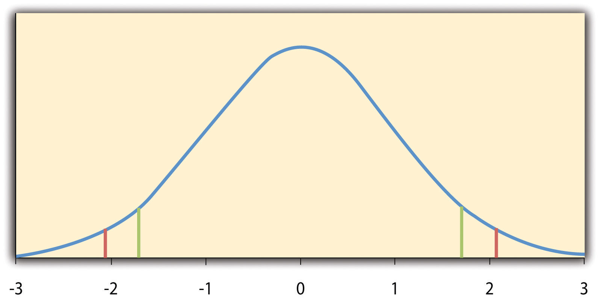
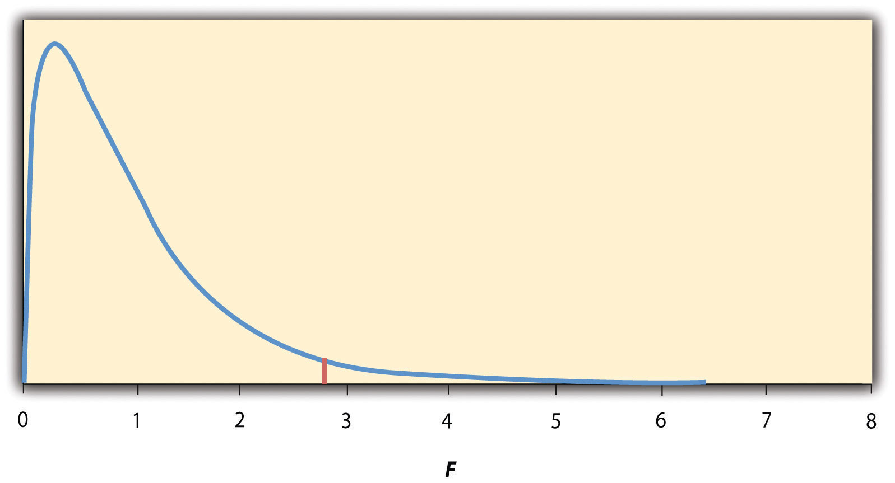
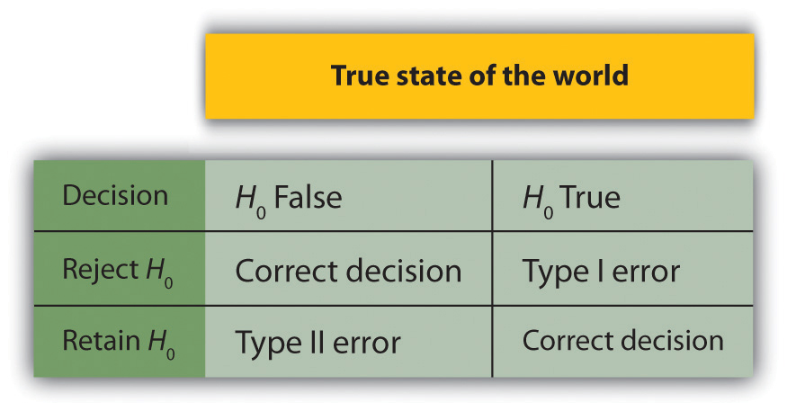

# Inferential Statistics

Recall that Matias Mehl and his colleagues, in their study of sex differences in talkativeness, found that the women in their sample spoke a mean of 16,215 words per day and the men a mean of 15,669 words per day [@mehl2007women]. But despite this sex difference in their sample, they concluded that there was no evidence of a sex difference in talkativeness in the population. Recall also that Allen Kanner and his colleagues, in their study of the relationship between daily hassles and symptoms, found a correlation of +.60 in their sample [@kanner1981comparison]. But they concluded that this means there *is* a relationship between hassles and symptoms in the population. This raises the question of how researchers can say whether their sample result reflects something that is true of the population.

The answer to this question is that they use a set of techniques called inferential statistics, which is what this chapter is about. We focus, in particular, on null hypothesis testing, the most common approach to inferential statistics in psychological research. We begin with a conceptual overview of null hypothesis testing, including its purpose and basic logic. Then we look at several null hypothesis testing techniques for drawing conclusions about differences between means and about correlations between quantitative variables. Finally, we consider a few other important ideas related to null hypothesis testing, including some that can be helpful in planning new studies and interpreting results. We also look at some long-standing criticisms of null hypothesis testing and some ways of dealing with these criticisms.

## Understanding Null Hypothesis Testing

:::learningobjectives
##### LEARNING OBJECTIVES {-}

1. Explain the purpose of null hypothesis testing, including the role of sampling error.
2. Describe the basic logic of null hypothesis testing.
3. Describe the role of relationship strength and sample size in determining statistical significance and make reasonable judgments about statistical significance based on these two factors.
:::

### The Purpose of Null Hypothesis Testing {-}

As we have seen, psychological research typically involves measuring one or more variables for a sample and computing descriptive statistics for that sample. In general, however, the researcher’s goal is not to draw conclusions about that sample but to draw conclusions about the population that the sample was selected from. Thus researchers must use sample statistics to draw conclusions about the corresponding values in the population. These corresponding values in the population are called [parameters](#parameter). Imagine, for example, that a researcher measures the number of depressive symptoms exhibited by each of 50 clinically depressed adults and computes the mean number of symptoms. The researcher probably wants to use this sample statistic (the mean number of symptoms for the sample) to draw conclusions about the corresponding population parameter (the mean number of symptoms for clinically depressed adults).

Unfortunately, sample statistics are not perfect estimates of their corresponding population parameters. This is because there is a certain amount of random variability in any statistic from sample to sample. The mean number of depressive symptoms might be 8.73 in one sample of clinically depressed adults, 6.45 in a second sample, and 9.44 in a third—even though these samples are selected randomly from the same population. Similarly, the correlation (Pearson’s *r*) between two variables might be +.24 in one sample, −.04 in a second sample, and +.15 in a third—again, even though these samples are selected randomly from the same population. This random variability in a statistic from sample to sample is called [sampling error]. (Note that the term error here refers to random variability and does not imply that anyone has made a mistake. No one “commits a sampling error.”)

One implication of this is that when there is a statistical relationship in a sample, it is not always clear that there is a statistical relationship in the population. A small difference between two group means in a sample might indicate that there is a small difference between the two group means in the population. But it could also be that there is no difference between the means in the population and that the difference in the sample is just a matter of sampling error. Similarly, a Pearson’s *r* value of −.29 in a sample might mean that there is a negative relationship in the population. But it could also be that there is no relationship in the population and that the relationship in the sample is just a matter of sampling error.

In fact, any statistical relationship in a sample can be interpreted in two ways:

1. There is a relationship in the population, and the relationship in the sample reflects this.
2. There is no relationship in the population, and the relationship in the sample reflects only sampling error.

The purpose of null hypothesis testing is simply to help researchers decide between these two interpretations.

### The Logic of Null Hypothesis Testing {-}

[Null hypothesis testing] is a formal approach to deciding between two interpretations of a statistical relationship in a sample. One interpretation is called the [null hypothesis] (often symbolized *H*~0~ and read as “H-naught”). This is the idea that there is no relationship in the population and that the relationship in the sample reflects only sampling error. Informally, the null hypothesis is that the sample relationship “occurred by chance.” The other interpretation is called the [alternative hypothesis] (often symbolized as *H*~1~). This is the idea that there is a relationship in the population and that the relationship in the sample reflects this relationship in the population.

Again, every statistical relationship in a sample can be interpreted in either of these two ways: It might have occurred by chance, or it might reflect a relationship in the population. So researchers need a way to decide between them. Although there are many specific null hypothesis testing techniques, they are all based on the same general logic. The steps are as follows:

1. Assume for the moment that the null hypothesis is true. There is no relationship between the variables in the population.
2. Determine how likely the sample relationship would be if the null hypothesis were true.
3. If the sample relationship would be extremely unlikely, then [reject the null hypothesis] in favor of the alternative hypothesis. If it would not be extremely unlikely, then [retain the null hypothesis].

Following this logic, we can begin to understand why Mehl and his colleagues concluded that there is no difference in talkativeness between women and men in the population. In essence, they asked the following question: “If there were no difference in the population, how likely is it that we would find a small difference of *d* = 0.06 in our sample?” Their answer to this question was that this sample relationship would be fairly likely if the null hypothesis were true. Therefore, they retained the null hypothesis—concluding that there is no evidence of a sex difference in the population. We can also see why Kanner and his colleagues concluded that there is a correlation between hassles and symptoms in the population. They asked, “If the null hypothesis were true, how likely is it that we would find a strong correlation of +.60 in our sample?” Their answer to this question was that this sample relationship would be fairly unlikely if the null hypothesis were true. Therefore, they rejected the null hypothesis in favor of the alternative hypothesis—concluding that there is a positive correlation between these variables in the population.

A crucial step in null hypothesis testing is finding the likelihood of the sample result if the null hypothesis were true. This probability is called the [*p* value]. A low *p* value means that the sample result would be unlikely if the null hypothesis were true and leads to the rejection of the null hypothesis. A high *p* value means that the sample result would be likely if the null hypothesis were true and leads to the retention of the null hypothesis. But how low must the *p* value be before the sample result is considered unlikely enough to reject the null hypothesis? In null hypothesis testing, this criterion is called [α (alpha)] and is almost always set to .05. If there is less than a 5% chance of a result as extreme as the sample result if the null hypothesis were true, then the null hypothesis is rejected. When this happens, the result is said to be [statistically significant]. If there is greater than a 5% chance of a result as extreme as the sample result when the null hypothesis is true, then the null hypothesis is retained. This does not necessarily mean that the researcher accepts the null hypothesis as true—only that there is not currently enough evidence to conclude that it is true. Researchers often use the expression “fail to reject the null hypothesis” rather than “retain the null hypothesis,” but they never use the expression “accept the null hypothesis.”

:::fyi
##### The Misunderstood *p* Value {-}

The *p* value is one of the most misunderstood quantities in psychological research [@cohen1994earth]. Even professional researchers misinterpret it, and it is not unusual for such misinterpretations to appear in statistics textbooks!

The most common misinterpretation is that the *p* value is the probability that the null hypothesis is true—that the sample result occurred by chance. For example, a misguided researcher might say that because the *p* value is .02, there is only a 2% chance that the result is due to chance and a 98% chance that it reflects a real relationship in the population. But this is *incorrect.* The *p* value is really the probability of a result at least as extreme as the sample result *if* the null hypothesis *were* true. So a *p* value of .02 means that if the null hypothesis were true, a sample result this extreme would occur only 2% of the time.

You can avoid this misunderstanding by remembering that the *p* value is not the probability that any particular *hypothesis* is true or false. Instead, it is the probability of obtaining the *sample result* if the null hypothesis were true.
:::

### Role of Sample Size and Relationship Strength  {-}

Recall that null hypothesis testing involves answering the question, “If the null hypothesis were true, what is the probability of a sample result as extreme as this one?” In other words, “What is the *p* value?” It can be helpful to see that the answer to this question depends on just two considerations: the strength of the relationship and the size of the sample. Specifically, the stronger the sample relationship and the larger the sample, the less likely the result would be if the null hypothesis were true. That is, the lower the *p* value. This should make sense. Imagine a study in which a sample of 500 women is compared with a sample of 500 men in terms of some psychological characteristic, and Cohen’s *d* is a strong 0.50. If there were really no sex difference in the population, then a result this strong based on such a large sample should seem highly unlikely. Now imagine a similar study in which a sample of three women is compared with a sample of three men, and Cohen’s *d* is a weak 0.10. If there were no sex difference in the population, then a relationship this weak based on such a small sample should seem likely. And this is precisely why the null hypothesis would be rejected in the first example and retained in the second.

Of course, sometimes the result can be weak and the sample large, or the result can be strong and the sample small. In these cases, the two considerations trade off against each other so that a weak result can be statistically significant if the sample is large enough and a strong relationship can be statistically significant even if the sample is small. Table \@ref(tab:strength) shows roughly how relationship strength and sample size combine to determine whether a sample result is statistically significant. The columns of the table represent the three levels of relationship strength: weak, medium, and strong. The rows represent four sample sizes that can be considered small, medium, large, and extra large in the context of psychological research. Thus each cell in the table represents a combination of relationship strength and sample size. If a cell contains the word Yes, then this combination would be statistically significant for both Cohen’s *d* and Pearson’s *r.* If it contains the word No, then it would not be statistically significant for either. There is one cell where the decision for *d* and *r* would be different and another where it might be different depending on some additional considerations, which are discussed later in the chapter.

Table: (\#tab:strength) How relationship strength (weak, medium, strong) and sample size combine to determine whether a result is statistically significant.

| Sample Size           | Weak           | Medium | Strong            |
|:----------------------|:---------------|:-------|:------------------|
| Small (*N* = 20)        | No             | No     | *d* = Maybe; *r* = Yes |
| Medium (*N* = 50)       | No             | Yes    | Yes               |
| Large (*N* = 100)       | *d* = Yes; *r* = No | Yes    | Yes               |
| Extra large (*N* = 500) | Yes            | Yes    | Yes               |

Although Table \@ref(tab:strength) provides only a rough guideline, it shows very clearly that weak relationships based on medium or small samples are never statistically significant and that strong relationships based on medium or larger samples are always statistically significant. If you keep this in mind, you will often know whether a result is statistically significant based on the descriptive statistics alone. It is extremely useful to be able to develop this kind of intuitive judgment. One reason is that it allows you to develop expectations about how your formal null hypothesis tests are going to come out, which in turn allows you to detect problems in your analyses. For example, if your sample relationship is strong and your sample is medium, then you would expect to reject the null hypothesis. If for some reason your formal null hypothesis test indicates otherwise, then you need to double-check your computations and interpretations. A second reason is that the ability to make this kind of intuitive judgment is an indication that you understand the basic logic of this approach in addition to being able to do the computations.

### Statistical Significance Versus Practical Significance {-}

Table \@ref(tab:strength) illustrates another extremely important point. A statistically significant result is not necessarily a strong one. Even a very weak result can be statistically significant if it is based on a large enough sample. This is closely related to Janet Shibley Hyde’s argument about sex differences [@hyde2007new]. The differences between women and men in mathematical problem solving and leadership ability are statistically significant. But the word *significant* can cause people to interpret these differences as strong and important—perhaps even important enough to influence the college courses they take or even who they vote for. As we have seen, however, these statistically significant differences are actually quite weak—perhaps even “trivial.”

This is why it is important to distinguish between the *statistical* significance of a result and the *practical* significance of that result. [Practical significance] refers to the importance or usefulness of the result in some real-world context. Many sex differences are statistically significant—and may even be interesting for purely scientific reasons—but they are not practically significant. In clinical practice, this same concept is often referred to as “clinical significance.” For example, a study on a new treatment for social phobia might show that it produces a statistically significant positive effect. Yet this effect still might not be strong enough to justify the time, effort, and other costs of putting it into practice—especially if easier and cheaper treatments that work almost as well already exist. Although statistically significant, this result would be said to lack practical or clinical significance.

:::takeaways
##### KEY TAKEAWAYS {-}

1. Null hypothesis testing is a formal approach to deciding whether a statistical relationship in a sample reflects a real relationship in the population or is just due to chance.
2. The logic of null hypothesis testing involves assuming that the null hypothesis is true, finding how likely the sample result would be if this assumption were correct, and then making a decision. If the sample result would be unlikely if the null hypothesis were true, then it is rejected in favor of the alternative hypothesis. If it would not be unlikely, then the null hypothesis is retained.
3. The probability of obtaining the sample result if the null hypothesis were true (the *p* value) is based on two considerations: relationship strength and sample size. Reasonable judgments about whether a sample relationship is statistically significant can often be made by quickly considering these two factors.
4. Statistical significance is not the same as relationship strength or importance. Even weak relationships can be statistically significant if the sample size is large enough. It is important to consider relationship strength and the practical significance of a result in addition to its statistical significance.
:::

:::exercises
##### EXERCISES {-}

1. Discussion: Imagine a study showing that people who eat more broccoli tend to be happier. Explain for someone who knows nothing about statistics why the researchers would conduct a null hypothesis test.
2. Practice: Use Table \@ref(tab:strength) to decide whether each of the following results is statistically significant.
    a. The correlation between two variables is *r* = −.78 based on a sample size of 137.
    b. The mean score on a psychological characteristic for women is 25 (*SD* = 5) and the mean score for men is 24 (*SD* = 5). There were 12 women and 10 men in this study.
    c. In a memory experiment, the mean number of items recalled by the 40 participants in Condition A was 0.50 standard deviations greater than the mean number recalled by the 40 participants in Condition B.
    d. In another memory experiment, the mean scores for participants in Condition A and Condition B came out exactly the same!
    e. A student finds a correlation of *r* = .04 between the number of units the students in his research methods class are taking and the students’ level of stress.
:::

## Some Basic Null Hypothesis Tests

:::learningobjectives
##### LEARNING OBJECTIVES {-}

1. Conduct and interpret one-sample, dependent-samples, and independent-samples *t* tests.
2. Interpret the results of one-way, repeated measures, and factorial ANOVAs.
3. Conduct and interpret null hypothesis tests of Pearson’s *r*.
:::

In this section, we look at several common null hypothesis testing procedures. The emphasis here is on providing enough information to allow you to conduct and interpret the most basic versions. In most cases, the online statistical analysis tools mentioned in the chapter on "Descriptive Statistics" will handle the computations—as will programs such as Microsoft Excel and SPSS.

### The *t* Test {-}

As we have seen throughout this book, many studies in psychology focus on the difference between two means. The most common null hypothesis test for this type of statistical relationship is the [*t* test]. In this section, we look at three types of *t* tests that are used for slightly different research designs: the one-sample *t* test, the dependent-samples *t* test, and the independent-samples *t* test.

#### One-Sample *t* Test {-}

The [one-sample *t* test] is used to compare a sample mean (*M*) with a hypothetical population mean (μ~0~) that provides some interesting standard of comparison. The null hypothesis is that the mean for the population (µ) is equal to the hypothetical population mean: μ = μ~0~. The alternative hypothesis is that the mean for the population is different from the hypothetical population mean: μ ≠ μ~0~. To decide between these two hypotheses, we need to find the probability of obtaining the sample mean (or one more extreme) if the null hypothesis were true. But finding this *p* value requires first computing a test statistic called t. (A [test statistic] is a statistic that is computed only to help find the *p* value.) The formula for *t* is as follows:

$t=\frac{M-\mu_0}{\frac{SD}{\sqrt{N}}}$

Again, *M* is the sample mean and µ0 is the hypothetical population mean of interest. *SD* is the sample standard deviation and N is the sample size.

The reason the *t* statistic (or any test statistic) is useful is that we know how it is distributed when the null hypothesis is true. As shown in Figure \@ref(fig:tdist), this distribution is unimodal and symmetrical, and it has a mean of 0. Its precise shape depends on a statistical concept called the degrees of freedom, which for a one-sample *t* test is N − 1. (There are 24 degrees of freedom for the distribution shown in Figure \@ref(fig:tdist).) The important point is that knowing this distribution makes it possible to find the *p* value for any *t* score. Consider, for example, a *t* score of +1.50 based on a sample of 25. The probability of a *t* score at least this extreme is given by the proportion of *t* scores in the distribution that are at least this extreme. For now, let us define extreme as being far from zero in either direction. Thus the *p* value is the proportion of *t* scores that are +1.50 or above or that are −1.50 or below—a value that turns out to be .14.

(\#fig:tdist)Distribution of *t* scores (with 24 degrees of freedom) when the null hypothesis is true. The red vertical lines represent the two-tailed critical values, and the green vertical lines the one-tailed critical values when α = .05.

Fortunately, we do not have to deal directly with the distribution of *t* scores. If we were to enter our sample data and hypothetical mean of interest into one of the online statistical tools in the chapter on "Descriptive Statistics" or into a program like SPSS (Excel does not have a one-sample *t* test function), the output would include both the *t* score and the *p* value. At this point, the rest of the procedure is simple. If *p* is less than .05, we reject the null hypothesis and conclude that the population mean differs from the hypothetical mean of interest. If *p* is greater than .05, we retain the null hypothesis and conclude that there is not enough evidence to say that the population mean differs from the hypothetical mean of interest. (Again, technically, we conclude only that we do not have enough evidence to conclude that it *does* differ.)

If we were to compute the *t* score by hand, we could use a table like Table \@ref(tab:tcrit) to make the decision. This table does not provide actual *p* values. Instead, it provides the critical values of *t* for different degrees of freedom (df) when α is .05. For now, let us focus on the two-tailed critical values in the last column of the table. Each of these values should be interpreted as a pair of values: one positive and one negative. For example, the two-tailed critical values when there are 24 degrees of freedom are +2.064 and −2.064. These are represented by the red vertical lines in Figure \@ref(fig:tdist). The idea is that any *t* score below the lower critical value (the left-hand red line in Figure \@ref(fig:tdist)) is in the lowest 2.5% of the distribution, while any *t* score above the upper critical value (the right-hand red line) is in the highest 2.5% of the distribution. This means that any *t* score beyond the critical value in either direction is in the most extreme 5% of *t* scores when the null hypothesis is true and therefore has a *p* value less than .05. Thus if the *t* score we compute is beyond the critical value in either direction, then we reject the null hypothesis. If the *t* score we compute is between the upper and lower critical values, then we retain the null hypothesis.

Table: (\#tab:tcrit) Table of critical values of *t* when α = .05.

| df | One-tailed | Two-tailed |
| ---: | ---: | ---: |
| 3 | 2.353 | 3.182 |
| 4 | 2.132 | 2.776 |
| 5 | 2.015 | 2.571 |
| 6 | 1.943 | 2.447 |
| 7 | 1.895 | 2.365 |
| 8 | 1.860 | 2.306 |
| 9 | 1.833 | 2.262 |
| 10 | 1.812 | 2.228 |
| 11 | 1.796 | 2.201 |
| 12 | 1.782 | 2.179 |
| 13 | 1.771 | 2.160 |
| 14 | 1.761 | 2.145 |
| 15 | 1.753 | 2.131 |
| 16 | 1.746 | 2.120 |
| 17 | 1.740 | 2.110 |
| 18 | 1.734 | 2.101 |
| 19 | 1.729 | 2.093 |
| 20 | 1.725 | 2.086 |
| 21 | 1.721 | 2.080 |
| 22 | 1.717 | 2.074 |
| 23 | 1.714 | 2.069 |
| 24 | 1.711 | 2.064 |
| 25 | 1.708 | 2.060 |
| 30 | 1.697 | 2.042 |
| 35 | 1.690 | 2.030 |
| 40 | 1.684 | 2.021 |
| 45 | 1.679 | 2.014 |
| 50 | 1.676 | 2.009 |
| 60 | 1.671 | 2.000 |
| 70 | 1.667 | 1.994 |
| 80 | 1.664 | 1.990 |
| 90 | 1.662 | 1.987 |
| 100 | 1.660 | 1.984 |

Thus far, we have considered what is called a [two-tailed test], where we reject the null hypothesis if the *t* score for the sample is extreme in either direction. This makes sense when we believe that the sample mean might differ from the hypothetical population mean but we do not have good reason to expect the difference to go in a particular direction. But it is also possible to do a [one-tailed test], where we reject the null hypothesis only if the *t* score for the sample is extreme in one direction that we specify before collecting the data. This makes sense when we have good reason to expect the sample mean will differ from the hypothetical population mean in a particular direction.

Here is how it works. Each one-tailed critical value in Table \@ref(tab:tcrit) can again be interpreted as a pair of values: one positive and one negative. A *t* score below the lower critical value is in the lowest 5% of the distribution, and a *t* score above the upper critical value is in the highest 5% of the distribution. For 24 degrees of freedom, these values are −1.711 and +1.711. (These are represented by the green vertical lines in Figure \@ref(fig:tdist) However, for a one-tailed test, we must decide before collecting data whether we expect the sample mean to be lower than the hypothetical population mean, in which case we would use only the lower critical value, or we expect the sample mean to be greater than the hypothetical population mean, in which case we would use only the upper critical value. Notice that we still reject the null hypothesis when the *t* score for our sample is in the most extreme 5% of the *t* scores we would expect if the null hypothesis were true—so α remains at .05. We have simply redefined *extreme* to refer only to one tail of the distribution. The advantage of the one-tailed test is that critical values are less extreme. If the sample mean differs from the hypothetical population mean in the expected direction, then we have a better chance of rejecting the null hypothesis. The disadvantage is that if the sample mean differs from the hypothetical population mean in the unexpected direction, then there is no chance at all of rejecting the null hypothesis.

##### Example One-Sample *t* Test {-}

Imagine that a health psychologist is interested in the accuracy of college students’ estimates of the number of calories in a chocolate chip cookie. He shows the cookie to a sample of 10 students and asks each one to estimate the number of calories in it. Because the actual number of calories in the cookie is 250, this is the hypothetical population mean of interest (µ0). The null hypothesis is that the mean estimate for the population (μ) is 250. Because he has no real sense of whether the students will underestimate or overestimate the number of calories, he decides to do a two-tailed test. Now imagine further that the participants’ actual estimates are as follows:

> 250, 280, 200, 150, 175, 200, 200, 220, 180, 250.

The mean estimate for the sample (*M*) is 212.00 calories and the standard deviation (*SD*) is 39.17. The health psychologist can now compute the *t* score for his sample:

$t=\frac{212-250}{\frac{39.17}{\sqrt{10}}}=-3.07$

If he enters the data into one of the online analysis tools or uses SPSS, it would also tell him that the two-tailed *p* value for this *t* score (with 10 − 1 = 9 degrees of freedom) is .013. Because this is less than .05, the health psychologist would reject the null hypothesis and conclude that college students tend to underestimate the number of calories in a chocolate chip cookie. If he computes the *t* score by hand, he could look at Table \@ref(tab:tcrit) and see that the critical value of *t* for a two-tailed test with 9 degrees of freedom is ±2.262. The fact that his *t* score was more extreme than this critical value would tell him that his *p* value is less than .05 and that he should reject the null hypothesis.

Finally, if this researcher had gone into this study with good reason to expect that college students underestimate the number of calories, then he could have done a one-tailed test instead of a two-tailed test. The only thing this would change is the critical value, which would be −1.833. This slightly less extreme value would make it a bit easier to reject the null hypothesis. However, if it turned out that college students overestimate the number of calories—no matter how much they overestimate it—the researcher would not have been able to reject the null hypothesis.

#### The Dependent-Samples *t* Test {-}

The [dependent-samples *t* test] (sometimes called the paired-samples *t* test) is used to compare two means for the same sample tested at two different times or under two different conditions. This makes it appropriate for pretest-posttest designs or within-subjects experiments. The null hypothesis is that the means at the two times or under the two conditions are the same in the population. The alternative hypothesis is that they are not the same. This test can also be one-tailed if the researcher has good reason to expect the difference goes in a particular direction.

It helps to think of the dependent-samples *t* test as a special case of the one-sample *t* test. However, the first step in the dependent-samples *t* test is to reduce the two scores for each participant to a single [difference score] by taking the difference between them. At this point, the dependent-samples *t* test becomes a one-sample *t* test on the difference scores. The hypothetical population mean (µ~0~) of interest is 0 because this is what the mean difference score would be if there were no difference on average between the two times or two conditions. We can now think of the null hypothesis as being that the mean difference score in the population is 0 (µ~0~ = 0) and the alternative hypothesis as being that the mean difference score in the population is not 0 (µ~0~ ≠ 0).

##### Example Dependent-Samples *t* Test {-}
Imagine that the health psychologist now knows that people tend to underestimate the number of calories in junk food and has developed a short training program to improve their estimates. To test the effectiveness of this program, he conducts a pretest-posttest study in which 10 participants estimate the number of calories in a chocolate chip cookie before the training program and then again afterward. Because he expects the program to increase the participants’ estimates, he decides to do a one-tailed test. Now imagine further that the pretest estimates are

> 230, 250, 280, 175, 150, 200, 180, 210, 220, 190

and that the posttest estimates (for the same participants in the same order) are

> 250, 260, 250, 200, 160, 200, 200, 180, 230, 240.

The difference scores, then, are as follows:

> +20, +10, −30, +25, +10, 0, +20, −30, +10, +50.

Note that it does not matter whether the first set of scores is subtracted from the second or the second from the first as long as it is done the same way for all participants. In this example, it makes sense to subtract the pretest estimates from the posttest estimates so that positive difference scores mean that the estimates went up after the training and negative difference scores mean the estimates went down.

The mean of the difference scores is 8.50 with a standard deviation of 27.27. The health psychologist can now compute the *t* score for his sample as follows:

$t=\frac{8.5-0}{\frac{27.27}{\sqrt{10}}}=-1.11$

If he enters the data into one of the online analysis tools or uses Excel or SPSS, it would tell him that the one-tailed *p* value for this *t* score (again with 10 − 1 = 9 degrees of freedom) is .148. Because this is greater than .05, he would retain the null hypothesis and conclude that the training program does not increase people’s calorie estimates. If he were to compute the *t* score by hand, he could look at Table \@ref(tab:tcrit) and see that the critical value of *t* for a one-tailed test with 9 degrees of freedom is +1.833. (It is positive this time because he was expecting a positive mean difference score.) The fact that his *t* score was less extreme than this critical value would tell him that his *p* value is greater than .05 and that he should fail to reject the null hypothesis.

#### The Independent-Samples *t* Test {-}

The [independent-samples *t* test] is used to compare the means of two separate samples (*M*~1~ and *M*~2~). The two samples might have been tested under different conditions in a between-subjects experiment, or they could be preexisting groups in a correlational design (e.g., women and men, extroverts and introverts). The null hypothesis is that the means of the two populations are the same: µ~1~ = µ~2~. The alternative hypothesis is that they are not the same: µ~1~ ≠ µ~2~. Again, the test can be one-tailed if the researcher has good reason to expect the difference goes in a particular direction.

The *t* statistic here is a bit more complicated because it must take into account two sample means, two standard deviations, and two sample sizes. The formula is as follows:

$t=\frac{M_1-M_2}{\sqrt{\frac{SD_1^2}{n_1}+\frac{SD_2^2}{n_2}}}$

Notice that this formula includes squared standard deviations (the variances) that appear inside the square root symbol. Also, lowercase *n*~1~ and *n*~2~ refer to the sample sizes in the two groups or condition (as opposed to capital *N*, which generally refers to the total sample size). The only additional thing to know here is that there are *N* − 2 degrees of freedom for the independent-samples *t* test.

##### Example Independent-Samples *t* Test {-}

Now the health psychologist wants to compare the calorie estimates of people who regularly eat junk food with the estimates of people who rarely eat junk food. He believes the difference could come out in either direction so he decides to conduct a two-tailed test. He collects data from a sample of eight participants who eat junk food regularly and seven participants who rarely eat junk food. The data are as follows:

> Junk food eaters: 180, 220, 150, 85, 200, 170, 150, 190
>
> Non–junk food eaters: 200, 240, 190, 175, 200, 300, 240

The mean for the junk food eaters is 220.71 with a standard deviation of 41.23. The mean for the non–junk food eaters is 168.12 with a standard deviation of 42.66. He can now compute his *t* score as follows:

$t=\frac{220.71-168.12}{\sqrt{\frac{41.23^2}{8}+\frac{42.66^2}{7}}}=2.42$

If he enters the data into one of the online analysis tools or uses Excel or SPSS, it would tell him that the two-tailed *p* value for this *t* score (with 15 − 2 = 13 degrees of freedom) is .015. Because this is less than .05, the health psychologist would reject the null hypothesis and conclude that people who eat junk food regularly make lower calorie estimates than people who eat it rarely. If he were to compute the *t* score by hand, he could look at Table \@ref(tab:tcrit) and see that the critical value of *t* for a two-tailed test with 13 degrees of freedom is ±2.160. The fact that his *t* score was more extreme than this critical value would tell him that his *p* value is less than .05 and that he should fail to retain the null hypothesis.

### The Analysis of Variance {-}

When there are more than two groups or condition means to be compared, the most common null hypothesis test is the [analysis of variance (ANOVA)]. In this section, we look primarily at the [one-way ANOVA], which is used for between-subjects designs with a single independent variable. We then briefly consider some other versions of the ANOVA that are used for within-subjects and factorial research designs.

#### One-Way ANOVA {-}

The one-way ANOVA is used to compare the means of more than two samples (*M*~1~, *M*~2~…*M*~G~) in a between-subjects design. The null hypothesis is that all the means are equal in the population: µ~1~= µ~2~ =…= µ~G~. The alternative hypothesis is that not all the means in the population are equal.

The test statistic for the ANOVA is called F. It is a ratio of two estimates of the population variance based on the sample data. One estimate of the population variance is called the [mean squares between groups (*MS~B~*)] and is based on the differences among the sample means. The other is called the [mean squares within groups (*MS~W~*)] and is based on the differences among the scores within each group. The *F* statistic is the ratio of the *MS~B~* to the *MS~W~* and can therefore be expressed as follows:

$F=\frac{MS_B}{MS_W}$

Again, the reason that *F* is useful is that we know how it is distributed when the null hypothesis is true. As shown in Figure \@ref(fig:fdist), this distribution is unimodal and positively skewed with values that cluster around 1. The precise shape of the distribution depends on both the number of groups and the sample size, and there is a degrees of freedom value associated with each of these. The between-groups degrees of freedom is the number of groups minus one: *df~B~* = (*G* − 1). The within-groups degrees of freedom is the total sample size minus the number of groups: *df~W~* = *N* − *G*. Again, knowing the distribution of *F* when the null hypothesis is true allows us to find the *p* value.

(\#fig:fdist)Distribution of *F* ratio with 2 and 37 degrees of freedome when the null hypothesis is true. The red vertical line represents the critical value when α is .05.

The online tools in the chapter on "Descriptive Statistics" and statistical software such as Excel and SPSS will compute *F* and find the *p* value. If *p* is less than .05, then we reject the null hypothesis and conclude that there are differences among the group means in the population. If *p* is greater than .05, then we retain the null hypothesis and conclude that there is not enough evidence to say that there are differences. In the unlikely event that we would compute *F* by hand, we can use a table of critical values like Table 13.3 "Table of Critical Values of " to make the decision. The idea is that any *F* ratio greater than the critical value has a *p* value of less than .05. Thus if the *F* ratio we compute is beyond the critical value, then we reject the null hypothesis. If the *F* ratio we compute is less than the critical value, then we retain the null hypothesis.

Table: (\#tab:fcrit) Table of Critical Values of *F* When α = .05. Values in the first column represent *df~W~*; values in the first row represent *df~B~*.

|  | 2 | 3 | 4 |
| --: | --: | --: | --: |
| **8** | 4.459 | 4.066 | 3.838 |
| **9** | 4.256 | 3.863 | 3.633 |
| **10** | 4.103 | 3.708 | 3.478 |
| **11** | 3.982 | 3.587 | 3.357 |
| **12** | 3.885 | 3.490 | 3.259 |
| **13** | 3.806 | 3.411 | 3.179 |
| **14** | 3.739 | 3.344 | 3.112 |
| **15** | 3.682 | 3.287 | 3.056 |
| **16** | 3.634 | 3.239 | 3.007 |
| **17** | 3.592 | 3.197 | 2.965 |
| **18** | 3.555 | 3.160 | 2.928 |
| **19** | 3.522 | 3.127 | 2.895 |
| **20** | 3.493 | 3.098 | 2.866 |
| **21** | 3.467 | 3.072 | 2.840 |
| **22** | 3.443 | 3.049 | 2.817 |
| **23** | 3.422 | 3.028 | 2.796 |
| **24** | 3.403 | 3.009 | 2.776 |
| **25** | 3.385 | 2.991 | 2.759 |
| **30** | 3.316 | 2.922 | 2.690 |
| **35** | 3.267 | 2.874 | 2.641 |
| **40** | 3.232 | 2.839 | 2.606 |
| **45** | 3.204 | 2.812 | 2.579 |
| **50** | 3.183 | 2.790 | 2.557 |
| **55** | 3.165 | 2.773 | 2.540 |
| **60** | 3.150 | 2.758 | 2.525 |
| **65** | 3.138 | 2.746 | 2.513 |
| **70** | 3.128 | 2.736 | 2.503 |
| **75** | 3.119 | 2.727 | 2.494 |
| **80** | 3.111 | 2.719 | 2.486 |
| **85** | 3.104 | 2.712 | 2.479 |
| **90** | 3.098 | 2.706 | 2.473 |
| **95** | 3.092 | 2.700 | 2.467 |
| **100** | 3.087 | 2.696 | 2.463 |

##### Example One-Way ANOVA {-}

Imagine that the health psychologist wants to compare the calorie estimates of psychology majors, nutrition majors, and professional dieticians. He collects the following data:

> Psych majors: 200, 180, 220, 160, 150, 200, 190, 200  
> Nutrition majors: 190, 220, 200, 230, 160, 150, 200, 210, 195  
> Dieticians: 220, 250, 240, 275, 250, 230, 200, 240

The means are 187.50 (*SD* = 23.14), 195.00 (*SD* = 27.77), and 238.13 (*SD* = 22.35), respectively. So it appears that dieticians made substantially more accurate estimates on average. The researcher would almost certainly enter these data into a program such as Excel or SPSS, which would compute *F* for him and find the *p* value. Table \@ref(tab:anovaoutput) shows the output of the one-way ANOVA function in Excel for these data. This is referred to as an ANOVA table. It shows that *MS~B~* is 5,971.88, *MS~W~* is 602.23, and their ratio, *F*, is 9.92. The *p* value is .0009. Because this is below .05, the researcher would reject the null hypothesis and conclude that the mean calorie estimates for the three groups are not the same in the population. Notice that the ANOVA table also includes the “sum of squares” (*SS*) for between groups and for within groups. These values are computed on the way to finding *MS~B~* and *MS~W~* but are not typically reported by the researcher. Finally, if the researcher were to compute the *F* ratio by hand, he could look at Table \@ref(tab:fcrit) and see that the critical value of *F* with 2 and 21 degrees of freedom is 3.467 (the same value in Table \@ref(tab:anovaoutput) under Fcrit). The fact that his *t* score was more extreme than this critical value would tell him that his *p* value is less than .05 and that he should reject the null hypothesis.

Table: (\#tab:anovaoutput) Typical one-way ANOVA output from Excel

| *Source of variation* | *SS* | *df* | *MS* | F | *p*-value | *F*~crit~ |
| :----- | :--- | :-- | :--- | :--- | :--- | :--- |
| Between groups | 11,943.75 | 2 | 5,971.875 | 9.916234 | 0.000928 | 3.4668 |
| Within groups | 12,646.88 | 21 | 602.2321 |  |  |  |
| Total | 24,590.63 | 23 |  |  |  |  |

#### ANOVA Elaborations {-}

##### Post Hoc Comparisons {-}

When we reject the null hypothesis in a one-way ANOVA, we conclude that the group means are not all the same in the population. But this can indicate different things. With three groups, it can indicate that all three means are significantly different from each other. Or it can indicate that one of the means is significantly different from the other two, but the other two are not significantly different from each other. It could be, for example, that the mean calorie estimates of psychology majors, nutrition majors, and dieticians are all significantly different from each other. Or it could be that the mean for dieticians is significantly different from the means for psychology and nutrition majors, but the means for psychology and nutrition majors are not significantly different from each other. For this reason, statistically significant one-way ANOVA results are typically followed up with a series of [post hoc comparisons] of selected pairs of group means to determine which are different from which others.

One approach to post hoc comparisons would be to conduct a series of independent-samples *t* tests comparing each group mean to each of the other group means. But there is a problem with this approach. In general, if we conduct a *t* test when the null hypothesis is true, we have a 5% chance of mistakenly rejecting the null hypothesis (see section "Additional Considerations" below for more on such Type I errors). If we conduct several *t* tests when the null hypothesis is true, the chance of mistakenly rejecting *at least one* null hypothesis increases with each test we conduct. Thus researchers do not usually make post hoc comparisons using standard *t* tests because there is too great a chance that they will mistakenly reject at least one null hypothesis. Instead, they use one of several modified *t* test procedures—among them the Bonferonni procedure, Fisher’s least significant difference (LSD) test, and Tukey’s honestly significant difference (HSD) test. The details of these approaches are beyond the scope of this book, but it is important to understand their purpose. It is to keep the risk of mistakenly rejecting a true null hypothesis to an acceptable level (close to 5%).

##### Repeated-Measures ANOVA {-}

Recall that the one-way ANOVA is appropriate for between-subjects designs in which the means being compared come from separate groups of participants. It is not appropriate for within-subjects designs in which the means being compared come from the same participants tested under different conditions or at different times. This requires a slightly different approach, called the [repeated-measures ANOVA]. The basics of the repeated-measures ANOVA are the same as for the one-way ANOVA. The main difference is that measuring the dependent variable multiple times for each participant allows for a more refined measure of *MS~W~*. Imagine, for example, that the dependent variable in a study is a measure of reaction time. Some participants will be faster or slower than others because of stable individual differences in their nervous systems, muscles, and other factors. In a between-subjects design, these stable individual differences would simply add to the variability within the groups and increase the value of *MS~W~*. In a within-subjects design, however, these stable individual differences can be measured and subtracted from the value of *MS~W~*. This lower value of *MS~W~* means a higher value of *F* and a more sensitive test.

##### Factorial ANOVA {-}
When more than one independent variable is included in a factorial design, the appropriate approach is the [factorial ANOVA]. Again, the basics of the factorial ANOVA are the same as for the one-way and repeated-measures ANOVAs. The main difference is that it produces an *F* ratio and *p* value for each main effect and for each interaction. Returning to our calorie estimation example, imagine that the health psychologist tests the effect of participant major (psychology vs. nutrition) and food type (cookie vs. hamburger) in a factorial design. A factorial ANOVA would produce separate *F* ratios and *p* values for the main effect of major, the main effect of food type, and the interaction between major and food. Appropriate modifications must be made depending on whether the design is between subjects, within subjects, or mixed.

### Testing Pearson’s *r* {-}

For relationships between quantitative variables, where Pearson’s *r* is used to describe the strength of those relationships, the appropriate null hypothesis test is a test of Pearson’s *r.* The basic logic is exactly the same as for other null hypothesis tests. In this case, the null hypothesis is that there is no relationship in the population. We can use the Greek lowercase rho (ρ) to represent the relevant parameter: ρ = 0. The alternative hypothesis is that there is a relationship in the population: ρ ≠ 0. As with the *t* test, this test can be two-tailed if the researcher has no expectation about the direction of the relationship or one-tailed if the researcher expects the relationship to go in a particular direction.

It is possible to use Pearson’s *r* for the sample to compute a *t* score with *N* − 2 degrees of freedom and then to proceed as for a *t* test. However, because of the way it is computed, Pearson’s *r* can also be treated as its own test statistic. The online statistical tools and statistical software such as Excel and SPSS generally compute Pearson’s *r* and provide the *p* value associated with that value of Pearson’s *r.* As always, if the *p* value is less than .05, we reject the null hypothesis and conclude that there is a relationship between the variables in the population. If the *p* value is greater than .05, we retain the null hypothesis and conclude that there is not enough evidence to say there is a relationship in the population. If we compute Pearson’s *r* by hand, we can use a table like Table \@ref(tab:rcrit), which shows the critical values of *r* for various samples sizes when α is .05. A sample value of Pearson’s *r* that is more extreme than the critical value is statistically significant.

Table: (\#tab:rcrit)  Table of critical values of Pearson’s *r* when α = .05

| *N* | One-tailed | Two-tailed |
| :-- | :-- | :-- |
| 5 | .805 | .878 |
| 10 | .549 | .632 |
| 15 | .441 | .514 |
| 20 | .378 | .444 |
| 25 | .337 | .396 |
| 30 | .306 | .361 |
| 35 | .283 | .334 |
| 40 | .264 | .312 |
| 45 | .248 | .294 |
| 50 | .235 | .279 |
| 55 | .224 | .266 |
| 60 | .214 | .254 |
| 65 | .206 | .244 |
| 70 | .198 | .235 |
| 75 | .191 | .227 |
| 80 | .185 | .220 |
| 85 | .180 | .213 |
| 90 | .174 | .207 |
| 95 | .170 | .202 |
| 100 | .165 | .197 |

#### Example Test of Pearson’s *r* {-}

Imagine that the health psychologist is interested in the correlation between people’s calorie estimates and their weight. He has no expectation about the direction of the relationship, so he decides to conduct a two-tailed test. He computes the correlation for a sample of 22 college students and finds that Pearson’s *r* is −.21. The statistical software he uses tells him that the *p* value is .348. It is greater than .05, so he retains the null hypothesis and concludes that there is no relationship between people’s calorie estimates and their weight. If he were to compute Pearson’s *r* by hand, he could look at Table \@ref(tab:rcrit) and see that the critical value for 22 − 2 = 20 degrees of freedom is .444. The fact that Pearson’s *r* for the sample is less extreme than this critical value tells him that the *p* value is greater than .05 and that he should retain the null hypothesis.

:::takeaways
##### KEY TAKEAWAYS {-}

- To compare two means, the most common null hypothesis test is the *t* test. The one-sample *t* test is used for comparing one sample mean with a hypothetical population mean of interest, the dependent-samples *t* test is used to compare two means in a within-subjects design, and the independent-samples *t* test is used to compare two means in a between-subjects design.
- To compare more than two means, the most common null hypothesis test is the analysis of variance (ANOVA). The one-way ANOVA is used for between-subjects designs with one independent variable, the repeated-measures ANOVA is used for within-subjects designs, and the factorial ANOVA is used for factorial designs.
- A null hypothesis test of Pearson’s *r* is used to compare a sample value of Pearson’s *r* with a hypothetical population value of 0.
:::

:::exercises
##### EXERCISES {-}

1. Practice: Use one of the online tools, Excel, or SPSS to reproduce the one-sample *t* test, dependent-samples *t* test, independent-samples *t* test, and one-way ANOVA for the four sets of calorie estimation data presented in this section.
2. Practice: A sample of 25 college students rated their friendliness on a scale of 1 (*Much Lower Than Average*) to 7 (*Much Higher Than Average*). Their mean rating was 5.30 with a standard deviation of 1.50. Conduct a one-sample *t* test comparing their mean rating with a hypothetical mean rating of 4 (*Average*). The question is whether college students have a tendency to rate themselves as friendlier than average.
3. Practice: Decide whether each of the following Pearson’s *r* values is statistically significant for both a one-tailed and a two-tailed test. (a) The correlation between height and IQ is +.13 in a sample of 35. (b) For a sample of 88 college students, the correlation between how disgusted they felt and the harshness of their moral judgments was +.23. (c) The correlation between the number of daily hassles and positive mood is −.43 for a sample of 30 middle-aged adults.
:::

## Additional Considerations

:::learningobjectives
##### LEARNING OBJECTIVES {-}

1. Define Type I and Type II errors, explain why they occur, and identify some steps that can be taken to minimize their likelihood.
2. Define statistical power, explain its role in the planning of new studies, and use online tools to compute the statistical power of simple research designs.
3. List some criticisms of conventional null hypothesis testing, along with some ways of dealing with these criticisms.
:::

In this section, we consider a few other issues related to null hypothesis testing, including some that are useful in planning studies and interpreting results. We even consider some long-standing criticisms of null hypothesis testing, along with some steps that researchers in psychology have taken to address them.

### Errors in Null Hypothesis Testing {-}

In null hypothesis testing, the researcher tries to draw a reasonable conclusion about the population based on the sample. Unfortunately, this conclusion is not guaranteed to be correct. This is illustrated by Figure \@ref(fig:errors). The rows of this table represent the two possible decisions that we can make in null hypothesis testing: to reject or retain the null hypothesis. The columns represent the two possible states of the world: The null hypothesis is false or it is true. The four cells of the table, then, represent the four distinct outcomes of a null hypothesis test. Two of the outcomes—rejecting the null hypothesis when it is false and retaining it when it is true—are correct decisions. The other two—rejecting the null hypothesis when it is true and retaining it when it is false—are errors.

(\#fig:errors)Two types of correct decisions and two types of errors in null hypothesis testing.

Rejecting the null hypothesis when it is true is called a [Type I error]. This means that we have concluded that there is a relationship in the population when in fact there is not. Type I errors occur because even when there is no relationship in the population, sampling error alone will occasionally produce an extreme result. In fact, when the null hypothesis is true and α is .05, we will mistakenly reject the null hypothesis 5% of the time. (This is why α is sometimes referred to as the “Type I error rate.”) Retaining the null hypothesis when it is false is called a [Type II error]. This means that we have concluded that there is no relationship in the population when in fact there is. In practice, Type II errors occur primarily because the research design lacks adequate statistical power to detect the relationship (e.g., the sample is too small). We will have more to say about statistical power shortly.

In principle, it is possible to reduce the chance of a Type I error by setting α to something less than .05. Setting it to .01, for example, would mean that if the null hypothesis is true, then there is only a 1% chance of mistakenly rejecting it. But making it harder to reject true null hypotheses also makes it harder to reject false ones and therefore increases the chance of a Type II error. Similarly, it is possible to reduce the chance of a Type II error by setting α to something greater than .05 (e.g., .10). But making it easier to reject false null hypotheses also makes it easier to reject true ones and therefore increases the chance of a Type I error. This provides some insight into why the convention is to set α to .05. There is some agreement among researchers that level of α keeps the rates of both Type I and Type II errors at acceptable levels.

The possibility of committing Type I and Type II errors has several important implications for interpreting the results of our own and others’ research. One is that we should be cautious about interpreting the results of any individual study because there is a chance that it reflects a Type I or Type II error. This is why researchers consider it important to replicate their studies. Each time researchers replicate a study and find a similar result, they rightly become more confident that the result represents a real phenomenon and not just a Type I or Type II error.

Another issue related to Type I errors is the so-called [file drawer problem] [@rosenthal1979file]. The idea is that when researchers obtain statistically significant results, they tend to submit them for publication, and journal editors and reviewers tend to accept them. But when researchers obtain nonsignificant results, they tend not to submit them for publication, or if they do submit them, journal editors and reviewers tend not to accept them. Researchers end up putting these nonsignificant results away in a file drawer (or nowadays, in a folder on their hard drive). One effect of this is that the published literature probably contains a higher proportion of Type I errors than we might expect on the basis of statistical considerations alone. Even when there is a relationship between two variables in the population, the published research literature is likely to overstate the strength of that relationship. Imagine, for example, that the relationship between two variables in the population is positive but weak (e.g., ρ = +.10). If several researchers conduct studies on this relationship, sampling error is likely to produce results ranging from weak negative relationships (e.g., *r* = −.10) to moderately strong positive ones (e.g., *r* = +.40). But because of the file drawer problem, it is likely that only those studies producing moderate to strong positive relationships are published. The result is that the effect reported in the published literature tends to be stronger than it really is in the population.

The file drawer problem is a difficult one because it is a product of the way scientific research has traditionally been conducted and published. One solution might be for journal editors and reviewers to evaluate research submitted for publication without knowing the results of that research. The idea is that if the research question is judged to be interesting and the method judged to be sound, then a nonsignificant result should be just as important and worthy of publication as a significant one. Short of such a radical change in how research is evaluated for publication, researchers can still take pains to keep their nonsignificant results and share them as widely as possible (e.g., at professional conferences). Many scientific disciplines now have journals devoted to publishing nonsignificant results. In psychology, for example, there is the *Journal of Articles in Support of the Null Hypothesis* (http://www.jasnh.com).

### Statistical Power {-}

The [statistical power] of a research design is the probability of rejecting the null hypothesis given the sample size and expected relationship strength. For example, the statistical power of a study with 50 participants and an expected Pearson’s *r* of +.30 in the population is .59. That is, there is a 59% chance of rejecting the null hypothesis if indeed the population correlation is +.30. Statistical power is the complement of the probability of committing a Type II error. So in this example, the probability of committing a Type II error would be 1 − .59 = .41. Clearly, researchers should be interested in the power of their research designs if they want to avoid making Type II errors. In particular, they should make sure their research design has adequate power before collecting data. A common guideline is that a power of .80 is adequate. This means that there is an 80% chance of rejecting the null hypothesis for the expected relationship strength.

The topic of how to compute power for various research designs and null hypothesis tests is beyond the scope of this book. However, there are online tools that allow you to do this by entering your sample size, expected relationship strength, and α level for various hypothesis tests (see box “Computing Power”). In addition, Table \@ref(tab:power) shows the sample size needed to achieve a power of .80 for weak, medium, and strong relationships for a two-tailed independent-samples *t* test and for a two-tailed test of Pearson’s *r.* Notice that this table amplifies the point made earlier about relationship strength, sample size, and statistical significance. In particular, weak relationships require very large samples to provide adequate statistical power.

Table: (\#tab:power) Sample sizes needed to achieve statistical power of .80 for different expected relationship strengths for an independent-samples *t* test and a test of pearson’s *r*.

| Relationship Strength | Independent-Samples *t* Test | Test of Pearson’s r |
| :--- | ---: | ---: |
| Strong (*d* = .80, *r* = .50) | 52 | 28 |
| Medium (*d* = .50, *r* = .30) | 128 | 84 |
| Weak (*d* = .20, *r* = .10) | 788 | 782 |

What should you do if you discover that your research design does not have adequate power? Imagine, for example, that you are conducting a between-subjects experiment with 20 participants in each of two conditions and that you expect a medium difference (*d* = .50) in the population. The statistical power of this design is only .34. That is, even if there is a medium difference in the population, there is only about a one in three chance of rejecting the null hypothesis and about a two in three chance of committing a Type II error. Given the time and effort involved in conducting the study, this probably seems like an unacceptably low chance of rejecting the null hypothesis and an unacceptably high chance of committing a Type II error.

Given that statistical power depends primarily on relationship strength and sample size, there are essentially two steps you can take to increase statistical power: increase the strength of the relationship or increase the sample size. Increasing the strength of the relationship can sometimes be accomplished by using a stronger manipulation or by more carefully controlling extraneous variables to reduce the amount of noise in the data (e.g., by using a within-subjects design rather than a between-subjects design). The usual strategy, however, is to increase the sample size. For any expected relationship strength, there will always be some sample large enough to achieve adequate power.

:::fyi
##### Computing Power {-}

[G*Power](https://www.psychologie.hhu.de/arbeitsgruppen/allgemeine-psychologie-und-arbeitspsychologie/gpower) is free downloadable software that allows you to compute statistical power for various research designs and null hypothesis tests by entering information about the expected relationship strength, the sample size, and the α level.It also allows you to compute the sample size necessary to achieve your desired level of power (e.g., .80).
:::

### Problems With Null Hypothesis Testing, and Some Solutions {-}

Again, null hypothesis testing is the most common approach to inferential statistics in psychology. It is not without its critics, however. In fact, in recent years the criticisms have become so prominent that the American Psychological Association convened a task force to make recommendations about how to deal with them (Wilkinson & Task Force on Statistical Inference, 1999).Wilkinson, L., & Task Force on Statistical Inference. (1999). Statistical methods in psychology journals: Guidelines and explanations. American Psychologist, 54, 594–604. In this section, we consider some of the criticisms and some of the recommendations.

#### Criticisms of Null Hypothesis Testing {-}

Some criticisms of null hypothesis testing focus on researchers’ misunderstanding of it. We have already seen, for example, that the *p* value is widely misinterpreted as the probability that the null hypothesis is true. (Recall that it is really the probability of the sample result if the null hypothesis were true.) A closely related misinterpretation is that 1 − *p* is the probability of replicating a statistically significant result. In one study, 60% of a sample of professional researchers thought that a *p* value of .01—for an independent-samples *t* test with 20 participants in each sample—meant there was a 99% chance of replicating the statistically significant result [@oaks1986statistical]. Our earlier discussion of power should make it clear that this is far too optimistic. As Table \@ref(tab:power) shows, even if there were a large difference between means in the population, it would require 26 participants per sample to achieve a power of .80. And the program G*Power shows that it would require 59 participants per sample to achieve a power of .99.

Another set of criticisms focuses on the logic of null hypothesis testing. To many, the strict convention of rejecting the null hypothesis when *p* is less than .05 and retaining it when *p* is greater than .05 makes little sense. This criticism does not have to do with the specific value of .05 but with the idea that there should be any rigid dividing line between results that are considered significant and results that are not. Imagine two studies on the same statistical relationship with similar sample sizes. One has a *p* value of .04 and the other a *p* value of .06. Although the two studies have produced essentially the same result, the former is likely to be considered interesting and worthy of publication and the latter simply not significant. This convention is likely to prevent good research from being published and to contribute to the file drawer problem.

Yet another set of criticisms focus on the idea that null hypothesis testing—even when understood and carried out correctly—is simply not very informative. Recall that the null hypothesis is that there is no relationship between variables in the population (e.g., Cohen’s *d* or Pearson’s *r* is precisely 0). So to reject the null hypothesis is simply to say that there is *some* nonzero relationship in the population. But this is not really saying very much. Imagine if chemistry could tell us only that there is *some* relationship between the temperature of a gas and its volume—as opposed to providing a precise equation to describe that relationship. Some critics even argue that the relationship between two variables in the population is never precisely 0 if it is carried out to enough decimal places. In other words, the null hypothesis is never literally true. So rejecting it does not tell us anything we did not already know!

To be fair, many researchers have come to the defense of null hypothesis testing. One of them, Robert Abelson, has argued that when it is correctly understood and carried out, null hypothesis testing does serve an important purpose [@abelson2012statistics]. Especially when dealing with new phenomena, it gives researchers a principled way to convince others that their results should not be dismissed as mere chance occurrences.

#### What to Do? {-}

Even those who defend null hypothesis testing recognize many of the problems with it. But what should be done? Some suggestions now appear in the *Publication Manual*. One is that each null hypothesis test should be accompanied by an effect size measure such as Cohen’s *d* or Pearson’s *r.* By doing so, the researcher provides an estimate of how strong the relationship in the population is—not just whether there is one or not. (Remember that the *p* value cannot substitute as a measure of relationship strength because it also depends on the sample size. Even a very weak result can be statistically significant if the sample is large enough.)

Another suggestion is to use confidence intervals rather than null hypothesis tests. A [confidence interval] around a statistic is a range of values that is computed in such a way that some percentage of the time (usually 95%) the population parameter will lie within that range. For example, a sample of 20 college students might have a mean calorie estimate for a chocolate chip cookie of 200 with a 95% confidence interval of 160 to 240. In other words, there is a very good chance that the mean calorie estimate for the population of college students lies between 160 and 240. Advocates of confidence intervals argue that they are much easier to interpret than null hypothesis tests. Another advantage of confidence intervals is that they provide the information necessary to do null hypothesis tests should anyone want to. In this example, the sample mean of 200 is significantly different at the .05 level from any hypothetical population mean that lies outside the confidence interval. So the confidence interval of 160 to 240 tells us that the sample mean is statistically significantly different from a hypothetical population mean of 250.

Finally, there are more radical solutions to the problems of null hypothesis testing that involve using very different approaches to inferential statistics. [Bayesian statistics], for example, is an approach in which the researcher specifies the probability that the null hypothesis and any important alternative hypotheses are true before conducting the study, conducts the study, and then updates the probabilities based on the data. It is too early to say whether this approach will become common in psychological research. For now, null hypothesis testing—supported by effect size measures and confidence intervals—remains the dominant approach.

:::takeaways
##### KEY TAKEAWAYS {-}
- The decision to reject or retain the null hypothesis is not guaranteed to be correct. A Type I error occurs when one rejects the null hypothesis when it is true. A Type II error occurs when one fails to reject the null hypothesis when it is false.
- The statistical power of a research design is the probability of rejecting the null hypothesis given the expected relationship strength in the population and the sample size. Researchers should make sure that their studies have adequate statistical power before conducting them.
- Null hypothesis testing has been criticized on the grounds that researchers misunderstand it, that it is illogical, and that it is uninformative. Others argue that it serves an important purpose—especially when used with effect size measures, confidence intervals, and other techniques. It remains the dominant approach to inferential statistics in psychology.
:::

:::exercises
##### EXERCISES {-}
1. Discussion: A researcher compares the effectiveness of two forms of psychotherapy for social phobia using an independent-samples *t* test.
    a. Explain what it would mean for the researcher to commit a Type I error.
    b. Explain what it would mean for the researcher to commit a Type II error.
2. Discussion: Imagine that you conduct a *t* test and the *p* value is .02. How could you explain what this *p* value means to someone who is not already familiar with null hypothesis testing? Be sure to avoid the common misinterpretations of the *p* value.
:::

## Glossary

##### α (alpha) {-}

In null hypothesis testing, the criterion for deciding that a *p* value is low enough to reject the null hypothesis. In psychological research, it is almost always set to .05.

##### alternative hypothesis {-}

The idea that there is a statistical relationship between two variables in the population and that any relationship in a sample reflects that real relationship. Often abbreviated *H*~1~.

##### analysis of variance (ANOVA) {-}

A null hypothesis test used to compare means for more than two groups or conditions.

##### Bayesian statistics {-}

An alternative approach to inferential statistics in which the researcher specifies the probability that the null hypothesis and important alternative hypotheses are true before conducting a study, conducts the study, and then computes revised probabilities based on the data.

##### confidence interval {-}

A range of values computed in such a way that some specified percentage of the time (usually 95%) the population parameter of interest will lie within that range.

##### critical values {-}

In null hypothesis testing, the value or values of a test statistic that correspond to a *p* value of .05 and therefore serve as a cutoff for deciding to reject the null hypothesis.

##### dependent-samples *t* test {-}

A null hypothesis test used to compare two means for one sample measured at two different times or under two different conditions—as in a pretest-posttest or within-subjects design.

##### difference score {-}

The difference between an individual’s score at one time or under one condition and that individual’s score at a second time or under a second condition. The dependent-samples *t* test is in essence a one-sample *t* test on a set of difference scores.

##### factorial ANOVA {-}

A null hypothesis test used to test both main effects and interactions in a factorial design.

##### file drawer problem {-}

The fact that statistically significant results are more likely to be submitted and accepted for publication than nonsignificant results.

##### independent-samples *t* test {-}

A null hypothesis test used to compare means for two separate samples—as in a between-subjects design.

##### mean squares between groups (*MS~B~*) {-}

In an analysis of variance, an estimate for the population variance based only on differences among the group or condition means.

##### mean squares within groups (*MS~W~*) {-}

In an analysis of variance, an estimate of the population variance based on the variability within each group or condition.

##### null hypothesis {-}

The idea that there is no statistical relationship between two variables in the population and that any relationship in a sample is due to chance. Often abbreviated *H*~0~.

##### null hypothesis testing {-}

A formal approach to deciding whether a sample relationship is due to chance (the null hypothesis) or reflects a real relationship in the population (the alternative hypothesis).

##### one-sample *t* test {-}

A null hypothesis test used to compare one sample mean with a hypothetical population mean that provides an interesting standard of comparison.

##### one-tailed test {-}

A null hypothesis test (e.g., a *t* test or test of Pearson’s *r*) in which the null hypothesis is rejected only if the sample result is extreme in one direction specified before the data are collected. Used when the researcher has a strong expectation about the direction of the relationship.

##### one-way ANOVA {-}

A null hypothesis test used to compare more than two means in a between-subjects design with one independent variable.

##### *p* value {-}

In null hypothesis testing, the probability of a sample result at least as extreme as the one obtained if the null hypothesis were true.

##### parameter {-}

A numerical summary (e.g., mean, standard deviation) of a population. A numerical summary of a sample is called a “statistic.”

##### post hoc comparison {-}

Statistical comparison of selected pairs of group or condition means following a statistically significant ANOVA result. Usually done using one of several modified *t* test procedures.

##### practical significance {-}

The importance of a research result in some real-world context. Research results can be statistically significant without having any practical significance. In clinical practice, practical significance is called “clinical significance.”

##### reject the null hypothesis {-}

In null hypothesis testing, the conclusion that the null hypothesis is false. The sample relationship reflects a real relationship in the population.

##### repeated-measures ANOVA {-}

A null hypothesis test used to compare means for one sample at more than two times or under more than two conditions in a within-subjects design.

##### retain the null hypothesis {-}

In null hypothesis testing, the tentative conclusion that the null hypothesis is true. The sample relationship is due to chance. Often expressed as “fail to reject the null hypothesis” (although never as “accept the null hypothesis”).

##### sampling error {-}

Random variation in a statistic from sample to sample.

##### statistical power {-}

The probability of rejecting the null hypothesis for a given sample size and expected relationship strength.

##### statistically significant {-}

Used to describe a result for which the null hypothesis has been rejected.

##### *t* test {-}

A family of null hypothesis tests used to compare two means.

##### test statistic {-}

In null hypothesis testing, a statistic such as *t* or *F* that is computed only to help find the *p* value for the sample result.

##### two-tailed test {-}

A null hypothesis test (e.g., a *t* test or test of Pearson’s *r*) in which the null hypothesis is rejected if the sample result is extreme in either direction. Used when the researcher does not have a strong expectation about the direction of the relationship.

##### type I error {-}

In null hypothesis testing, rejecting the null hypothesis when it is true.

##### type II error {-}

In null hypothesis testing, failing to reject the null hypothesis when it is false.
