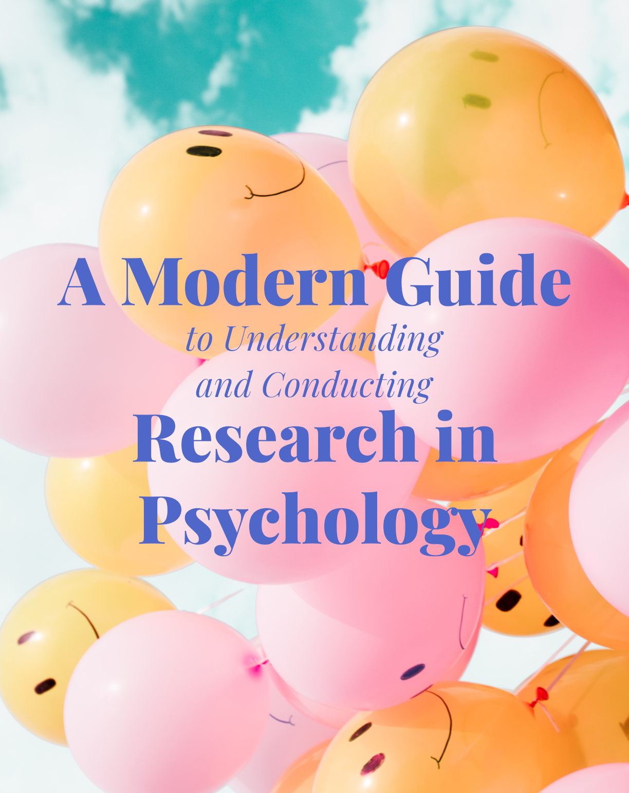

--- 
title: "A Modern Guide to Understanding and Conducting Research in Psychology"
author: "Edited by Celeste Pilegard and Emma Geller"
date: "Current version rendered `r Sys.Date()`"
site: bookdown::bookdown_site
documentclass: krantz
bibliography: [book.bib, packages.bib]
csl: apa.csl
url: https://pilegard.github.io/psychmethods/
favicon: images/favicon.ico
cover-image: images/cover.png
description: |
  This is a an OER textbook for introductory research methods in psychology.
link-citations: yes
github-repo: pilegard/psychmethods
---

# Welcome {-}

## License {-}

This textbook is an adaptation of [Psychology Research Methods: Core Skills and Concepts](https://2012books.lardbucket.org/books/psychology-research-methods-core-skills-and-concepts/) licensed under a [Creative Commons by-nc-sa 3.0 license](https://creativecommons.org/licenses/by-nc-sa/3.0/) without attribution [as requested by the work’s original creator or licensee](https://2012books.lardbucket.org/attribution.html).

The following portions of the book were adapted from [Introduction to Modern Statistics](http://openintro.org/book/ims) First Edition by Mine Çetinkaya-Rundel and Johanna Hardin, licensed under a [Creative Commons by-sa 3.0 license](https://creativecommons.org/licenses/by-sa/3.0/): Sampling plots; Intro and Anecdotal Evidence portions of Sampling chapter.

This adaptation is authored by Celeste Pilegard (University of California, San Diego) and is licensed under a [Creative Commons Attribution-NonCommercial-ShareAlike 3.0](https://creativecommons.org/licenses/by-nc-sa/3.0/) license.

Cover photo by Photo by [Ryoji Iwata](https://unsplash.com/@ryoji__iwata?utm_source=unsplash&utm_medium=referral&utm_content=creditCopyText) on [Unsplash](https://unsplash.com/@ryoji__iwata?utm_source=unsplash&utm_medium=referral&utm_content=creditCopyText). Icons by [Eucalyp](https://creativemarket.com/eucalyp) on [Flaticon](https://www.flaticon.com/).

## Revisions  {-}

Throughout the book: Chapter formatting updated using bookdown package; glossaries restored; references formatted with BibTeX. Photographs refreshed with more recent examples; figures recreated for visual alignment with book design; plots recreated in Base R. Broken links updated or removed. Organization and topic groupings changed by chapter.

- Developing Research Ideas and Reviewing the Research Literature sections moved from Getting Started chapter to appendix.
- Qualitative Research section moved from Nonexperiments to Getting Started
- Sampling chapter created from Survey Research subsection; remaining survey research details moved to Nonexperiments

Appendices: Guidelines on presenting research have been updated to align with the 7th edition of the *APA Publication Manual*, including citation rules, figure/table formatting examples, and the student/professional paper distinction. The sample APA-style paper has been replaced with an adapted preprint of Pilegard & Mayer (2016) formatted for APA 7. Jitter plots added to data visualization examples. Advice from Bem (2003) deemphasized or removed.

Revisions to portions from Çetinkaya-Rundel & Hardi: Changes in formatting. Stratified random sampling figure adapted to proportionate stratified random sampling.
